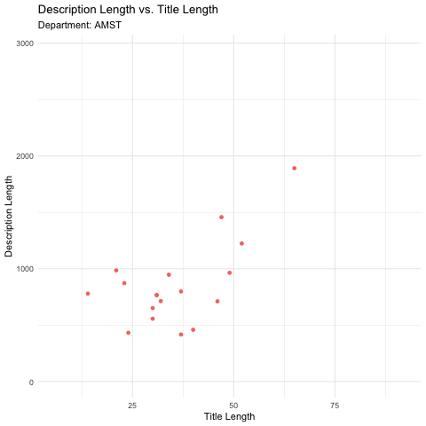

```r
library(tidyverse)     # for data cleaning and plotting
library(gardenR)       # for Lisa's garden data
library(lubridate)     # for date manipulation
library(openintro)     # for the abbr2state() function
library(palmerpenguins)# for Palmer penguin data
library(maps)          # for map data
library(ggmap)         # for mapping points on maps
library(gplots)        # for col2hex() function
library(RColorBrewer)  # for color palettes
library(sf)            # for working with spatial data
library(leaflet)       # for highly customizable mapping
library(ggthemes)      # for more themes (including theme_map())
library(plotly)        # for the ggplotly() - basic interactivity
library(gganimate)     # for adding animation layers to ggplots
library(gifski)        # for creating the gif (don't need to load this library every time,but need it installed)
library(transformr)    # for "tweening" (gganimate)
library(shiny)         # for creating interactive apps
library(patchwork)     # for nicely combining ggplot2 graphs  
library(gt)            # for creating nice tables
library(rvest)         # for scraping data
library(robotstxt)     # for checking if you can scrape data
theme_set(theme_minimal())
```


```r
# Lisa's garden data
data("garden_harvest")

#COVID-19 data from the New York Times
covid19 <- read_csv("https://raw.githubusercontent.com/nytimes/covid-19-data/master/us-states.csv")
```

## Put your homework on GitHub!

Go [here](https://github.com/llendway/github_for_collaboration/blob/master/github_for_collaboration.md) or to previous homework to remind yourself how to get set up. 

Once your repository is created, you should always open your **project** rather than just opening an .Rmd file. You can do that by either clicking on the .Rproj file in your repository folder on your computer. Or, by going to the upper right hand corner in R Studio and clicking the arrow next to where it says Project: (None). You should see your project come up in that list if you've used it recently. You could also go to File --> Open Project and navigate to your .Rproj file. 

## Instructions

* Put your name at the top of the document. 

* **For ALL graphs, you should include appropriate labels.** 

* Feel free to change the default theme, which I currently have set to `theme_minimal()`. 

* Use good coding practice. Read the short sections on good code with [pipes](https://style.tidyverse.org/pipes.html) and [ggplot2](https://style.tidyverse.org/ggplot2.html). **This is part of your grade!**

* **NEW!!** With animated graphs, add `eval=FALSE` to the code chunk that creates the animation and saves it using `anim_save()`. Add another code chunk to reread the gif back into the file. See the [tutorial](https://animation-and-interactivity-in-r.netlify.app/) for help. 

* When you are finished with ALL the exercises, uncomment the options at the top so your document looks nicer. Don't do it before then, or else you might miss some important warnings and messages.


## Warm-up exercises from tutorial

1. Read in the fake garden harvest data. Find the data [here](https://github.com/llendway/scraping_etc/blob/main/2020_harvest.csv) and click on the `Raw` button to get a direct link to the data. After reading in the data, do one of the quick checks mentioned in the tutorial.


```r
X2020_harvest <- read_csv("https://raw.githubusercontent.com/llendway/scraping_etc/main/2020_harvest.csv", 
                          col_types = cols(...1 = col_skip(), 
                                           date = col_date(format = "%m/%d/%y"), 
                                           weight = col_number()), 
                          na = "MISSING", 
                          skip = 2)

X2020_harvest %>% 
  mutate(across(where(is.character), as.factor)) %>% 
  summary()
```

```
##      vegetable              variety         date                weight    
##  tomatoes :232   grape          : 37   Min.   :2020-06-06   Min.   :   2  
##  lettuce  : 68   Romanesco      : 34   1st Qu.:2020-07-21   1st Qu.:  87  
##  beans    : 38   pickling       : 32   Median :2020-08-09   Median : 252  
##  zucchini : 34   Lettuce Mixture: 28   Mean   :2020-08-08   Mean   : 504  
##  cucumbers: 32   Bonny Best     : 26   3rd Qu.:2020-08-26   3rd Qu.: 599  
##  peas     : 27   (Other)        :525   Max.   :2020-10-03   Max.   :7350  
##  (Other)  :254   NA's           :  3                        NA's   :4     
##    units    
##  grams:685  
##             
##             
##             
##             
##             
## 
```

  
2. Read in this [data](https://www.kaggle.com/heeraldedhia/groceries-dataset) from the kaggle website. You will need to download the data first. Save it to your project/repo folder. Do some quick checks of the data to assure it has been read in appropriately.


```r
Groceries_dataset2 <- read_csv("Groceries_dataset2.csv", 
    col_types = cols(Member_number = col_number(), 
        Date = col_date(format = "%M-%D-%Y")))

Groceries_dataset2 %>%
  mutate(across(where(is.character), as.factor)) %>% 
  summary()
```

```
##  Member_number       Date                    itemDescription 
##  Min.   :1000   Min.   :2014-01-01   whole milk      : 2502  
##  1st Qu.:2002   1st Qu.:2014-07-01   other vegetables: 1898  
##  Median :3005   Median :2015-01-01   rolls/buns      : 1716  
##  Mean   :3004   Mean   :2014-12-26   soda            : 1514  
##  3rd Qu.:4007   3rd Qu.:2015-07-01   yogurt          : 1334  
##  Max.   :5000   Max.   :2015-12-01   root vegetables : 1071  
##                                      (Other)         :28730
```


3. Create a table using `gt` with data from your project or from the `garden_harvest` data if your project data aren't ready. Use at least 3 `gt()` functions.


```r
newpitchdata <- read_csv("~/Documents/COMP112/newpitchdata.csv", 
    col_types = cols(tot_Ks = col_number(), 
        K_percent = col_number(), pitch_count = col_number(), 
        percent_pitch = col_number(), avg_pitchVelo = col_number(), 
        avg_pitchrpm = col_number(), unfixed_movH = col_number(), 
        avg_break_H = col_number(), avg_break_V = col_number(), 
        avg_breakTot = col_number()))

newpitchdata %>%
  gt() %>%
  cols_hide(columns = vars(tot_Ks, unfixed_movH, avg_break_H, avg_break_V, avg_breakTot)) %>%
  tab_footnote(
    footnote = "These are very good pitchers",
    locations = cells_body(
      columns = vars(K_percent),
      rows = K_percent > 30
    )
  ) %>%
  tab_header(
    title = "Project Data",
    subtitle = md("Uses Pitch Data from MLB 2019 Season")
  )
```

```{=html}
<div id="kffznqzxml" style="overflow-x:auto;overflow-y:auto;width:auto;height:auto;">
<style>html {
  font-family: -apple-system, BlinkMacSystemFont, 'Segoe UI', Roboto, Oxygen, Ubuntu, Cantarell, 'Helvetica Neue', 'Fira Sans', 'Droid Sans', Arial, sans-serif;
}

#kffznqzxml .gt_table {
  display: table;
  border-collapse: collapse;
  margin-left: auto;
  margin-right: auto;
  color: #333333;
  font-size: 16px;
  font-weight: normal;
  font-style: normal;
  background-color: #FFFFFF;
  width: auto;
  border-top-style: solid;
  border-top-width: 2px;
  border-top-color: #A8A8A8;
  border-right-style: none;
  border-right-width: 2px;
  border-right-color: #D3D3D3;
  border-bottom-style: solid;
  border-bottom-width: 2px;
  border-bottom-color: #A8A8A8;
  border-left-style: none;
  border-left-width: 2px;
  border-left-color: #D3D3D3;
}

#kffznqzxml .gt_heading {
  background-color: #FFFFFF;
  text-align: center;
  border-bottom-color: #FFFFFF;
  border-left-style: none;
  border-left-width: 1px;
  border-left-color: #D3D3D3;
  border-right-style: none;
  border-right-width: 1px;
  border-right-color: #D3D3D3;
}

#kffznqzxml .gt_title {
  color: #333333;
  font-size: 125%;
  font-weight: initial;
  padding-top: 4px;
  padding-bottom: 4px;
  padding-left: 5px;
  padding-right: 5px;
  border-bottom-color: #FFFFFF;
  border-bottom-width: 0;
}

#kffznqzxml .gt_subtitle {
  color: #333333;
  font-size: 85%;
  font-weight: initial;
  padding-top: 0;
  padding-bottom: 6px;
  padding-left: 5px;
  padding-right: 5px;
  border-top-color: #FFFFFF;
  border-top-width: 0;
}

#kffznqzxml .gt_bottom_border {
  border-bottom-style: solid;
  border-bottom-width: 2px;
  border-bottom-color: #D3D3D3;
}

#kffznqzxml .gt_col_headings {
  border-top-style: solid;
  border-top-width: 2px;
  border-top-color: #D3D3D3;
  border-bottom-style: solid;
  border-bottom-width: 2px;
  border-bottom-color: #D3D3D3;
  border-left-style: none;
  border-left-width: 1px;
  border-left-color: #D3D3D3;
  border-right-style: none;
  border-right-width: 1px;
  border-right-color: #D3D3D3;
}

#kffznqzxml .gt_col_heading {
  color: #333333;
  background-color: #FFFFFF;
  font-size: 100%;
  font-weight: normal;
  text-transform: inherit;
  border-left-style: none;
  border-left-width: 1px;
  border-left-color: #D3D3D3;
  border-right-style: none;
  border-right-width: 1px;
  border-right-color: #D3D3D3;
  vertical-align: bottom;
  padding-top: 5px;
  padding-bottom: 6px;
  padding-left: 5px;
  padding-right: 5px;
  overflow-x: hidden;
}

#kffznqzxml .gt_column_spanner_outer {
  color: #333333;
  background-color: #FFFFFF;
  font-size: 100%;
  font-weight: normal;
  text-transform: inherit;
  padding-top: 0;
  padding-bottom: 0;
  padding-left: 4px;
  padding-right: 4px;
}

#kffznqzxml .gt_column_spanner_outer:first-child {
  padding-left: 0;
}

#kffznqzxml .gt_column_spanner_outer:last-child {
  padding-right: 0;
}

#kffznqzxml .gt_column_spanner {
  border-bottom-style: solid;
  border-bottom-width: 2px;
  border-bottom-color: #D3D3D3;
  vertical-align: bottom;
  padding-top: 5px;
  padding-bottom: 5px;
  overflow-x: hidden;
  display: inline-block;
  width: 100%;
}

#kffznqzxml .gt_group_heading {
  padding-top: 8px;
  padding-bottom: 8px;
  padding-left: 5px;
  padding-right: 5px;
  color: #333333;
  background-color: #FFFFFF;
  font-size: 100%;
  font-weight: initial;
  text-transform: inherit;
  border-top-style: solid;
  border-top-width: 2px;
  border-top-color: #D3D3D3;
  border-bottom-style: solid;
  border-bottom-width: 2px;
  border-bottom-color: #D3D3D3;
  border-left-style: none;
  border-left-width: 1px;
  border-left-color: #D3D3D3;
  border-right-style: none;
  border-right-width: 1px;
  border-right-color: #D3D3D3;
  vertical-align: middle;
}

#kffznqzxml .gt_empty_group_heading {
  padding: 0.5px;
  color: #333333;
  background-color: #FFFFFF;
  font-size: 100%;
  font-weight: initial;
  border-top-style: solid;
  border-top-width: 2px;
  border-top-color: #D3D3D3;
  border-bottom-style: solid;
  border-bottom-width: 2px;
  border-bottom-color: #D3D3D3;
  vertical-align: middle;
}

#kffznqzxml .gt_from_md > :first-child {
  margin-top: 0;
}

#kffznqzxml .gt_from_md > :last-child {
  margin-bottom: 0;
}

#kffznqzxml .gt_row {
  padding-top: 8px;
  padding-bottom: 8px;
  padding-left: 5px;
  padding-right: 5px;
  margin: 10px;
  border-top-style: solid;
  border-top-width: 1px;
  border-top-color: #D3D3D3;
  border-left-style: none;
  border-left-width: 1px;
  border-left-color: #D3D3D3;
  border-right-style: none;
  border-right-width: 1px;
  border-right-color: #D3D3D3;
  vertical-align: middle;
  overflow-x: hidden;
}

#kffznqzxml .gt_stub {
  color: #333333;
  background-color: #FFFFFF;
  font-size: 100%;
  font-weight: initial;
  text-transform: inherit;
  border-right-style: solid;
  border-right-width: 2px;
  border-right-color: #D3D3D3;
  padding-left: 5px;
  padding-right: 5px;
}

#kffznqzxml .gt_stub_row_group {
  color: #333333;
  background-color: #FFFFFF;
  font-size: 100%;
  font-weight: initial;
  text-transform: inherit;
  border-right-style: solid;
  border-right-width: 2px;
  border-right-color: #D3D3D3;
  padding-left: 5px;
  padding-right: 5px;
  vertical-align: top;
}

#kffznqzxml .gt_row_group_first td {
  border-top-width: 2px;
}

#kffznqzxml .gt_summary_row {
  color: #333333;
  background-color: #FFFFFF;
  text-transform: inherit;
  padding-top: 8px;
  padding-bottom: 8px;
  padding-left: 5px;
  padding-right: 5px;
}

#kffznqzxml .gt_first_summary_row {
  border-top-style: solid;
  border-top-color: #D3D3D3;
}

#kffznqzxml .gt_first_summary_row.thick {
  border-top-width: 2px;
}

#kffznqzxml .gt_last_summary_row {
  padding-top: 8px;
  padding-bottom: 8px;
  padding-left: 5px;
  padding-right: 5px;
  border-bottom-style: solid;
  border-bottom-width: 2px;
  border-bottom-color: #D3D3D3;
}

#kffznqzxml .gt_grand_summary_row {
  color: #333333;
  background-color: #FFFFFF;
  text-transform: inherit;
  padding-top: 8px;
  padding-bottom: 8px;
  padding-left: 5px;
  padding-right: 5px;
}

#kffznqzxml .gt_first_grand_summary_row {
  padding-top: 8px;
  padding-bottom: 8px;
  padding-left: 5px;
  padding-right: 5px;
  border-top-style: double;
  border-top-width: 6px;
  border-top-color: #D3D3D3;
}

#kffznqzxml .gt_striped {
  background-color: rgba(128, 128, 128, 0.05);
}

#kffznqzxml .gt_table_body {
  border-top-style: solid;
  border-top-width: 2px;
  border-top-color: #D3D3D3;
  border-bottom-style: solid;
  border-bottom-width: 2px;
  border-bottom-color: #D3D3D3;
}

#kffznqzxml .gt_footnotes {
  color: #333333;
  background-color: #FFFFFF;
  border-bottom-style: none;
  border-bottom-width: 2px;
  border-bottom-color: #D3D3D3;
  border-left-style: none;
  border-left-width: 2px;
  border-left-color: #D3D3D3;
  border-right-style: none;
  border-right-width: 2px;
  border-right-color: #D3D3D3;
}

#kffznqzxml .gt_footnote {
  margin: 0px;
  font-size: 90%;
  padding-left: 4px;
  padding-right: 4px;
  padding-left: 5px;
  padding-right: 5px;
}

#kffznqzxml .gt_sourcenotes {
  color: #333333;
  background-color: #FFFFFF;
  border-bottom-style: none;
  border-bottom-width: 2px;
  border-bottom-color: #D3D3D3;
  border-left-style: none;
  border-left-width: 2px;
  border-left-color: #D3D3D3;
  border-right-style: none;
  border-right-width: 2px;
  border-right-color: #D3D3D3;
}

#kffznqzxml .gt_sourcenote {
  font-size: 90%;
  padding-top: 4px;
  padding-bottom: 4px;
  padding-left: 5px;
  padding-right: 5px;
}

#kffznqzxml .gt_left {
  text-align: left;
}

#kffznqzxml .gt_center {
  text-align: center;
}

#kffznqzxml .gt_right {
  text-align: right;
  font-variant-numeric: tabular-nums;
}

#kffznqzxml .gt_font_normal {
  font-weight: normal;
}

#kffznqzxml .gt_font_bold {
  font-weight: bold;
}

#kffznqzxml .gt_font_italic {
  font-style: italic;
}

#kffznqzxml .gt_super {
  font-size: 65%;
}

#kffznqzxml .gt_footnote_marks {
  font-style: italic;
  font-weight: normal;
  font-size: 75%;
  vertical-align: 0.4em;
}

#kffznqzxml .gt_asterisk {
  font-size: 100%;
  vertical-align: 0;
}

#kffznqzxml .gt_slash_mark {
  font-size: 0.7em;
  line-height: 0.7em;
  vertical-align: 0.15em;
}

#kffznqzxml .gt_fraction_numerator {
  font-size: 0.6em;
  line-height: 0.6em;
  vertical-align: 0.45em;
}

#kffznqzxml .gt_fraction_denominator {
  font-size: 0.6em;
  line-height: 0.6em;
  vertical-align: -0.05em;
}
</style>
<table class="gt_table">
  <thead class="gt_header">
    <tr>
      <th colspan="8" class="gt_heading gt_title gt_font_normal" style>Project Data</th>
    </tr>
    <tr>
      <th colspan="8" class="gt_heading gt_subtitle gt_font_normal gt_bottom_border" style>Uses Pitch Data from MLB 2019 Season</th>
    </tr>
  </thead>
  <thead class="gt_col_headings">
    <tr>
      <th class="gt_col_heading gt_columns_bottom_border gt_left" rowspan="1" colspan="1">last_name</th>
      <th class="gt_col_heading gt_columns_bottom_border gt_left" rowspan="1" colspan="1">first_name</th>
      <th class="gt_col_heading gt_columns_bottom_border gt_center" rowspan="1" colspan="1">is_4S</th>
      <th class="gt_col_heading gt_columns_bottom_border gt_right" rowspan="1" colspan="1">K_percent</th>
      <th class="gt_col_heading gt_columns_bottom_border gt_right" rowspan="1" colspan="1">pitch_count</th>
      <th class="gt_col_heading gt_columns_bottom_border gt_right" rowspan="1" colspan="1">percent_pitch</th>
      <th class="gt_col_heading gt_columns_bottom_border gt_right" rowspan="1" colspan="1">avg_pitchVelo</th>
      <th class="gt_col_heading gt_columns_bottom_border gt_right" rowspan="1" colspan="1">avg_pitchrpm</th>
    </tr>
  </thead>
  <tbody class="gt_table_body">
    <tr><td class="gt_row gt_left">Brice</td>
<td class="gt_row gt_left">Austin</td>
<td class="gt_row gt_center">TRUE</td>
<td class="gt_row gt_right">28.7</td>
<td class="gt_row gt_right">359</td>
<td class="gt_row gt_right">34.5</td>
<td class="gt_row gt_right">93.8</td>
<td class="gt_row gt_right">2251</td></tr>
    <tr><td class="gt_row gt_left">Thompson</td>
<td class="gt_row gt_left">Ryan</td>
<td class="gt_row gt_center">TRUE</td>
<td class="gt_row gt_right">20.2</td>
<td class="gt_row gt_right">419</td>
<td class="gt_row gt_right">9.0</td>
<td class="gt_row gt_right">92.8</td>
<td class="gt_row gt_right">2121</td></tr>
    <tr><td class="gt_row gt_left">Herget</td>
<td class="gt_row gt_left">Jimmy</td>
<td class="gt_row gt_center">TRUE</td>
<td class="gt_row gt_right">19.5</td>
<td class="gt_row gt_right">350</td>
<td class="gt_row gt_right">43.6</td>
<td class="gt_row gt_right">93.5</td>
<td class="gt_row gt_right">2345</td></tr>
    <tr><td class="gt_row gt_left">Diaz</td>
<td class="gt_row gt_left">Edwin</td>
<td class="gt_row gt_center">TRUE</td>
<td class="gt_row gt_right">45.5<sup class="gt_footnote_marks">1</sup></td>
<td class="gt_row gt_right">483</td>
<td class="gt_row gt_right">60.8</td>
<td class="gt_row gt_right">97.8</td>
<td class="gt_row gt_right">2355</td></tr>
    <tr><td class="gt_row gt_left">Romo</td>
<td class="gt_row gt_left">Sergio</td>
<td class="gt_row gt_center">TRUE</td>
<td class="gt_row gt_right">26.4</td>
<td class="gt_row gt_right">364</td>
<td class="gt_row gt_right">10.7</td>
<td class="gt_row gt_right">85.8</td>
<td class="gt_row gt_right">2371</td></tr>
    <tr><td class="gt_row gt_left">Nola</td>
<td class="gt_row gt_left">Aaron</td>
<td class="gt_row gt_center">TRUE</td>
<td class="gt_row gt_right">33.2<sup class="gt_footnote_marks">1</sup></td>
<td class="gt_row gt_right">1148</td>
<td class="gt_row gt_right">25.2</td>
<td class="gt_row gt_right">92.8</td>
<td class="gt_row gt_right">2184</td></tr>
    <tr><td class="gt_row gt_left">Buttrey</td>
<td class="gt_row gt_left">Ty</td>
<td class="gt_row gt_center">TRUE</td>
<td class="gt_row gt_right">16.1</td>
<td class="gt_row gt_right">428</td>
<td class="gt_row gt_right">58.1</td>
<td class="gt_row gt_right">96.1</td>
<td class="gt_row gt_right">2232</td></tr>
    <tr><td class="gt_row gt_left">Mahle</td>
<td class="gt_row gt_left">Tyler</td>
<td class="gt_row gt_center">TRUE</td>
<td class="gt_row gt_right">29.9</td>
<td class="gt_row gt_right">852</td>
<td class="gt_row gt_right">54.9</td>
<td class="gt_row gt_right">93.9</td>
<td class="gt_row gt_right">2389</td></tr>
    <tr><td class="gt_row gt_left">Pena</td>
<td class="gt_row gt_left">Felix</td>
<td class="gt_row gt_center">TRUE</td>
<td class="gt_row gt_right">25.2</td>
<td class="gt_row gt_right">460</td>
<td class="gt_row gt_right">6.5</td>
<td class="gt_row gt_right">93.9</td>
<td class="gt_row gt_right">2133</td></tr>
    <tr><td class="gt_row gt_left">Cole</td>
<td class="gt_row gt_left">Gerrit</td>
<td class="gt_row gt_center">TRUE</td>
<td class="gt_row gt_right">32.6<sup class="gt_footnote_marks">1</sup></td>
<td class="gt_row gt_right">1203</td>
<td class="gt_row gt_right">52.7</td>
<td class="gt_row gt_right">96.7</td>
<td class="gt_row gt_right">2505</td></tr>
    <tr><td class="gt_row gt_left">Robles</td>
<td class="gt_row gt_left">Hansel</td>
<td class="gt_row gt_center">TRUE</td>
<td class="gt_row gt_right">25.0</td>
<td class="gt_row gt_right">317</td>
<td class="gt_row gt_right">45.4</td>
<td class="gt_row gt_right">95.4</td>
<td class="gt_row gt_right">2320</td></tr>
    <tr><td class="gt_row gt_left">Chavez</td>
<td class="gt_row gt_left">Jesse</td>
<td class="gt_row gt_center">TRUE</td>
<td class="gt_row gt_right">16.9</td>
<td class="gt_row gt_right">305</td>
<td class="gt_row gt_right">7.2</td>
<td class="gt_row gt_right">91.0</td>
<td class="gt_row gt_right">2180</td></tr>
    <tr><td class="gt_row gt_left">Crichton</td>
<td class="gt_row gt_left">Stefan</td>
<td class="gt_row gt_center">TRUE</td>
<td class="gt_row gt_right">21.1</td>
<td class="gt_row gt_right">402</td>
<td class="gt_row gt_right">1.4</td>
<td class="gt_row gt_right">91.9</td>
<td class="gt_row gt_right">1930</td></tr>
    <tr><td class="gt_row gt_left">Samardzija</td>
<td class="gt_row gt_left">Jeff</td>
<td class="gt_row gt_center">TRUE</td>
<td class="gt_row gt_right">7.8</td>
<td class="gt_row gt_right">298</td>
<td class="gt_row gt_right">18.7</td>
<td class="gt_row gt_right">90.3</td>
<td class="gt_row gt_right">2557</td></tr>
    <tr><td class="gt_row gt_left">Farmer</td>
<td class="gt_row gt_left">Buck</td>
<td class="gt_row gt_center">TRUE</td>
<td class="gt_row gt_right">15.7</td>
<td class="gt_row gt_right">341</td>
<td class="gt_row gt_right">52.7</td>
<td class="gt_row gt_right">93.2</td>
<td class="gt_row gt_right">2276</td></tr>
    <tr><td class="gt_row gt_left">Familia</td>
<td class="gt_row gt_left">Jeurys</td>
<td class="gt_row gt_center">TRUE</td>
<td class="gt_row gt_right">19.2</td>
<td class="gt_row gt_right">455</td>
<td class="gt_row gt_right">14.2</td>
<td class="gt_row gt_right">97.2</td>
<td class="gt_row gt_right">2298</td></tr>
    <tr><td class="gt_row gt_left">Heuer</td>
<td class="gt_row gt_left">Codi</td>
<td class="gt_row gt_center">TRUE</td>
<td class="gt_row gt_right">27.2</td>
<td class="gt_row gt_right">374</td>
<td class="gt_row gt_right">2.6</td>
<td class="gt_row gt_right">97.8</td>
<td class="gt_row gt_right">2305</td></tr>
    <tr><td class="gt_row gt_left">Gray</td>
<td class="gt_row gt_left">Jon</td>
<td class="gt_row gt_center">TRUE</td>
<td class="gt_row gt_right">12.6</td>
<td class="gt_row gt_right">658</td>
<td class="gt_row gt_right">48.3</td>
<td class="gt_row gt_right">94.0</td>
<td class="gt_row gt_right">2148</td></tr>
    <tr><td class="gt_row gt_left">Floro</td>
<td class="gt_row gt_left">Dylan</td>
<td class="gt_row gt_center">TRUE</td>
<td class="gt_row gt_right">19.4</td>
<td class="gt_row gt_right">371</td>
<td class="gt_row gt_right">4.0</td>
<td class="gt_row gt_right">93.3</td>
<td class="gt_row gt_right">2238</td></tr>
    <tr><td class="gt_row gt_left">Castillo</td>
<td class="gt_row gt_left">Luis</td>
<td class="gt_row gt_center">TRUE</td>
<td class="gt_row gt_right">30.5<sup class="gt_footnote_marks">1</sup></td>
<td class="gt_row gt_right">1153</td>
<td class="gt_row gt_right">27.0</td>
<td class="gt_row gt_right">97.4</td>
<td class="gt_row gt_right">2188</td></tr>
    <tr><td class="gt_row gt_left">Dobnak</td>
<td class="gt_row gt_left">Randy</td>
<td class="gt_row gt_center">TRUE</td>
<td class="gt_row gt_right">13.5</td>
<td class="gt_row gt_right">748</td>
<td class="gt_row gt_right">4.5</td>
<td class="gt_row gt_right">92.9</td>
<td class="gt_row gt_right">2052</td></tr>
    <tr><td class="gt_row gt_left">Jimenez</td>
<td class="gt_row gt_left">Joe</td>
<td class="gt_row gt_center">TRUE</td>
<td class="gt_row gt_right">21.8</td>
<td class="gt_row gt_right">389</td>
<td class="gt_row gt_right">62.2</td>
<td class="gt_row gt_right">94.2</td>
<td class="gt_row gt_right">2465</td></tr>
    <tr><td class="gt_row gt_left">Barnes</td>
<td class="gt_row gt_left">Matt</td>
<td class="gt_row gt_center">TRUE</td>
<td class="gt_row gt_right">30.4<sup class="gt_footnote_marks">1</sup></td>
<td class="gt_row gt_right">455</td>
<td class="gt_row gt_right">54.0</td>
<td class="gt_row gt_right">95.5</td>
<td class="gt_row gt_right">2315</td></tr>
    <tr><td class="gt_row gt_left">Yamaguchi</td>
<td class="gt_row gt_left">Shun</td>
<td class="gt_row gt_center">TRUE</td>
<td class="gt_row gt_right">21.7</td>
<td class="gt_row gt_right">502</td>
<td class="gt_row gt_right">40.9</td>
<td class="gt_row gt_right">90.8</td>
<td class="gt_row gt_right">2129</td></tr>
    <tr><td class="gt_row gt_left">Eovaldi</td>
<td class="gt_row gt_left">Nathan</td>
<td class="gt_row gt_center">TRUE</td>
<td class="gt_row gt_right">26.1</td>
<td class="gt_row gt_right">748</td>
<td class="gt_row gt_right">37.7</td>
<td class="gt_row gt_right">97.3</td>
<td class="gt_row gt_right">2121</td></tr>
    <tr><td class="gt_row gt_left">Lorenzen</td>
<td class="gt_row gt_left">Michael</td>
<td class="gt_row gt_center">TRUE</td>
<td class="gt_row gt_right">23.8</td>
<td class="gt_row gt_right">608</td>
<td class="gt_row gt_right">33.0</td>
<td class="gt_row gt_right">96.8</td>
<td class="gt_row gt_right">2528</td></tr>
    <tr><td class="gt_row gt_left">Berrios</td>
<td class="gt_row gt_left">Jose</td>
<td class="gt_row gt_center">TRUE</td>
<td class="gt_row gt_right">25.1</td>
<td class="gt_row gt_right">1102</td>
<td class="gt_row gt_right">25.9</td>
<td class="gt_row gt_right">94.5</td>
<td class="gt_row gt_right">2192</td></tr>
    <tr><td class="gt_row gt_left">Wright</td>
<td class="gt_row gt_left">Kyle</td>
<td class="gt_row gt_center">TRUE</td>
<td class="gt_row gt_right">17.9</td>
<td class="gt_row gt_right">641</td>
<td class="gt_row gt_right">16.6</td>
<td class="gt_row gt_right">94.7</td>
<td class="gt_row gt_right">2425</td></tr>
    <tr><td class="gt_row gt_left">Mize</td>
<td class="gt_row gt_left">Casey</td>
<td class="gt_row gt_center">TRUE</td>
<td class="gt_row gt_right">19.5</td>
<td class="gt_row gt_right">543</td>
<td class="gt_row gt_right">25.4</td>
<td class="gt_row gt_right">93.7</td>
<td class="gt_row gt_right">2245</td></tr>
    <tr><td class="gt_row gt_left">Marshall</td>
<td class="gt_row gt_left">Evan</td>
<td class="gt_row gt_center">TRUE</td>
<td class="gt_row gt_right">32.3<sup class="gt_footnote_marks">1</sup></td>
<td class="gt_row gt_right">384</td>
<td class="gt_row gt_right">20.3</td>
<td class="gt_row gt_right">92.8</td>
<td class="gt_row gt_right">2334</td></tr>
    <tr><td class="gt_row gt_left">Eflin</td>
<td class="gt_row gt_left">Zach</td>
<td class="gt_row gt_center">TRUE</td>
<td class="gt_row gt_right">28.6</td>
<td class="gt_row gt_right">913</td>
<td class="gt_row gt_right">9.6</td>
<td class="gt_row gt_right">94.3</td>
<td class="gt_row gt_right">2160</td></tr>
    <tr><td class="gt_row gt_left">Fiers</td>
<td class="gt_row gt_left">Mike</td>
<td class="gt_row gt_center">TRUE</td>
<td class="gt_row gt_right">14.4</td>
<td class="gt_row gt_right">916</td>
<td class="gt_row gt_right">31.5</td>
<td class="gt_row gt_right">88.0</td>
<td class="gt_row gt_right">2158</td></tr>
    <tr><td class="gt_row gt_left">Hartlieb</td>
<td class="gt_row gt_left">Geoff</td>
<td class="gt_row gt_center">TRUE</td>
<td class="gt_row gt_right">18.8</td>
<td class="gt_row gt_right">409</td>
<td class="gt_row gt_right">2.6</td>
<td class="gt_row gt_right">93.1</td>
<td class="gt_row gt_right">2355</td></tr>
    <tr><td class="gt_row gt_left">Castellani</td>
<td class="gt_row gt_left">Ryan</td>
<td class="gt_row gt_center">TRUE</td>
<td class="gt_row gt_right">13.2</td>
<td class="gt_row gt_right">757</td>
<td class="gt_row gt_right">48.2</td>
<td class="gt_row gt_right">92.5</td>
<td class="gt_row gt_right">2349</td></tr>
    <tr><td class="gt_row gt_left">Scherzer</td>
<td class="gt_row gt_left">Max</td>
<td class="gt_row gt_center">TRUE</td>
<td class="gt_row gt_right">31.2<sup class="gt_footnote_marks">1</sup></td>
<td class="gt_row gt_right">1213</td>
<td class="gt_row gt_right">46.0</td>
<td class="gt_row gt_right">94.7</td>
<td class="gt_row gt_right">2472</td></tr>
    <tr><td class="gt_row gt_left">Cueto</td>
<td class="gt_row gt_left">Johnny</td>
<td class="gt_row gt_center">TRUE</td>
<td class="gt_row gt_right">20.2</td>
<td class="gt_row gt_right">1145</td>
<td class="gt_row gt_right">32.4</td>
<td class="gt_row gt_right">91.4</td>
<td class="gt_row gt_right">2222</td></tr>
    <tr><td class="gt_row gt_left">May</td>
<td class="gt_row gt_left">Dustin</td>
<td class="gt_row gt_center">TRUE</td>
<td class="gt_row gt_right">19.6</td>
<td class="gt_row gt_right">866</td>
<td class="gt_row gt_right">5.5</td>
<td class="gt_row gt_right">99.1</td>
<td class="gt_row gt_right">2341</td></tr>
    <tr><td class="gt_row gt_left">Ginkel</td>
<td class="gt_row gt_left">Kevin</td>
<td class="gt_row gt_center">TRUE</td>
<td class="gt_row gt_right">22.8</td>
<td class="gt_row gt_right">340</td>
<td class="gt_row gt_right">59.7</td>
<td class="gt_row gt_right">95.5</td>
<td class="gt_row gt_right">2387</td></tr>
    <tr><td class="gt_row gt_left">Morton</td>
<td class="gt_row gt_left">Charlie</td>
<td class="gt_row gt_center">TRUE</td>
<td class="gt_row gt_right">24.7</td>
<td class="gt_row gt_right">660</td>
<td class="gt_row gt_right">35.4</td>
<td class="gt_row gt_right">93.4</td>
<td class="gt_row gt_right">2349</td></tr>
    <tr><td class="gt_row gt_left">Sanchez</td>
<td class="gt_row gt_left">Sixto</td>
<td class="gt_row gt_center">TRUE</td>
<td class="gt_row gt_right">20.9</td>
<td class="gt_row gt_right">559</td>
<td class="gt_row gt_right">23.7</td>
<td class="gt_row gt_right">98.5</td>
<td class="gt_row gt_right">2164</td></tr>
    <tr><td class="gt_row gt_left">Gausman</td>
<td class="gt_row gt_left">Kevin</td>
<td class="gt_row gt_center">TRUE</td>
<td class="gt_row gt_right">32.2<sup class="gt_footnote_marks">1</sup></td>
<td class="gt_row gt_right">975</td>
<td class="gt_row gt_right">49.1</td>
<td class="gt_row gt_right">95.1</td>
<td class="gt_row gt_right">2312</td></tr>
    <tr><td class="gt_row gt_left">Williams</td>
<td class="gt_row gt_left">Devin</td>
<td class="gt_row gt_center">TRUE</td>
<td class="gt_row gt_right">53.0<sup class="gt_footnote_marks">1</sup></td>
<td class="gt_row gt_right">431</td>
<td class="gt_row gt_right">41.7</td>
<td class="gt_row gt_right">96.4</td>
<td class="gt_row gt_right">2383</td></tr>
    <tr><td class="gt_row gt_left">Cisnero</td>
<td class="gt_row gt_left">Jose</td>
<td class="gt_row gt_center">TRUE</td>
<td class="gt_row gt_right">27.6</td>
<td class="gt_row gt_right">519</td>
<td class="gt_row gt_right">58.3</td>
<td class="gt_row gt_right">96.3</td>
<td class="gt_row gt_right">2412</td></tr>
    <tr><td class="gt_row gt_left">Neris</td>
<td class="gt_row gt_left">Hector</td>
<td class="gt_row gt_center">TRUE</td>
<td class="gt_row gt_right">26.2</td>
<td class="gt_row gt_right">399</td>
<td class="gt_row gt_right">42.6</td>
<td class="gt_row gt_right">93.8</td>
<td class="gt_row gt_right">2352</td></tr>
    <tr><td class="gt_row gt_left">Sulser</td>
<td class="gt_row gt_left">Cole</td>
<td class="gt_row gt_center">TRUE</td>
<td class="gt_row gt_right">19.0</td>
<td class="gt_row gt_right">416</td>
<td class="gt_row gt_right">57.4</td>
<td class="gt_row gt_right">93.8</td>
<td class="gt_row gt_right">2409</td></tr>
    <tr><td class="gt_row gt_left">Nova</td>
<td class="gt_row gt_left">Ivan</td>
<td class="gt_row gt_center">TRUE</td>
<td class="gt_row gt_right">10.2</td>
<td class="gt_row gt_right">284</td>
<td class="gt_row gt_right">13.3</td>
<td class="gt_row gt_right">92.5</td>
<td class="gt_row gt_right">2276</td></tr>
    <tr><td class="gt_row gt_left">Howard</td>
<td class="gt_row gt_left">Spencer</td>
<td class="gt_row gt_center">TRUE</td>
<td class="gt_row gt_right">20.4</td>
<td class="gt_row gt_right">439</td>
<td class="gt_row gt_right">56.4</td>
<td class="gt_row gt_right">94.0</td>
<td class="gt_row gt_right">2345</td></tr>
    <tr><td class="gt_row gt_left">Hoffman</td>
<td class="gt_row gt_left">Jeff</td>
<td class="gt_row gt_center">TRUE</td>
<td class="gt_row gt_right">19.2</td>
<td class="gt_row gt_right">399</td>
<td class="gt_row gt_right">54.6</td>
<td class="gt_row gt_right">94.4</td>
<td class="gt_row gt_right">2425</td></tr>
    <tr><td class="gt_row gt_left">Urena</td>
<td class="gt_row gt_left">Jose</td>
<td class="gt_row gt_center">TRUE</td>
<td class="gt_row gt_right">14.4</td>
<td class="gt_row gt_right">396</td>
<td class="gt_row gt_right">18.9</td>
<td class="gt_row gt_right">95.6</td>
<td class="gt_row gt_right">2161</td></tr>
    <tr><td class="gt_row gt_left">Hernandez</td>
<td class="gt_row gt_left">Jonathan</td>
<td class="gt_row gt_center">TRUE</td>
<td class="gt_row gt_right">24.8</td>
<td class="gt_row gt_right">497</td>
<td class="gt_row gt_right">0.2</td>
<td class="gt_row gt_right">97.9</td>
<td class="gt_row gt_right">2104</td></tr>
    <tr><td class="gt_row gt_left">Wittgren</td>
<td class="gt_row gt_left">Nick</td>
<td class="gt_row gt_center">TRUE</td>
<td class="gt_row gt_right">28.6</td>
<td class="gt_row gt_right">377</td>
<td class="gt_row gt_right">60.4</td>
<td class="gt_row gt_right">92.9</td>
<td class="gt_row gt_right">2221</td></tr>
    <tr><td class="gt_row gt_left">Paddack</td>
<td class="gt_row gt_left">Chris</td>
<td class="gt_row gt_center">TRUE</td>
<td class="gt_row gt_right">23.7</td>
<td class="gt_row gt_right">963</td>
<td class="gt_row gt_right">58.1</td>
<td class="gt_row gt_right">94.1</td>
<td class="gt_row gt_right">2170</td></tr>
    <tr><td class="gt_row gt_left">Ramirez</td>
<td class="gt_row gt_left">Noe</td>
<td class="gt_row gt_center">TRUE</td>
<td class="gt_row gt_right">16.5</td>
<td class="gt_row gt_right">336</td>
<td class="gt_row gt_right">36.0</td>
<td class="gt_row gt_right">88.7</td>
<td class="gt_row gt_right">2183</td></tr>
    <tr><td class="gt_row gt_left">Stammen</td>
<td class="gt_row gt_left">Craig</td>
<td class="gt_row gt_center">TRUE</td>
<td class="gt_row gt_right">19.0</td>
<td class="gt_row gt_right">377</td>
<td class="gt_row gt_right">6.8</td>
<td class="gt_row gt_right">91.4</td>
<td class="gt_row gt_right">1989</td></tr>
    <tr><td class="gt_row gt_left">Hudson</td>
<td class="gt_row gt_left">Daniel</td>
<td class="gt_row gt_center">TRUE</td>
<td class="gt_row gt_right">30.4<sup class="gt_footnote_marks">1</sup></td>
<td class="gt_row gt_right">378</td>
<td class="gt_row gt_right">75.1</td>
<td class="gt_row gt_right">96.4</td>
<td class="gt_row gt_right">2337</td></tr>
    <tr><td class="gt_row gt_left">Mills</td>
<td class="gt_row gt_left">Alec</td>
<td class="gt_row gt_center">TRUE</td>
<td class="gt_row gt_right">18.3</td>
<td class="gt_row gt_right">945</td>
<td class="gt_row gt_right">25.7</td>
<td class="gt_row gt_right">89.8</td>
<td class="gt_row gt_right">2185</td></tr>
    <tr><td class="gt_row gt_left">Garcia</td>
<td class="gt_row gt_left">Rony</td>
<td class="gt_row gt_center">TRUE</td>
<td class="gt_row gt_right">14.6</td>
<td class="gt_row gt_right">393</td>
<td class="gt_row gt_right">63.1</td>
<td class="gt_row gt_right">93.3</td>
<td class="gt_row gt_right">2276</td></tr>
    <tr><td class="gt_row gt_left">Alcantara</td>
<td class="gt_row gt_left">Sandy</td>
<td class="gt_row gt_center">TRUE</td>
<td class="gt_row gt_right">22.7</td>
<td class="gt_row gt_right">662</td>
<td class="gt_row gt_right">24.7</td>
<td class="gt_row gt_right">96.8</td>
<td class="gt_row gt_right">2320</td></tr>
    <tr><td class="gt_row gt_left">Givens</td>
<td class="gt_row gt_left">Mychal</td>
<td class="gt_row gt_center">TRUE</td>
<td class="gt_row gt_right">26.9</td>
<td class="gt_row gt_right">415</td>
<td class="gt_row gt_right">64.8</td>
<td class="gt_row gt_right">94.7</td>
<td class="gt_row gt_right">2416</td></tr>
    <tr><td class="gt_row gt_left">Gonsolin</td>
<td class="gt_row gt_left">Tony</td>
<td class="gt_row gt_center">TRUE</td>
<td class="gt_row gt_right">26.1</td>
<td class="gt_row gt_right">705</td>
<td class="gt_row gt_right">47.5</td>
<td class="gt_row gt_right">95.1</td>
<td class="gt_row gt_right">2489</td></tr>
    <tr><td class="gt_row gt_left">Tanaka</td>
<td class="gt_row gt_left">Masahiro</td>
<td class="gt_row gt_center">TRUE</td>
<td class="gt_row gt_right">22.3</td>
<td class="gt_row gt_right">769</td>
<td class="gt_row gt_right">24.0</td>
<td class="gt_row gt_right">92.3</td>
<td class="gt_row gt_right">2235</td></tr>
    <tr><td class="gt_row gt_left">Lopez</td>
<td class="gt_row gt_left">Jorge</td>
<td class="gt_row gt_center">TRUE</td>
<td class="gt_row gt_right">16.1</td>
<td class="gt_row gt_right">635</td>
<td class="gt_row gt_right">21.5</td>
<td class="gt_row gt_right">94.0</td>
<td class="gt_row gt_right">1910</td></tr>
    <tr><td class="gt_row gt_left">Kintzler</td>
<td class="gt_row gt_left">Brandon</td>
<td class="gt_row gt_center">TRUE</td>
<td class="gt_row gt_right">13.9</td>
<td class="gt_row gt_right">343</td>
<td class="gt_row gt_right">1.4</td>
<td class="gt_row gt_right">92.0</td>
<td class="gt_row gt_right">1903</td></tr>
    <tr><td class="gt_row gt_left">Ponce de Leon</td>
<td class="gt_row gt_left">Daniel</td>
<td class="gt_row gt_center">TRUE</td>
<td class="gt_row gt_right">31.5<sup class="gt_footnote_marks">1</sup></td>
<td class="gt_row gt_right">646</td>
<td class="gt_row gt_right">61.1</td>
<td class="gt_row gt_right">93.1</td>
<td class="gt_row gt_right">2354</td></tr>
    <tr><td class="gt_row gt_left">Ynoa</td>
<td class="gt_row gt_left">Huascar</td>
<td class="gt_row gt_center">TRUE</td>
<td class="gt_row gt_right">17.0</td>
<td class="gt_row gt_right">395</td>
<td class="gt_row gt_right">42.6</td>
<td class="gt_row gt_right">95.0</td>
<td class="gt_row gt_right">2071</td></tr>
    <tr><td class="gt_row gt_left">Kremer</td>
<td class="gt_row gt_left">Dean</td>
<td class="gt_row gt_center">TRUE</td>
<td class="gt_row gt_right">26.5</td>
<td class="gt_row gt_right">346</td>
<td class="gt_row gt_right">39.5</td>
<td class="gt_row gt_right">92.8</td>
<td class="gt_row gt_right">2321</td></tr>
    <tr><td class="gt_row gt_left">Iglesias</td>
<td class="gt_row gt_left">Raisel</td>
<td class="gt_row gt_center">TRUE</td>
<td class="gt_row gt_right">34.1<sup class="gt_footnote_marks">1</sup></td>
<td class="gt_row gt_right">361</td>
<td class="gt_row gt_right">38.2</td>
<td class="gt_row gt_right">96.0</td>
<td class="gt_row gt_right">2417</td></tr>
    <tr><td class="gt_row gt_left">Weber</td>
<td class="gt_row gt_left">Ryan</td>
<td class="gt_row gt_center">TRUE</td>
<td class="gt_row gt_right">14.6</td>
<td class="gt_row gt_right">645</td>
<td class="gt_row gt_right">1.2</td>
<td class="gt_row gt_right">87.3</td>
<td class="gt_row gt_right">2114</td></tr>
    <tr><td class="gt_row gt_left">Bauer</td>
<td class="gt_row gt_left">Trevor</td>
<td class="gt_row gt_center">TRUE</td>
<td class="gt_row gt_right">36.0<sup class="gt_footnote_marks">1</sup></td>
<td class="gt_row gt_right">1165</td>
<td class="gt_row gt_right">40.8</td>
<td class="gt_row gt_right">93.5</td>
<td class="gt_row gt_right">2776</td></tr>
    <tr><td class="gt_row gt_left">King</td>
<td class="gt_row gt_left">Michael</td>
<td class="gt_row gt_center">TRUE</td>
<td class="gt_row gt_right">21.5</td>
<td class="gt_row gt_right">470</td>
<td class="gt_row gt_right">6.1</td>
<td class="gt_row gt_right">93.6</td>
<td class="gt_row gt_right">2350</td></tr>
    <tr><td class="gt_row gt_left">McCullers Jr.</td>
<td class="gt_row gt_left">Lance</td>
<td class="gt_row gt_center">TRUE</td>
<td class="gt_row gt_right">24.7</td>
<td class="gt_row gt_right">884</td>
<td class="gt_row gt_right">0.4</td>
<td class="gt_row gt_right">93.0</td>
<td class="gt_row gt_right">2056</td></tr>
    <tr><td class="gt_row gt_left">Bieber</td>
<td class="gt_row gt_left">Shane</td>
<td class="gt_row gt_center">TRUE</td>
<td class="gt_row gt_right">41.1<sup class="gt_footnote_marks">1</sup></td>
<td class="gt_row gt_right">1238</td>
<td class="gt_row gt_right">37.3</td>
<td class="gt_row gt_right">94.1</td>
<td class="gt_row gt_right">2354</td></tr>
    <tr><td class="gt_row gt_left">Hughes</td>
<td class="gt_row gt_left">Jared</td>
<td class="gt_row gt_center">TRUE</td>
<td class="gt_row gt_right">19.3</td>
<td class="gt_row gt_right">412</td>
<td class="gt_row gt_right">7.7</td>
<td class="gt_row gt_right">92.2</td>
<td class="gt_row gt_right">2136</td></tr>
    <tr><td class="gt_row gt_left">Carrasco</td>
<td class="gt_row gt_left">Carlos</td>
<td class="gt_row gt_center">TRUE</td>
<td class="gt_row gt_right">29.3</td>
<td class="gt_row gt_right">1101</td>
<td class="gt_row gt_right">33.9</td>
<td class="gt_row gt_right">93.8</td>
<td class="gt_row gt_right">2470</td></tr>
    <tr><td class="gt_row gt_left">Webb</td>
<td class="gt_row gt_left">Logan</td>
<td class="gt_row gt_center">TRUE</td>
<td class="gt_row gt_right">18.7</td>
<td class="gt_row gt_right">998</td>
<td class="gt_row gt_right">33.6</td>
<td class="gt_row gt_right">93.0</td>
<td class="gt_row gt_right">2118</td></tr>
    <tr><td class="gt_row gt_left">Tomlin</td>
<td class="gt_row gt_left">Josh</td>
<td class="gt_row gt_center">TRUE</td>
<td class="gt_row gt_right">22.1</td>
<td class="gt_row gt_right">575</td>
<td class="gt_row gt_right">18.4</td>
<td class="gt_row gt_right">88.3</td>
<td class="gt_row gt_right">2294</td></tr>
    <tr><td class="gt_row gt_left">Graterol</td>
<td class="gt_row gt_left">Brusdar</td>
<td class="gt_row gt_center">TRUE</td>
<td class="gt_row gt_right">14.8</td>
<td class="gt_row gt_right">291</td>
<td class="gt_row gt_right">3.0</td>
<td class="gt_row gt_right">98.8</td>
<td class="gt_row gt_right">2017</td></tr>
    <tr><td class="gt_row gt_left">Estevez</td>
<td class="gt_row gt_left">Carlos</td>
<td class="gt_row gt_center">TRUE</td>
<td class="gt_row gt_right">23.3</td>
<td class="gt_row gt_right">436</td>
<td class="gt_row gt_right">61.4</td>
<td class="gt_row gt_right">96.9</td>
<td class="gt_row gt_right">2168</td></tr>
    <tr><td class="gt_row gt_left">Canning</td>
<td class="gt_row gt_left">Griffin</td>
<td class="gt_row gt_center">TRUE</td>
<td class="gt_row gt_right">23.5</td>
<td class="gt_row gt_right">965</td>
<td class="gt_row gt_right">41.2</td>
<td class="gt_row gt_right">92.8</td>
<td class="gt_row gt_right">2359</td></tr>
    <tr><td class="gt_row gt_left">Bielak</td>
<td class="gt_row gt_left">Brandon</td>
<td class="gt_row gt_center">TRUE</td>
<td class="gt_row gt_right">17.6</td>
<td class="gt_row gt_right">597</td>
<td class="gt_row gt_right">49.4</td>
<td class="gt_row gt_right">93.2</td>
<td class="gt_row gt_right">2327</td></tr>
    <tr><td class="gt_row gt_left">Alzolay</td>
<td class="gt_row gt_left">Adbert</td>
<td class="gt_row gt_center">TRUE</td>
<td class="gt_row gt_right">33.3<sup class="gt_footnote_marks">1</sup></td>
<td class="gt_row gt_right">387</td>
<td class="gt_row gt_right">29.9</td>
<td class="gt_row gt_right">94.3</td>
<td class="gt_row gt_right">2399</td></tr>
    <tr><td class="gt_row gt_left">Cahill</td>
<td class="gt_row gt_left">Trevor</td>
<td class="gt_row gt_center">TRUE</td>
<td class="gt_row gt_right">29.2</td>
<td class="gt_row gt_right">456</td>
<td class="gt_row gt_right">10.3</td>
<td class="gt_row gt_right">90.8</td>
<td class="gt_row gt_right">2197</td></tr>
    <tr><td class="gt_row gt_left">Garcia</td>
<td class="gt_row gt_left">Deivi</td>
<td class="gt_row gt_center">TRUE</td>
<td class="gt_row gt_right">22.6</td>
<td class="gt_row gt_right">532</td>
<td class="gt_row gt_right">59.5</td>
<td class="gt_row gt_right">91.9</td>
<td class="gt_row gt_right">2178</td></tr>
    <tr><td class="gt_row gt_left">Martinez</td>
<td class="gt_row gt_left">Carlos</td>
<td class="gt_row gt_center">TRUE</td>
<td class="gt_row gt_right">16.3</td>
<td class="gt_row gt_right">402</td>
<td class="gt_row gt_right">34.8</td>
<td class="gt_row gt_right">93.3</td>
<td class="gt_row gt_right">2132</td></tr>
    <tr><td class="gt_row gt_left">Cole</td>
<td class="gt_row gt_left">A.J.</td>
<td class="gt_row gt_center">TRUE</td>
<td class="gt_row gt_right">21.1</td>
<td class="gt_row gt_right">390</td>
<td class="gt_row gt_right">34.3</td>
<td class="gt_row gt_right">93.4</td>
<td class="gt_row gt_right">2331</td></tr>
    <tr><td class="gt_row gt_left">Trivino</td>
<td class="gt_row gt_left">Lou</td>
<td class="gt_row gt_center">TRUE</td>
<td class="gt_row gt_right">28.0</td>
<td class="gt_row gt_right">370</td>
<td class="gt_row gt_right">31.3</td>
<td class="gt_row gt_right">95.4</td>
<td class="gt_row gt_right">2048</td></tr>
    <tr><td class="gt_row gt_left">Shoemaker</td>
<td class="gt_row gt_left">Matt</td>
<td class="gt_row gt_center">TRUE</td>
<td class="gt_row gt_right">22.6</td>
<td class="gt_row gt_right">446</td>
<td class="gt_row gt_right">18.6</td>
<td class="gt_row gt_right">92.1</td>
<td class="gt_row gt_right">2240</td></tr>
    <tr><td class="gt_row gt_left">Mazza</td>
<td class="gt_row gt_left">Chris</td>
<td class="gt_row gt_center">TRUE</td>
<td class="gt_row gt_right">21.3</td>
<td class="gt_row gt_right">538</td>
<td class="gt_row gt_right">16.9</td>
<td class="gt_row gt_right">92.4</td>
<td class="gt_row gt_right">2080</td></tr>
    <tr><td class="gt_row gt_left">Singer</td>
<td class="gt_row gt_left">Brady</td>
<td class="gt_row gt_center">TRUE</td>
<td class="gt_row gt_right">23.2</td>
<td class="gt_row gt_right">1071</td>
<td class="gt_row gt_right">0.7</td>
<td class="gt_row gt_right">93.0</td>
<td class="gt_row gt_right">2199</td></tr>
    <tr><td class="gt_row gt_left">James</td>
<td class="gt_row gt_left">Josh</td>
<td class="gt_row gt_center">TRUE</td>
<td class="gt_row gt_right">25.3</td>
<td class="gt_row gt_right">340</td>
<td class="gt_row gt_right">57.6</td>
<td class="gt_row gt_right">96.3</td>
<td class="gt_row gt_right">2307</td></tr>
    <tr><td class="gt_row gt_left">Dunn</td>
<td class="gt_row gt_left">Justin</td>
<td class="gt_row gt_center">TRUE</td>
<td class="gt_row gt_right">19.2</td>
<td class="gt_row gt_right">801</td>
<td class="gt_row gt_right">53.5</td>
<td class="gt_row gt_right">91.2</td>
<td class="gt_row gt_right">2240</td></tr>
    <tr><td class="gt_row gt_left">Rondon</td>
<td class="gt_row gt_left">Hector</td>
<td class="gt_row gt_center">TRUE</td>
<td class="gt_row gt_right">23.7</td>
<td class="gt_row gt_right">390</td>
<td class="gt_row gt_right">49.2</td>
<td class="gt_row gt_right">95.7</td>
<td class="gt_row gt_right">2045</td></tr>
    <tr><td class="gt_row gt_left">Andriese</td>
<td class="gt_row gt_left">Matt</td>
<td class="gt_row gt_center">TRUE</td>
<td class="gt_row gt_right">26.2</td>
<td class="gt_row gt_right">500</td>
<td class="gt_row gt_right">36.8</td>
<td class="gt_row gt_right">91.9</td>
<td class="gt_row gt_right">2320</td></tr>
    <tr><td class="gt_row gt_left">Lugo</td>
<td class="gt_row gt_left">Seth</td>
<td class="gt_row gt_center">TRUE</td>
<td class="gt_row gt_right">29.4</td>
<td class="gt_row gt_right">610</td>
<td class="gt_row gt_right">32.2</td>
<td class="gt_row gt_right">93.5</td>
<td class="gt_row gt_right">2241</td></tr>
    <tr><td class="gt_row gt_left">Funkhouser</td>
<td class="gt_row gt_left">Kyle</td>
<td class="gt_row gt_center">TRUE</td>
<td class="gt_row gt_right">14.8</td>
<td class="gt_row gt_right">319</td>
<td class="gt_row gt_right">28.8</td>
<td class="gt_row gt_right">95.2</td>
<td class="gt_row gt_right">1995</td></tr>
    <tr><td class="gt_row gt_left">Zuber</td>
<td class="gt_row gt_left">Tyler</td>
<td class="gt_row gt_center">TRUE</td>
<td class="gt_row gt_right">30.3<sup class="gt_footnote_marks">1</sup></td>
<td class="gt_row gt_right">412</td>
<td class="gt_row gt_right">44.5</td>
<td class="gt_row gt_right">94.1</td>
<td class="gt_row gt_right">2235</td></tr>
    <tr><td class="gt_row gt_left">Bard</td>
<td class="gt_row gt_left">Daniel</td>
<td class="gt_row gt_center">TRUE</td>
<td class="gt_row gt_right">25.5</td>
<td class="gt_row gt_right">404</td>
<td class="gt_row gt_right">41.5</td>
<td class="gt_row gt_right">97.1</td>
<td class="gt_row gt_right">2707</td></tr>
    <tr><td class="gt_row gt_left">Brubaker</td>
<td class="gt_row gt_left">JT</td>
<td class="gt_row gt_center">TRUE</td>
<td class="gt_row gt_right">23.4</td>
<td class="gt_row gt_right">804</td>
<td class="gt_row gt_right">13.9</td>
<td class="gt_row gt_right">93.5</td>
<td class="gt_row gt_right">2256</td></tr>
    <tr><td class="gt_row gt_left">Wacha</td>
<td class="gt_row gt_left">Michael</td>
<td class="gt_row gt_center">TRUE</td>
<td class="gt_row gt_right">23.7</td>
<td class="gt_row gt_right">609</td>
<td class="gt_row gt_right">42.5</td>
<td class="gt_row gt_right">93.6</td>
<td class="gt_row gt_right">2127</td></tr>
    <tr><td class="gt_row gt_left">Teheran</td>
<td class="gt_row gt_left">Julio</td>
<td class="gt_row gt_center">TRUE</td>
<td class="gt_row gt_right">13.4</td>
<td class="gt_row gt_right">572</td>
<td class="gt_row gt_right">25.8</td>
<td class="gt_row gt_right">89.2</td>
<td class="gt_row gt_right">2330</td></tr>
    <tr><td class="gt_row gt_left">Garcia</td>
<td class="gt_row gt_left">Bryan</td>
<td class="gt_row gt_center">TRUE</td>
<td class="gt_row gt_right">12.9</td>
<td class="gt_row gt_right">332</td>
<td class="gt_row gt_right">4.2</td>
<td class="gt_row gt_right">94.6</td>
<td class="gt_row gt_right">2172</td></tr>
    <tr><td class="gt_row gt_left">Foster</td>
<td class="gt_row gt_left">Matt</td>
<td class="gt_row gt_center">TRUE</td>
<td class="gt_row gt_right">28.4</td>
<td class="gt_row gt_right">436</td>
<td class="gt_row gt_right">57.1</td>
<td class="gt_row gt_right">93.8</td>
<td class="gt_row gt_right">2322</td></tr>
    <tr><td class="gt_row gt_left">Underwood Jr.</td>
<td class="gt_row gt_left">Duane</td>
<td class="gt_row gt_center">TRUE</td>
<td class="gt_row gt_right">30.7<sup class="gt_footnote_marks">1</sup></td>
<td class="gt_row gt_right">335</td>
<td class="gt_row gt_right">42.9</td>
<td class="gt_row gt_right">94.5</td>
<td class="gt_row gt_right">2148</td></tr>
    <tr><td class="gt_row gt_left">Almonte</td>
<td class="gt_row gt_left">Yency</td>
<td class="gt_row gt_center">TRUE</td>
<td class="gt_row gt_right">20.4</td>
<td class="gt_row gt_right">446</td>
<td class="gt_row gt_right">39.4</td>
<td class="gt_row gt_right">94.8</td>
<td class="gt_row gt_right">2122</td></tr>
    <tr><td class="gt_row gt_left">Maeda</td>
<td class="gt_row gt_left">Kenta</td>
<td class="gt_row gt_center">TRUE</td>
<td class="gt_row gt_right">32.3<sup class="gt_footnote_marks">1</sup></td>
<td class="gt_row gt_right">986</td>
<td class="gt_row gt_right">18.7</td>
<td class="gt_row gt_right">91.6</td>
<td class="gt_row gt_right">2269</td></tr>
    <tr><td class="gt_row gt_left">Bassitt</td>
<td class="gt_row gt_left">Chris</td>
<td class="gt_row gt_center">TRUE</td>
<td class="gt_row gt_right">21.1</td>
<td class="gt_row gt_right">946</td>
<td class="gt_row gt_right">16.4</td>
<td class="gt_row gt_right">93.3</td>
<td class="gt_row gt_right">2160</td></tr>
    <tr><td class="gt_row gt_left">Jeffress</td>
<td class="gt_row gt_left">Jeremy</td>
<td class="gt_row gt_center">TRUE</td>
<td class="gt_row gt_right">19.3</td>
<td class="gt_row gt_right">340</td>
<td class="gt_row gt_right">11.4</td>
<td class="gt_row gt_right">93.3</td>
<td class="gt_row gt_right">2165</td></tr>
    <tr><td class="gt_row gt_left">Porcello</td>
<td class="gt_row gt_left">Rick</td>
<td class="gt_row gt_center">TRUE</td>
<td class="gt_row gt_right">20.7</td>
<td class="gt_row gt_right">983</td>
<td class="gt_row gt_right">10.4</td>
<td class="gt_row gt_right">91.6</td>
<td class="gt_row gt_right">2299</td></tr>
    <tr><td class="gt_row gt_left">Nelson</td>
<td class="gt_row gt_left">Nick</td>
<td class="gt_row gt_center">TRUE</td>
<td class="gt_row gt_right">20.0</td>
<td class="gt_row gt_right">374</td>
<td class="gt_row gt_right">57.2</td>
<td class="gt_row gt_right">96.3</td>
<td class="gt_row gt_right">2092</td></tr>
    <tr><td class="gt_row gt_left">Lyles</td>
<td class="gt_row gt_left">Jordan</td>
<td class="gt_row gt_center">TRUE</td>
<td class="gt_row gt_right">13.5</td>
<td class="gt_row gt_right">993</td>
<td class="gt_row gt_right">43.5</td>
<td class="gt_row gt_right">92.3</td>
<td class="gt_row gt_right">2145</td></tr>
    <tr><td class="gt_row gt_left">Toussaint</td>
<td class="gt_row gt_left">Touki</td>
<td class="gt_row gt_center">TRUE</td>
<td class="gt_row gt_right">25.0</td>
<td class="gt_row gt_right">491</td>
<td class="gt_row gt_right">36.0</td>
<td class="gt_row gt_right">94.0</td>
<td class="gt_row gt_right">2293</td></tr>
    <tr><td class="gt_row gt_left">Cody</td>
<td class="gt_row gt_left">Kyle</td>
<td class="gt_row gt_center">TRUE</td>
<td class="gt_row gt_right">19.6</td>
<td class="gt_row gt_right">370</td>
<td class="gt_row gt_right">29.7</td>
<td class="gt_row gt_right">94.2</td>
<td class="gt_row gt_right">2158</td></tr>
    <tr><td class="gt_row gt_left">Tepera</td>
<td class="gt_row gt_left">Ryan</td>
<td class="gt_row gt_center">TRUE</td>
<td class="gt_row gt_right">34.8<sup class="gt_footnote_marks">1</sup></td>
<td class="gt_row gt_right">369</td>
<td class="gt_row gt_right">14.3</td>
<td class="gt_row gt_right">93.5</td>
<td class="gt_row gt_right">2299</td></tr>
    <tr><td class="gt_row gt_left">Greene</td>
<td class="gt_row gt_left">Shane</td>
<td class="gt_row gt_center">TRUE</td>
<td class="gt_row gt_right">19.3</td>
<td class="gt_row gt_right">398</td>
<td class="gt_row gt_right">1.7</td>
<td class="gt_row gt_right">92.8</td>
<td class="gt_row gt_right">2293</td></tr>
    <tr><td class="gt_row gt_left">Plesac</td>
<td class="gt_row gt_left">Zach</td>
<td class="gt_row gt_center">TRUE</td>
<td class="gt_row gt_right">27.7</td>
<td class="gt_row gt_right">776</td>
<td class="gt_row gt_right">37.6</td>
<td class="gt_row gt_right">92.8</td>
<td class="gt_row gt_right">2086</td></tr>
    <tr><td class="gt_row gt_left">DeSclafani</td>
<td class="gt_row gt_left">Anthony</td>
<td class="gt_row gt_center">TRUE</td>
<td class="gt_row gt_right">15.8</td>
<td class="gt_row gt_right">602</td>
<td class="gt_row gt_right">28.5</td>
<td class="gt_row gt_right">94.8</td>
<td class="gt_row gt_right">2225</td></tr>
    <tr><td class="gt_row gt_left">Montas</td>
<td class="gt_row gt_left">Frankie</td>
<td class="gt_row gt_center">TRUE</td>
<td class="gt_row gt_right">25.3</td>
<td class="gt_row gt_right">914</td>
<td class="gt_row gt_right">23.9</td>
<td class="gt_row gt_right">95.9</td>
<td class="gt_row gt_right">2384</td></tr>
    <tr><td class="gt_row gt_left">Urquidy</td>
<td class="gt_row gt_left">Jose</td>
<td class="gt_row gt_center">TRUE</td>
<td class="gt_row gt_right">14.7</td>
<td class="gt_row gt_right">429</td>
<td class="gt_row gt_right">54.5</td>
<td class="gt_row gt_right">93.1</td>
<td class="gt_row gt_right">2216</td></tr>
    <tr><td class="gt_row gt_left">Alcala</td>
<td class="gt_row gt_left">Jorge</td>
<td class="gt_row gt_center">TRUE</td>
<td class="gt_row gt_right">28.7</td>
<td class="gt_row gt_right">403</td>
<td class="gt_row gt_right">46.4</td>
<td class="gt_row gt_right">96.9</td>
<td class="gt_row gt_right">2400</td></tr>
    <tr><td class="gt_row gt_left">Sadler</td>
<td class="gt_row gt_left">Casey</td>
<td class="gt_row gt_center">TRUE</td>
<td class="gt_row gt_right">24.4</td>
<td class="gt_row gt_right">348</td>
<td class="gt_row gt_right">0.2</td>
<td class="gt_row gt_right">93.1</td>
<td class="gt_row gt_right">2437</td></tr>
    <tr><td class="gt_row gt_left">Brasier</td>
<td class="gt_row gt_left">Ryan</td>
<td class="gt_row gt_center">TRUE</td>
<td class="gt_row gt_right">27.3</td>
<td class="gt_row gt_right">424</td>
<td class="gt_row gt_right">58.2</td>
<td class="gt_row gt_right">96.2</td>
<td class="gt_row gt_right">2253</td></tr>
    <tr><td class="gt_row gt_left">Weaver</td>
<td class="gt_row gt_left">Luke</td>
<td class="gt_row gt_center">TRUE</td>
<td class="gt_row gt_right">23.3</td>
<td class="gt_row gt_right">968</td>
<td class="gt_row gt_right">54.0</td>
<td class="gt_row gt_right">94.0</td>
<td class="gt_row gt_right">2467</td></tr>
    <tr><td class="gt_row gt_left">Hatch</td>
<td class="gt_row gt_left">Thomas</td>
<td class="gt_row gt_center">TRUE</td>
<td class="gt_row gt_right">21.1</td>
<td class="gt_row gt_right">441</td>
<td class="gt_row gt_right">46.9</td>
<td class="gt_row gt_right">95.5</td>
<td class="gt_row gt_right">2598</td></tr>
    <tr><td class="gt_row gt_left">Ottavino</td>
<td class="gt_row gt_left">Adam</td>
<td class="gt_row gt_center">TRUE</td>
<td class="gt_row gt_right">29.4</td>
<td class="gt_row gt_right">339</td>
<td class="gt_row gt_right">0.2</td>
<td class="gt_row gt_right">92.8</td>
<td class="gt_row gt_right">2433</td></tr>
    <tr><td class="gt_row gt_left">Hernandez</td>
<td class="gt_row gt_left">Elieser</td>
<td class="gt_row gt_center">TRUE</td>
<td class="gt_row gt_right">32.1<sup class="gt_footnote_marks">1</sup></td>
<td class="gt_row gt_right">453</td>
<td class="gt_row gt_right">58.9</td>
<td class="gt_row gt_right">91.3</td>
<td class="gt_row gt_right">2265</td></tr>
    <tr><td class="gt_row gt_left">Graveman</td>
<td class="gt_row gt_left">Kendall</td>
<td class="gt_row gt_center">TRUE</td>
<td class="gt_row gt_right">19.5</td>
<td class="gt_row gt_right">329</td>
<td class="gt_row gt_right">8.5</td>
<td class="gt_row gt_right">94.1</td>
<td class="gt_row gt_right">2422</td></tr>
    <tr><td class="gt_row gt_left">Lopez</td>
<td class="gt_row gt_left">Reynaldo</td>
<td class="gt_row gt_center">TRUE</td>
<td class="gt_row gt_right">19.8</td>
<td class="gt_row gt_right">503</td>
<td class="gt_row gt_right">50.6</td>
<td class="gt_row gt_right">94.2</td>
<td class="gt_row gt_right">2138</td></tr>
    <tr><td class="gt_row gt_left">Pineda</td>
<td class="gt_row gt_left">Michael</td>
<td class="gt_row gt_center">TRUE</td>
<td class="gt_row gt_right">22.5</td>
<td class="gt_row gt_right">455</td>
<td class="gt_row gt_right">50.1</td>
<td class="gt_row gt_right">92.1</td>
<td class="gt_row gt_right">1942</td></tr>
    <tr><td class="gt_row gt_left">Sims</td>
<td class="gt_row gt_left">Lucas</td>
<td class="gt_row gt_center">TRUE</td>
<td class="gt_row gt_right">33.0<sup class="gt_footnote_marks">1</sup></td>
<td class="gt_row gt_right">464</td>
<td class="gt_row gt_right">48.0</td>
<td class="gt_row gt_right">93.9</td>
<td class="gt_row gt_right">2771</td></tr>
    <tr><td class="gt_row gt_left">Keller</td>
<td class="gt_row gt_left">Mitch</td>
<td class="gt_row gt_center">TRUE</td>
<td class="gt_row gt_right">18.4</td>
<td class="gt_row gt_right">385</td>
<td class="gt_row gt_right">55.7</td>
<td class="gt_row gt_right">93.9</td>
<td class="gt_row gt_right">2327</td></tr>
    <tr><td class="gt_row gt_left">Giolito</td>
<td class="gt_row gt_left">Lucas</td>
<td class="gt_row gt_center">TRUE</td>
<td class="gt_row gt_right">33.7<sup class="gt_footnote_marks">1</sup></td>
<td class="gt_row gt_right">1214</td>
<td class="gt_row gt_right">50.5</td>
<td class="gt_row gt_right">94.0</td>
<td class="gt_row gt_right">2349</td></tr>
    <tr><td class="gt_row gt_left">May</td>
<td class="gt_row gt_left">Trevor</td>
<td class="gt_row gt_center">TRUE</td>
<td class="gt_row gt_right">39.6<sup class="gt_footnote_marks">1</sup></td>
<td class="gt_row gt_right">411</td>
<td class="gt_row gt_right">47.6</td>
<td class="gt_row gt_right">96.3</td>
<td class="gt_row gt_right">2397</td></tr>
    <tr><td class="gt_row gt_left">Hale</td>
<td class="gt_row gt_left">David</td>
<td class="gt_row gt_center">TRUE</td>
<td class="gt_row gt_right">18.7</td>
<td class="gt_row gt_right">282</td>
<td class="gt_row gt_right">44.3</td>
<td class="gt_row gt_right">92.8</td>
<td class="gt_row gt_right">2279</td></tr>
    <tr><td class="gt_row gt_left">Quantrill</td>
<td class="gt_row gt_left">Cal</td>
<td class="gt_row gt_center">TRUE</td>
<td class="gt_row gt_right">23.0</td>
<td class="gt_row gt_right">504</td>
<td class="gt_row gt_right">5.9</td>
<td class="gt_row gt_right">94.9</td>
<td class="gt_row gt_right">2196</td></tr>
    <tr><td class="gt_row gt_left">Javier</td>
<td class="gt_row gt_left">Cristian</td>
<td class="gt_row gt_center">TRUE</td>
<td class="gt_row gt_right">25.2</td>
<td class="gt_row gt_right">889</td>
<td class="gt_row gt_right">62.9</td>
<td class="gt_row gt_right">92.2</td>
<td class="gt_row gt_right">2364</td></tr>
    <tr><td class="gt_row gt_left">Clevinger</td>
<td class="gt_row gt_left">Mike</td>
<td class="gt_row gt_center">TRUE</td>
<td class="gt_row gt_right">24.7</td>
<td class="gt_row gt_right">649</td>
<td class="gt_row gt_right">39.9</td>
<td class="gt_row gt_right">95.1</td>
<td class="gt_row gt_right">2349</td></tr>
    <tr><td class="gt_row gt_left">Richards</td>
<td class="gt_row gt_left">Trevor</td>
<td class="gt_row gt_center">TRUE</td>
<td class="gt_row gt_right">18.0</td>
<td class="gt_row gt_right">576</td>
<td class="gt_row gt_right">50.6</td>
<td class="gt_row gt_right">90.5</td>
<td class="gt_row gt_right">2155</td></tr>
    <tr><td class="gt_row gt_left">deGrom</td>
<td class="gt_row gt_left">Jacob</td>
<td class="gt_row gt_center">TRUE</td>
<td class="gt_row gt_right">38.8<sup class="gt_footnote_marks">1</sup></td>
<td class="gt_row gt_right">1135</td>
<td class="gt_row gt_right">44.9</td>
<td class="gt_row gt_right">98.6</td>
<td class="gt_row gt_right">2477</td></tr>
    <tr><td class="gt_row gt_left">Widener</td>
<td class="gt_row gt_left">Taylor</td>
<td class="gt_row gt_center">TRUE</td>
<td class="gt_row gt_right">25.0</td>
<td class="gt_row gt_right">364</td>
<td class="gt_row gt_right">64.0</td>
<td class="gt_row gt_right">94.5</td>
<td class="gt_row gt_right">2397</td></tr>
    <tr><td class="gt_row gt_left">Walker</td>
<td class="gt_row gt_left">Taijuan</td>
<td class="gt_row gt_center">TRUE</td>
<td class="gt_row gt_right">22.2</td>
<td class="gt_row gt_right">884</td>
<td class="gt_row gt_right">38.3</td>
<td class="gt_row gt_right">93.2</td>
<td class="gt_row gt_right">2143</td></tr>
    <tr><td class="gt_row gt_left">Marquez</td>
<td class="gt_row gt_left">German</td>
<td class="gt_row gt_center">TRUE</td>
<td class="gt_row gt_right">21.2</td>
<td class="gt_row gt_right">1226</td>
<td class="gt_row gt_right">37.8</td>
<td class="gt_row gt_right">95.9</td>
<td class="gt_row gt_right">2156</td></tr>
    <tr><td class="gt_row gt_left">Houser</td>
<td class="gt_row gt_left">Adrian</td>
<td class="gt_row gt_center">TRUE</td>
<td class="gt_row gt_right">17.9</td>
<td class="gt_row gt_right">922</td>
<td class="gt_row gt_right">20.2</td>
<td class="gt_row gt_right">93.8</td>
<td class="gt_row gt_right">2166</td></tr>
    <tr><td class="gt_row gt_left">Cobb</td>
<td class="gt_row gt_left">Alex</td>
<td class="gt_row gt_center">TRUE</td>
<td class="gt_row gt_right">16.8</td>
<td class="gt_row gt_right">807</td>
<td class="gt_row gt_right">0.6</td>
<td class="gt_row gt_right">92.9</td>
<td class="gt_row gt_right">2098</td></tr>
    <tr><td class="gt_row gt_left">Lynn</td>
<td class="gt_row gt_left">Lance</td>
<td class="gt_row gt_center">TRUE</td>
<td class="gt_row gt_right">25.9</td>
<td class="gt_row gt_right">1408</td>
<td class="gt_row gt_right">50.1</td>
<td class="gt_row gt_right">94.0</td>
<td class="gt_row gt_right">2492</td></tr>
    <tr><td class="gt_row gt_left">Kuhl</td>
<td class="gt_row gt_left">Chad</td>
<td class="gt_row gt_center">TRUE</td>
<td class="gt_row gt_right">22.3</td>
<td class="gt_row gt_right">789</td>
<td class="gt_row gt_right">1.6</td>
<td class="gt_row gt_right">93.9</td>
<td class="gt_row gt_right">2040</td></tr>
    <tr><td class="gt_row gt_left">Arrieta</td>
<td class="gt_row gt_left">Jake</td>
<td class="gt_row gt_center">TRUE</td>
<td class="gt_row gt_right">16.8</td>
<td class="gt_row gt_right">729</td>
<td class="gt_row gt_right">0.4</td>
<td class="gt_row gt_right">91.9</td>
<td class="gt_row gt_right">2249</td></tr>
    <tr><td class="gt_row gt_left">Woodruff</td>
<td class="gt_row gt_left">Brandon</td>
<td class="gt_row gt_center">TRUE</td>
<td class="gt_row gt_right">31.1<sup class="gt_footnote_marks">1</sup></td>
<td class="gt_row gt_right">1211</td>
<td class="gt_row gt_right">34.5</td>
<td class="gt_row gt_right">96.6</td>
<td class="gt_row gt_right">2457</td></tr>
    <tr><td class="gt_row gt_left">Lopez</td>
<td class="gt_row gt_left">Pablo</td>
<td class="gt_row gt_center">TRUE</td>
<td class="gt_row gt_right">24.6</td>
<td class="gt_row gt_right">903</td>
<td class="gt_row gt_right">32.2</td>
<td class="gt_row gt_right">93.9</td>
<td class="gt_row gt_right">2124</td></tr>
    <tr><td class="gt_row gt_left">Clippard</td>
<td class="gt_row gt_left">Tyler</td>
<td class="gt_row gt_center">TRUE</td>
<td class="gt_row gt_right">26.5</td>
<td class="gt_row gt_right">416</td>
<td class="gt_row gt_right">18.2</td>
<td class="gt_row gt_right">89.5</td>
<td class="gt_row gt_right">2364</td></tr>
    <tr><td class="gt_row gt_left">Slegers</td>
<td class="gt_row gt_left">Aaron</td>
<td class="gt_row gt_center">TRUE</td>
<td class="gt_row gt_right">18.8</td>
<td class="gt_row gt_right">387</td>
<td class="gt_row gt_right">22.9</td>
<td class="gt_row gt_right">91.1</td>
<td class="gt_row gt_right">1986</td></tr>
    <tr><td class="gt_row gt_left">Font</td>
<td class="gt_row gt_left">Wilmer</td>
<td class="gt_row gt_center">TRUE</td>
<td class="gt_row gt_right">17.6</td>
<td class="gt_row gt_right">368</td>
<td class="gt_row gt_right">54.0</td>
<td class="gt_row gt_right">95.0</td>
<td class="gt_row gt_right">2274</td></tr>
    <tr><td class="gt_row gt_left">Cessa</td>
<td class="gt_row gt_left">Luis</td>
<td class="gt_row gt_center">TRUE</td>
<td class="gt_row gt_right">18.3</td>
<td class="gt_row gt_right">360</td>
<td class="gt_row gt_right">16.9</td>
<td class="gt_row gt_right">93.7</td>
<td class="gt_row gt_right">2289</td></tr>
    <tr><td class="gt_row gt_left">Cishek</td>
<td class="gt_row gt_left">Steve</td>
<td class="gt_row gt_center">TRUE</td>
<td class="gt_row gt_right">22.6</td>
<td class="gt_row gt_right">374</td>
<td class="gt_row gt_right">2.6</td>
<td class="gt_row gt_right">89.2</td>
<td class="gt_row gt_right">2354</td></tr>
    <tr><td class="gt_row gt_left">Pearson</td>
<td class="gt_row gt_left">Nate</td>
<td class="gt_row gt_center">TRUE</td>
<td class="gt_row gt_right">19.8</td>
<td class="gt_row gt_right">324</td>
<td class="gt_row gt_right">50.6</td>
<td class="gt_row gt_right">96.3</td>
<td class="gt_row gt_right">2306</td></tr>
    <tr><td class="gt_row gt_left">Anderson</td>
<td class="gt_row gt_left">Chase</td>
<td class="gt_row gt_center">TRUE</td>
<td class="gt_row gt_right">24.7</td>
<td class="gt_row gt_right">652</td>
<td class="gt_row gt_right">34.3</td>
<td class="gt_row gt_right">92.4</td>
<td class="gt_row gt_right">2186</td></tr>
    <tr><td class="gt_row gt_left">Voth</td>
<td class="gt_row gt_left">Austin</td>
<td class="gt_row gt_center">TRUE</td>
<td class="gt_row gt_right">19.6</td>
<td class="gt_row gt_right">895</td>
<td class="gt_row gt_right">61.0</td>
<td class="gt_row gt_right">92.0</td>
<td class="gt_row gt_right">2246</td></tr>
    <tr><td class="gt_row gt_left">Reyes</td>
<td class="gt_row gt_left">Alex</td>
<td class="gt_row gt_center">TRUE</td>
<td class="gt_row gt_right">31.4<sup class="gt_footnote_marks">1</sup></td>
<td class="gt_row gt_right">369</td>
<td class="gt_row gt_right">48.7</td>
<td class="gt_row gt_right">97.5</td>
<td class="gt_row gt_right">2546</td></tr>
    <tr><td class="gt_row gt_left">Dunning</td>
<td class="gt_row gt_left">Dane</td>
<td class="gt_row gt_center">TRUE</td>
<td class="gt_row gt_right">24.6</td>
<td class="gt_row gt_right">571</td>
<td class="gt_row gt_right">21.0</td>
<td class="gt_row gt_right">91.8</td>
<td class="gt_row gt_right">2194</td></tr>
    <tr><td class="gt_row gt_left">Darvish</td>
<td class="gt_row gt_left">Yu</td>
<td class="gt_row gt_center">TRUE</td>
<td class="gt_row gt_right">31.3<sup class="gt_footnote_marks">1</sup></td>
<td class="gt_row gt_right">1153</td>
<td class="gt_row gt_right">14.7</td>
<td class="gt_row gt_right">95.9</td>
<td class="gt_row gt_right">2582</td></tr>
    <tr><td class="gt_row gt_left">Kelly</td>
<td class="gt_row gt_left">Merrill</td>
<td class="gt_row gt_center">TRUE</td>
<td class="gt_row gt_right">23.2</td>
<td class="gt_row gt_right">473</td>
<td class="gt_row gt_right">24.7</td>
<td class="gt_row gt_right">92.1</td>
<td class="gt_row gt_right">2436</td></tr>
    <tr><td class="gt_row gt_left">Godley</td>
<td class="gt_row gt_left">Zack</td>
<td class="gt_row gt_center">TRUE</td>
<td class="gt_row gt_right">19.6</td>
<td class="gt_row gt_right">553</td>
<td class="gt_row gt_right">5.6</td>
<td class="gt_row gt_right">90.0</td>
<td class="gt_row gt_right">2160</td></tr>
    <tr><td class="gt_row gt_left">Soria</td>
<td class="gt_row gt_left">Joakim</td>
<td class="gt_row gt_center">TRUE</td>
<td class="gt_row gt_right">25.0</td>
<td class="gt_row gt_right">377</td>
<td class="gt_row gt_right">65.5</td>
<td class="gt_row gt_right">92.4</td>
<td class="gt_row gt_right">2281</td></tr>
    <tr><td class="gt_row gt_left">Senzatela</td>
<td class="gt_row gt_left">Antonio</td>
<td class="gt_row gt_center">TRUE</td>
<td class="gt_row gt_right">13.5</td>
<td class="gt_row gt_right">1136</td>
<td class="gt_row gt_right">55.8</td>
<td class="gt_row gt_right">94.3</td>
<td class="gt_row gt_right">2144</td></tr>
    <tr><td class="gt_row gt_left">Flaherty</td>
<td class="gt_row gt_left">Jack</td>
<td class="gt_row gt_center">TRUE</td>
<td class="gt_row gt_right">28.8</td>
<td class="gt_row gt_right">719</td>
<td class="gt_row gt_right">44.2</td>
<td class="gt_row gt_right">94.0</td>
<td class="gt_row gt_right">2199</td></tr>
    <tr><td class="gt_row gt_left">Loaisiga</td>
<td class="gt_row gt_left">Jonathan</td>
<td class="gt_row gt_center">TRUE</td>
<td class="gt_row gt_right">22.0</td>
<td class="gt_row gt_right">394</td>
<td class="gt_row gt_right">42.6</td>
<td class="gt_row gt_right">96.9</td>
<td class="gt_row gt_right">2364</td></tr>
    <tr><td class="gt_row gt_left">Wheeler</td>
<td class="gt_row gt_left">Zack</td>
<td class="gt_row gt_center">TRUE</td>
<td class="gt_row gt_right">18.4</td>
<td class="gt_row gt_right">1078</td>
<td class="gt_row gt_right">42.1</td>
<td class="gt_row gt_right">96.9</td>
<td class="gt_row gt_right">2336</td></tr>
    <tr><td class="gt_row gt_left">Barria</td>
<td class="gt_row gt_left">Jaime</td>
<td class="gt_row gt_center">TRUE</td>
<td class="gt_row gt_right">20.5</td>
<td class="gt_row gt_right">511</td>
<td class="gt_row gt_right">31.5</td>
<td class="gt_row gt_right">92.1</td>
<td class="gt_row gt_right">2302</td></tr>
    <tr><td class="gt_row gt_left">Melancon</td>
<td class="gt_row gt_left">Mark</td>
<td class="gt_row gt_center">TRUE</td>
<td class="gt_row gt_right">14.7</td>
<td class="gt_row gt_right">323</td>
<td class="gt_row gt_right">2.7</td>
<td class="gt_row gt_right">91.6</td>
<td class="gt_row gt_right">2325</td></tr>
    <tr><td class="gt_row gt_left">Rosenthal</td>
<td class="gt_row gt_left">Trevor</td>
<td class="gt_row gt_center">TRUE</td>
<td class="gt_row gt_right">41.8<sup class="gt_footnote_marks">1</sup></td>
<td class="gt_row gt_right">381</td>
<td class="gt_row gt_right">67.4</td>
<td class="gt_row gt_right">97.9</td>
<td class="gt_row gt_right">2454</td></tr>
    <tr><td class="gt_row gt_left">Boxberger</td>
<td class="gt_row gt_left">Brad</td>
<td class="gt_row gt_center">TRUE</td>
<td class="gt_row gt_right">22.8</td>
<td class="gt_row gt_right">357</td>
<td class="gt_row gt_right">55.1</td>
<td class="gt_row gt_right">92.5</td>
<td class="gt_row gt_right">2483</td></tr>
    <tr><td class="gt_row gt_left">Hendricks</td>
<td class="gt_row gt_left">Kyle</td>
<td class="gt_row gt_center">TRUE</td>
<td class="gt_row gt_right">20.3</td>
<td class="gt_row gt_right">1162</td>
<td class="gt_row gt_right">20.0</td>
<td class="gt_row gt_right">87.4</td>
<td class="gt_row gt_right">1972</td></tr>
    <tr><td class="gt_row gt_left">Gibson</td>
<td class="gt_row gt_left">Kyle</td>
<td class="gt_row gt_center">TRUE</td>
<td class="gt_row gt_right">19.3</td>
<td class="gt_row gt_right">1139</td>
<td class="gt_row gt_right">13.9</td>
<td class="gt_row gt_right">92.4</td>
<td class="gt_row gt_right">2265</td></tr>
    <tr><td class="gt_row gt_left">Musgrove</td>
<td class="gt_row gt_left">Joe</td>
<td class="gt_row gt_center">TRUE</td>
<td class="gt_row gt_right">33.1<sup class="gt_footnote_marks">1</sup></td>
<td class="gt_row gt_right">673</td>
<td class="gt_row gt_right">27.0</td>
<td class="gt_row gt_right">92.6</td>
<td class="gt_row gt_right">2451</td></tr>
    <tr><td class="gt_row gt_left">Wojciechowski</td>
<td class="gt_row gt_left">Asher</td>
<td class="gt_row gt_center">TRUE</td>
<td class="gt_row gt_right">18.5</td>
<td class="gt_row gt_right">674</td>
<td class="gt_row gt_right">45.9</td>
<td class="gt_row gt_right">90.9</td>
<td class="gt_row gt_right">2145</td></tr>
    <tr><td class="gt_row gt_left">Velasquez</td>
<td class="gt_row gt_left">Vince</td>
<td class="gt_row gt_center">TRUE</td>
<td class="gt_row gt_right">29.9</td>
<td class="gt_row gt_right">650</td>
<td class="gt_row gt_right">52.7</td>
<td class="gt_row gt_right">93.7</td>
<td class="gt_row gt_right">2435</td></tr>
    <tr><td class="gt_row gt_left">Clarke</td>
<td class="gt_row gt_left">Taylor</td>
<td class="gt_row gt_center">TRUE</td>
<td class="gt_row gt_right">21.9</td>
<td class="gt_row gt_right">703</td>
<td class="gt_row gt_right">45.5</td>
<td class="gt_row gt_right">94.3</td>
<td class="gt_row gt_right">2336</td></tr>
    <tr><td class="gt_row gt_left">Sanchez</td>
<td class="gt_row gt_left">Anibal</td>
<td class="gt_row gt_center">TRUE</td>
<td class="gt_row gt_right">17.6</td>
<td class="gt_row gt_right">971</td>
<td class="gt_row gt_right">28.5</td>
<td class="gt_row gt_right">89.2</td>
<td class="gt_row gt_right">2148</td></tr>
    <tr><td class="gt_row gt_left">Fulmer</td>
<td class="gt_row gt_left">Michael</td>
<td class="gt_row gt_center">TRUE</td>
<td class="gt_row gt_right">14.7</td>
<td class="gt_row gt_right">528</td>
<td class="gt_row gt_right">27.6</td>
<td class="gt_row gt_right">93.2</td>
<td class="gt_row gt_right">2170</td></tr>
    <tr><td class="gt_row gt_left">Fedde</td>
<td class="gt_row gt_left">Erick</td>
<td class="gt_row gt_center">TRUE</td>
<td class="gt_row gt_right">12.6</td>
<td class="gt_row gt_right">850</td>
<td class="gt_row gt_right">11.6</td>
<td class="gt_row gt_right">93.3</td>
<td class="gt_row gt_right">1792</td></tr>
    <tr><td class="gt_row gt_left">Dolis</td>
<td class="gt_row gt_left">Rafael</td>
<td class="gt_row gt_center">TRUE</td>
<td class="gt_row gt_right">31.0<sup class="gt_footnote_marks">1</sup></td>
<td class="gt_row gt_right">414</td>
<td class="gt_row gt_right">0.7</td>
<td class="gt_row gt_right">94.3</td>
<td class="gt_row gt_right">2315</td></tr>
    <tr><td class="gt_row gt_left">Vincent</td>
<td class="gt_row gt_left">Nick</td>
<td class="gt_row gt_center">TRUE</td>
<td class="gt_row gt_right">18.5</td>
<td class="gt_row gt_right">323</td>
<td class="gt_row gt_right">47.6</td>
<td class="gt_row gt_right">89.1</td>
<td class="gt_row gt_right">2336</td></tr>
    <tr><td class="gt_row gt_left">Woodford</td>
<td class="gt_row gt_left">Jake</td>
<td class="gt_row gt_center">TRUE</td>
<td class="gt_row gt_right">18.8</td>
<td class="gt_row gt_right">360</td>
<td class="gt_row gt_right">43.3</td>
<td class="gt_row gt_right">92.7</td>
<td class="gt_row gt_right">2266</td></tr>
    <tr><td class="gt_row gt_left">Stripling</td>
<td class="gt_row gt_left">Ross</td>
<td class="gt_row gt_center">TRUE</td>
<td class="gt_row gt_right">18.2</td>
<td class="gt_row gt_right">815</td>
<td class="gt_row gt_right">43.5</td>
<td class="gt_row gt_right">91.7</td>
<td class="gt_row gt_right">2275</td></tr>
    <tr><td class="gt_row gt_left">Lindblom</td>
<td class="gt_row gt_left">Josh</td>
<td class="gt_row gt_center">TRUE</td>
<td class="gt_row gt_right">27.2</td>
<td class="gt_row gt_right">793</td>
<td class="gt_row gt_right">35.0</td>
<td class="gt_row gt_right">90.1</td>
<td class="gt_row gt_right">2551</td></tr>
    <tr><td class="gt_row gt_left">Cordero</td>
<td class="gt_row gt_left">Jimmy</td>
<td class="gt_row gt_center">TRUE</td>
<td class="gt_row gt_right">17.7</td>
<td class="gt_row gt_right">424</td>
<td class="gt_row gt_right">9.1</td>
<td class="gt_row gt_right">97.1</td>
<td class="gt_row gt_right">2131</td></tr>
    <tr><td class="gt_row gt_left">Hudson</td>
<td class="gt_row gt_left">Dakota</td>
<td class="gt_row gt_center">TRUE</td>
<td class="gt_row gt_right">20.5</td>
<td class="gt_row gt_right">589</td>
<td class="gt_row gt_right">22.7</td>
<td class="gt_row gt_right">92.6</td>
<td class="gt_row gt_right">2114</td></tr>
    <tr><td class="gt_row gt_left">Petit</td>
<td class="gt_row gt_left">Yusmeiro</td>
<td class="gt_row gt_center">TRUE</td>
<td class="gt_row gt_right">19.3</td>
<td class="gt_row gt_right">315</td>
<td class="gt_row gt_right">42.5</td>
<td class="gt_row gt_right">88.1</td>
<td class="gt_row gt_right">2134</td></tr>
    <tr><td class="gt_row gt_left">Bundy</td>
<td class="gt_row gt_left">Dylan</td>
<td class="gt_row gt_center">TRUE</td>
<td class="gt_row gt_right">27.0</td>
<td class="gt_row gt_right">1018</td>
<td class="gt_row gt_right">33.5</td>
<td class="gt_row gt_right">90.0</td>
<td class="gt_row gt_right">2422</td></tr>
    <tr><td class="gt_row gt_left">Guerra</td>
<td class="gt_row gt_left">Junior</td>
<td class="gt_row gt_center">TRUE</td>
<td class="gt_row gt_right">20.4</td>
<td class="gt_row gt_right">404</td>
<td class="gt_row gt_right">33.1</td>
<td class="gt_row gt_right">93.9</td>
<td class="gt_row gt_right">2495</td></tr>
    <tr><td class="gt_row gt_left">Finnegan</td>
<td class="gt_row gt_left">Kyle</td>
<td class="gt_row gt_center">TRUE</td>
<td class="gt_row gt_right">25.2</td>
<td class="gt_row gt_right">419</td>
<td class="gt_row gt_right">0.2</td>
<td class="gt_row gt_right">96.2</td>
<td class="gt_row gt_right">2072</td></tr>
    <tr><td class="gt_row gt_left">Anderson</td>
<td class="gt_row gt_left">Ian</td>
<td class="gt_row gt_center">TRUE</td>
<td class="gt_row gt_right">29.7</td>
<td class="gt_row gt_right">571</td>
<td class="gt_row gt_right">46.9</td>
<td class="gt_row gt_right">94.1</td>
<td class="gt_row gt_right">2063</td></tr>
    <tr><td class="gt_row gt_left">Civale</td>
<td class="gt_row gt_left">Aaron</td>
<td class="gt_row gt_center">TRUE</td>
<td class="gt_row gt_right">22.1</td>
<td class="gt_row gt_right">1201</td>
<td class="gt_row gt_right">2.5</td>
<td class="gt_row gt_right">91.3</td>
<td class="gt_row gt_right">2343</td></tr>
    <tr><td class="gt_row gt_left">Winkler</td>
<td class="gt_row gt_left">Dan</td>
<td class="gt_row gt_center">TRUE</td>
<td class="gt_row gt_right">23.7</td>
<td class="gt_row gt_right">299</td>
<td class="gt_row gt_right">22.4</td>
<td class="gt_row gt_right">92.9</td>
<td class="gt_row gt_right">2532</td></tr>
    <tr><td class="gt_row gt_left">Cease</td>
<td class="gt_row gt_left">Dylan</td>
<td class="gt_row gt_center">TRUE</td>
<td class="gt_row gt_right">17.3</td>
<td class="gt_row gt_right">1085</td>
<td class="gt_row gt_right">47.8</td>
<td class="gt_row gt_right">97.5</td>
<td class="gt_row gt_right">2521</td></tr>
    <tr><td class="gt_row gt_left">Junis</td>
<td class="gt_row gt_left">Jakob</td>
<td class="gt_row gt_center">TRUE</td>
<td class="gt_row gt_right">16.7</td>
<td class="gt_row gt_right">394</td>
<td class="gt_row gt_right">34.7</td>
<td class="gt_row gt_right">91.1</td>
<td class="gt_row gt_right">2097</td></tr>
    <tr><td class="gt_row gt_left">McKenzie</td>
<td class="gt_row gt_left">Triston</td>
<td class="gt_row gt_center">TRUE</td>
<td class="gt_row gt_right">33.1<sup class="gt_footnote_marks">1</sup></td>
<td class="gt_row gt_right">550</td>
<td class="gt_row gt_right">53.0</td>
<td class="gt_row gt_right">92.8</td>
<td class="gt_row gt_right">2336</td></tr>
    <tr><td class="gt_row gt_left">Stratton</td>
<td class="gt_row gt_left">Chris</td>
<td class="gt_row gt_center">TRUE</td>
<td class="gt_row gt_right">29.8</td>
<td class="gt_row gt_right">547</td>
<td class="gt_row gt_right">46.4</td>
<td class="gt_row gt_right">93.2</td>
<td class="gt_row gt_right">2627</td></tr>
    <tr><td class="gt_row gt_left">Lakins Sr.</td>
<td class="gt_row gt_left">Travis</td>
<td class="gt_row gt_center">TRUE</td>
<td class="gt_row gt_right">21.6</td>
<td class="gt_row gt_right">470</td>
<td class="gt_row gt_right">33.6</td>
<td class="gt_row gt_right">93.2</td>
<td class="gt_row gt_right">2227</td></tr>
    <tr><td class="gt_row gt_left">Plutko</td>
<td class="gt_row gt_left">Adam</td>
<td class="gt_row gt_center">TRUE</td>
<td class="gt_row gt_right">12.9</td>
<td class="gt_row gt_right">446</td>
<td class="gt_row gt_right">50.2</td>
<td class="gt_row gt_right">91.0</td>
<td class="gt_row gt_right">2293</td></tr>
    <tr><td class="gt_row gt_left">Kinley</td>
<td class="gt_row gt_left">Tyler</td>
<td class="gt_row gt_center">TRUE</td>
<td class="gt_row gt_right">27.1</td>
<td class="gt_row gt_right">371</td>
<td class="gt_row gt_right">33.4</td>
<td class="gt_row gt_right">95.9</td>
<td class="gt_row gt_right">2343</td></tr>
    <tr><td class="gt_row gt_left">Suter</td>
<td class="gt_row gt_left">Brent</td>
<td class="gt_row gt_center">TRUE</td>
<td class="gt_row gt_right">29.5</td>
<td class="gt_row gt_right">516</td>
<td class="gt_row gt_right">71.5</td>
<td class="gt_row gt_right">85.4</td>
<td class="gt_row gt_right">2161</td></tr>
    <tr><td class="gt_row gt_left">Roark</td>
<td class="gt_row gt_left">Tanner</td>
<td class="gt_row gt_center">TRUE</td>
<td class="gt_row gt_right">18.6</td>
<td class="gt_row gt_right">901</td>
<td class="gt_row gt_right">31.6</td>
<td class="gt_row gt_right">90.6</td>
<td class="gt_row gt_right">2079</td></tr>
    <tr><td class="gt_row gt_left">Jones</td>
<td class="gt_row gt_left">Nate</td>
<td class="gt_row gt_center">TRUE</td>
<td class="gt_row gt_right">26.7</td>
<td class="gt_row gt_right">361</td>
<td class="gt_row gt_right">1.3</td>
<td class="gt_row gt_right">95.5</td>
<td class="gt_row gt_right">2453</td></tr>
    <tr><td class="gt_row gt_left">Bass</td>
<td class="gt_row gt_left">Anthony</td>
<td class="gt_row gt_center">TRUE</td>
<td class="gt_row gt_right">21.0</td>
<td class="gt_row gt_right">385</td>
<td class="gt_row gt_right">0.2</td>
<td class="gt_row gt_right">91.8</td>
<td class="gt_row gt_right">2146</td></tr>
    <tr><td class="gt_row gt_left">Oviedo</td>
<td class="gt_row gt_left">Johan</td>
<td class="gt_row gt_center">TRUE</td>
<td class="gt_row gt_right">14.3</td>
<td class="gt_row gt_right">444</td>
<td class="gt_row gt_right">56.0</td>
<td class="gt_row gt_right">94.8</td>
<td class="gt_row gt_right">2277</td></tr>
    <tr><td class="gt_row gt_left">Williams</td>
<td class="gt_row gt_left">Trevor</td>
<td class="gt_row gt_center">TRUE</td>
<td class="gt_row gt_right">19.4</td>
<td class="gt_row gt_right">1017</td>
<td class="gt_row gt_right">42.6</td>
<td class="gt_row gt_right">91.5</td>
<td class="gt_row gt_right">2277</td></tr>
    <tr><td class="gt_row gt_left">Gallen</td>
<td class="gt_row gt_left">Zac</td>
<td class="gt_row gt_center">TRUE</td>
<td class="gt_row gt_right">28.2</td>
<td class="gt_row gt_right">1117</td>
<td class="gt_row gt_right">39.0</td>
<td class="gt_row gt_right">93.2</td>
<td class="gt_row gt_right">2380</td></tr>
    <tr><td class="gt_row gt_left">Holder</td>
<td class="gt_row gt_left">Jonathan</td>
<td class="gt_row gt_center">TRUE</td>
<td class="gt_row gt_right">13.9</td>
<td class="gt_row gt_right">397</td>
<td class="gt_row gt_right">52.3</td>
<td class="gt_row gt_right">92.1</td>
<td class="gt_row gt_right">2399</td></tr>
    <tr><td class="gt_row gt_left">Barnes</td>
<td class="gt_row gt_left">Jacob</td>
<td class="gt_row gt_center">TRUE</td>
<td class="gt_row gt_right">30.8<sup class="gt_footnote_marks">1</sup></td>
<td class="gt_row gt_right">309</td>
<td class="gt_row gt_right">46.6</td>
<td class="gt_row gt_right">95.2</td>
<td class="gt_row gt_right">2377</td></tr>
    <tr><td class="gt_row gt_left">Smith</td>
<td class="gt_row gt_left">Josh A.</td>
<td class="gt_row gt_center">TRUE</td>
<td class="gt_row gt_right">14.9</td>
<td class="gt_row gt_right">426</td>
<td class="gt_row gt_right">19.0</td>
<td class="gt_row gt_right">90.4</td>
<td class="gt_row gt_right">2325</td></tr>
    <tr><td class="gt_row gt_left">Wendelken</td>
<td class="gt_row gt_left">J.B.</td>
<td class="gt_row gt_center">TRUE</td>
<td class="gt_row gt_right">29.2</td>
<td class="gt_row gt_right">427</td>
<td class="gt_row gt_right">47.5</td>
<td class="gt_row gt_right">94.6</td>
<td class="gt_row gt_right">2442</td></tr>
    <tr><td class="gt_row gt_left">Paredes</td>
<td class="gt_row gt_left">Enoli</td>
<td class="gt_row gt_center">TRUE</td>
<td class="gt_row gt_right">22.2</td>
<td class="gt_row gt_right">362</td>
<td class="gt_row gt_right">68.2</td>
<td class="gt_row gt_right">95.7</td>
<td class="gt_row gt_right">2396</td></tr>
    <tr><td class="gt_row gt_left">Chatwood</td>
<td class="gt_row gt_left">Tyler</td>
<td class="gt_row gt_center">TRUE</td>
<td class="gt_row gt_right">29.1</td>
<td class="gt_row gt_right">333</td>
<td class="gt_row gt_right">7.5</td>
<td class="gt_row gt_right">94.7</td>
<td class="gt_row gt_right">2483</td></tr>
    <tr><td class="gt_row gt_left">Burnes</td>
<td class="gt_row gt_left">Corbin</td>
<td class="gt_row gt_center">TRUE</td>
<td class="gt_row gt_right">36.7<sup class="gt_footnote_marks">1</sup></td>
<td class="gt_row gt_right">1010</td>
<td class="gt_row gt_right">2.4</td>
<td class="gt_row gt_right">96.1</td>
<td class="gt_row gt_right">2669</td></tr>
    <tr><td class="gt_row gt_left">Newberry</td>
<td class="gt_row gt_left">Jake</td>
<td class="gt_row gt_center">TRUE</td>
<td class="gt_row gt_right">25.5</td>
<td class="gt_row gt_right">387</td>
<td class="gt_row gt_right">45.2</td>
<td class="gt_row gt_right">93.4</td>
<td class="gt_row gt_right">2403</td></tr>
    <tr><td class="gt_row gt_left">Wainwright</td>
<td class="gt_row gt_left">Adam</td>
<td class="gt_row gt_center">TRUE</td>
<td class="gt_row gt_right">20.6</td>
<td class="gt_row gt_right">930</td>
<td class="gt_row gt_right">9.2</td>
<td class="gt_row gt_right">89.2</td>
<td class="gt_row gt_right">2218</td></tr>
    <tr><td class="gt_row gt_left">Gonzalez</td>
<td class="gt_row gt_left">Chi Chi</td>
<td class="gt_row gt_center">TRUE</td>
<td class="gt_row gt_right">17.6</td>
<td class="gt_row gt_right">347</td>
<td class="gt_row gt_right">47.2</td>
<td class="gt_row gt_right">92.2</td>
<td class="gt_row gt_right">2357</td></tr>
    <tr><td class="gt_row gt_left">Turnbull</td>
<td class="gt_row gt_left">Spencer</td>
<td class="gt_row gt_center">TRUE</td>
<td class="gt_row gt_right">21.1</td>
<td class="gt_row gt_right">963</td>
<td class="gt_row gt_right">45.0</td>
<td class="gt_row gt_right">93.7</td>
<td class="gt_row gt_right">2500</td></tr>
    <tr><td class="gt_row gt_left">Waguespack</td>
<td class="gt_row gt_left">Jacob</td>
<td class="gt_row gt_center">TRUE</td>
<td class="gt_row gt_right">17.8</td>
<td class="gt_row gt_right">397</td>
<td class="gt_row gt_right">43.8</td>
<td class="gt_row gt_right">92.5</td>
<td class="gt_row gt_right">1990</td></tr>
    <tr><td class="gt_row gt_left">Gray</td>
<td class="gt_row gt_left">Sonny</td>
<td class="gt_row gt_center">TRUE</td>
<td class="gt_row gt_right">30.6<sup class="gt_footnote_marks">1</sup></td>
<td class="gt_row gt_right">968</td>
<td class="gt_row gt_right">25.8</td>
<td class="gt_row gt_right">93.0</td>
<td class="gt_row gt_right">2521</td></tr>
    <tr><td class="gt_row gt_left">Patino</td>
<td class="gt_row gt_left">Luis</td>
<td class="gt_row gt_center">TRUE</td>
<td class="gt_row gt_right">24.7</td>
<td class="gt_row gt_right">349</td>
<td class="gt_row gt_right">64.7</td>
<td class="gt_row gt_right">96.7</td>
<td class="gt_row gt_right">2468</td></tr>
    <tr><td class="gt_row gt_left">Taylor</td>
<td class="gt_row gt_left">Blake</td>
<td class="gt_row gt_center">TRUE</td>
<td class="gt_row gt_right">19.5</td>
<td class="gt_row gt_right">341</td>
<td class="gt_row gt_right">76.5</td>
<td class="gt_row gt_right">93.7</td>
<td class="gt_row gt_right">2281</td></tr>
    <tr><td class="gt_row gt_left">Greinke</td>
<td class="gt_row gt_left">Zack</td>
<td class="gt_row gt_center">TRUE</td>
<td class="gt_row gt_right">24.5</td>
<td class="gt_row gt_right">1060</td>
<td class="gt_row gt_right">41.6</td>
<td class="gt_row gt_right">87.9</td>
<td class="gt_row gt_right">2323</td></tr>
    <tr><td class="gt_row gt_left">Glasnow</td>
<td class="gt_row gt_left">Tyler</td>
<td class="gt_row gt_center">TRUE</td>
<td class="gt_row gt_right">38.2<sup class="gt_footnote_marks">1</sup></td>
<td class="gt_row gt_right">964</td>
<td class="gt_row gt_right">60.5</td>
<td class="gt_row gt_right">96.9</td>
<td class="gt_row gt_right">2409</td></tr>
    <tr><td class="gt_row gt_left">Kershaw</td>
<td class="gt_row gt_left">Clayton</td>
<td class="gt_row gt_center">TRUE</td>
<td class="gt_row gt_right">28.1</td>
<td class="gt_row gt_right">888</td>
<td class="gt_row gt_right">41.1</td>
<td class="gt_row gt_right">91.6</td>
<td class="gt_row gt_right">2484</td></tr>
    <tr><td class="gt_row gt_left">Holland</td>
<td class="gt_row gt_left">Greg</td>
<td class="gt_row gt_center">TRUE</td>
<td class="gt_row gt_right">27.7</td>
<td class="gt_row gt_right">447</td>
<td class="gt_row gt_right">37.1</td>
<td class="gt_row gt_right">92.9</td>
<td class="gt_row gt_right">2317</td></tr>
    <tr><td class="gt_row gt_left">Zimmer</td>
<td class="gt_row gt_left">Kyle</td>
<td class="gt_row gt_center">TRUE</td>
<td class="gt_row gt_right">28.6</td>
<td class="gt_row gt_right">373</td>
<td class="gt_row gt_right">47.9</td>
<td class="gt_row gt_right">94.1</td>
<td class="gt_row gt_right">2162</td></tr>
    <tr><td class="gt_row gt_left">Eshelman</td>
<td class="gt_row gt_left">Thomas</td>
<td class="gt_row gt_center">TRUE</td>
<td class="gt_row gt_right">11.2</td>
<td class="gt_row gt_right">529</td>
<td class="gt_row gt_right">22.6</td>
<td class="gt_row gt_right">86.0</td>
<td class="gt_row gt_right">1865</td></tr>
    <tr><td class="gt_row gt_left">Harper</td>
<td class="gt_row gt_left">Ryne</td>
<td class="gt_row gt_center">TRUE</td>
<td class="gt_row gt_right">22.7</td>
<td class="gt_row gt_right">408</td>
<td class="gt_row gt_right">37.5</td>
<td class="gt_row gt_right">88.4</td>
<td class="gt_row gt_right">1830</td></tr>
    <tr><td class="gt_row gt_left">Kim</td>
<td class="gt_row gt_left">Kwang Hyun</td>
<td class="gt_row gt_center">TRUE</td>
<td class="gt_row gt_right">15.6</td>
<td class="gt_row gt_right">613</td>
<td class="gt_row gt_right">48.6</td>
<td class="gt_row gt_right">89.9</td>
<td class="gt_row gt_right">2163</td></tr>
    <tr><td class="gt_row gt_left">Minor</td>
<td class="gt_row gt_left">Mike</td>
<td class="gt_row gt_center">TRUE</td>
<td class="gt_row gt_right">25.9</td>
<td class="gt_row gt_right">979</td>
<td class="gt_row gt_right">50.6</td>
<td class="gt_row gt_right">90.6</td>
<td class="gt_row gt_right">2587</td></tr>
    <tr><td class="gt_row gt_left">Fried</td>
<td class="gt_row gt_left">Max</td>
<td class="gt_row gt_center">TRUE</td>
<td class="gt_row gt_right">22.3</td>
<td class="gt_row gt_right">899</td>
<td class="gt_row gt_right">41.8</td>
<td class="gt_row gt_right">93.1</td>
<td class="gt_row gt_right">2120</td></tr>
    <tr><td class="gt_row gt_left">Webb</td>
<td class="gt_row gt_left">Tyler</td>
<td class="gt_row gt_center">TRUE</td>
<td class="gt_row gt_right">21.8</td>
<td class="gt_row gt_right">346</td>
<td class="gt_row gt_right">39.5</td>
<td class="gt_row gt_right">90.0</td>
<td class="gt_row gt_right">2154</td></tr>
    <tr><td class="gt_row gt_left">Valdez</td>
<td class="gt_row gt_left">Framber</td>
<td class="gt_row gt_center">TRUE</td>
<td class="gt_row gt_right">26.4</td>
<td class="gt_row gt_right">1049</td>
<td class="gt_row gt_right">2.0</td>
<td class="gt_row gt_right">93.2</td>
<td class="gt_row gt_right">2306</td></tr>
    <tr><td class="gt_row gt_left">Keller</td>
<td class="gt_row gt_left">Brad</td>
<td class="gt_row gt_center">TRUE</td>
<td class="gt_row gt_right">16.3</td>
<td class="gt_row gt_right">858</td>
<td class="gt_row gt_right">38.3</td>
<td class="gt_row gt_right">92.8</td>
<td class="gt_row gt_right">2349</td></tr>
    <tr><td class="gt_row gt_left">Keuchel</td>
<td class="gt_row gt_left">Dallas</td>
<td class="gt_row gt_center">TRUE</td>
<td class="gt_row gt_right">16.3</td>
<td class="gt_row gt_right">960</td>
<td class="gt_row gt_right">2.2</td>
<td class="gt_row gt_right">88.3</td>
<td class="gt_row gt_right">2218</td></tr>
    <tr><td class="gt_row gt_left">Castano</td>
<td class="gt_row gt_left">Daniel</td>
<td class="gt_row gt_center">TRUE</td>
<td class="gt_row gt_right">9.5</td>
<td class="gt_row gt_right">474</td>
<td class="gt_row gt_right">39.0</td>
<td class="gt_row gt_right">89.4</td>
<td class="gt_row gt_right">2244</td></tr>
    <tr><td class="gt_row gt_left">Urias</td>
<td class="gt_row gt_left">Julio</td>
<td class="gt_row gt_center">TRUE</td>
<td class="gt_row gt_right">20.1</td>
<td class="gt_row gt_right">875</td>
<td class="gt_row gt_right">57.5</td>
<td class="gt_row gt_right">94.2</td>
<td class="gt_row gt_right">2477</td></tr>
    <tr><td class="gt_row gt_left">Margevicius</td>
<td class="gt_row gt_left">Nick</td>
<td class="gt_row gt_center">TRUE</td>
<td class="gt_row gt_right">21.2</td>
<td class="gt_row gt_right">679</td>
<td class="gt_row gt_right">64.0</td>
<td class="gt_row gt_right">90.0</td>
<td class="gt_row gt_right">2126</td></tr>
    <tr><td class="gt_row gt_left">Sandoval</td>
<td class="gt_row gt_left">Patrick</td>
<td class="gt_row gt_center">TRUE</td>
<td class="gt_row gt_right">20.8</td>
<td class="gt_row gt_right">598</td>
<td class="gt_row gt_right">44.6</td>
<td class="gt_row gt_right">92.8</td>
<td class="gt_row gt_right">2021</td></tr>
    <tr><td class="gt_row gt_left">Norris</td>
<td class="gt_row gt_left">Daniel</td>
<td class="gt_row gt_center">TRUE</td>
<td class="gt_row gt_right">24.1</td>
<td class="gt_row gt_right">490</td>
<td class="gt_row gt_right">47.5</td>
<td class="gt_row gt_right">92.7</td>
<td class="gt_row gt_right">2444</td></tr>
    <tr><td class="gt_row gt_left">Gomber</td>
<td class="gt_row gt_left">Austin</td>
<td class="gt_row gt_center">TRUE</td>
<td class="gt_row gt_right">22.7</td>
<td class="gt_row gt_right">526</td>
<td class="gt_row gt_right">52.4</td>
<td class="gt_row gt_right">92.5</td>
<td class="gt_row gt_right">2151</td></tr>
    <tr><td class="gt_row gt_left">Hearn</td>
<td class="gt_row gt_left">Taylor</td>
<td class="gt_row gt_center">TRUE</td>
<td class="gt_row gt_right">30.3<sup class="gt_footnote_marks">1</sup></td>
<td class="gt_row gt_right">352</td>
<td class="gt_row gt_right">60.2</td>
<td class="gt_row gt_right">94.9</td>
<td class="gt_row gt_right">2289</td></tr>
    <tr><td class="gt_row gt_left">Snell</td>
<td class="gt_row gt_left">Blake</td>
<td class="gt_row gt_center">TRUE</td>
<td class="gt_row gt_right">31.0<sup class="gt_footnote_marks">1</sup></td>
<td class="gt_row gt_right">872</td>
<td class="gt_row gt_right">50.5</td>
<td class="gt_row gt_right">95.0</td>
<td class="gt_row gt_right">2404</td></tr>
    <tr><td class="gt_row gt_left">Raley</td>
<td class="gt_row gt_left">Brooks</td>
<td class="gt_row gt_center">TRUE</td>
<td class="gt_row gt_right">32.1<sup class="gt_footnote_marks">1</sup></td>
<td class="gt_row gt_right">336</td>
<td class="gt_row gt_right">11.6</td>
<td class="gt_row gt_right">90.1</td>
<td class="gt_row gt_right">2403</td></tr>
    <tr><td class="gt_row gt_left">Fry</td>
<td class="gt_row gt_left">Paul</td>
<td class="gt_row gt_center">TRUE</td>
<td class="gt_row gt_right">29.6</td>
<td class="gt_row gt_right">376</td>
<td class="gt_row gt_right">53.1</td>
<td class="gt_row gt_right">92.8</td>
<td class="gt_row gt_right">2281</td></tr>
    <tr><td class="gt_row gt_left">Bubic</td>
<td class="gt_row gt_left">Kris</td>
<td class="gt_row gt_center">TRUE</td>
<td class="gt_row gt_right">22.1</td>
<td class="gt_row gt_right">932</td>
<td class="gt_row gt_right">54.2</td>
<td class="gt_row gt_right">91.4</td>
<td class="gt_row gt_right">2180</td></tr>
    <tr><td class="gt_row gt_left">Duffy</td>
<td class="gt_row gt_left">Danny</td>
<td class="gt_row gt_center">TRUE</td>
<td class="gt_row gt_right">23.6</td>
<td class="gt_row gt_right">943</td>
<td class="gt_row gt_right">39.4</td>
<td class="gt_row gt_right">92.2</td>
<td class="gt_row gt_right">2173</td></tr>
    <tr><td class="gt_row gt_left">Bumgarner</td>
<td class="gt_row gt_left">Madison</td>
<td class="gt_row gt_center">TRUE</td>
<td class="gt_row gt_right">15.8</td>
<td class="gt_row gt_right">710</td>
<td class="gt_row gt_right">38.8</td>
<td class="gt_row gt_right">88.4</td>
<td class="gt_row gt_right">2395</td></tr>
    <tr><td class="gt_row gt_left">Kay</td>
<td class="gt_row gt_left">Anthony</td>
<td class="gt_row gt_center">TRUE</td>
<td class="gt_row gt_right">22.4</td>
<td class="gt_row gt_right">409</td>
<td class="gt_row gt_right">56.4</td>
<td class="gt_row gt_right">93.6</td>
<td class="gt_row gt_right">2367</td></tr>
    <tr><td class="gt_row gt_left">Means</td>
<td class="gt_row gt_left">John</td>
<td class="gt_row gt_center">TRUE</td>
<td class="gt_row gt_right">23.9</td>
<td class="gt_row gt_right">745</td>
<td class="gt_row gt_right">52.3</td>
<td class="gt_row gt_right">93.8</td>
<td class="gt_row gt_right">2458</td></tr>
    <tr><td class="gt_row gt_left">Kikuchi</td>
<td class="gt_row gt_left">Yusei</td>
<td class="gt_row gt_center">TRUE</td>
<td class="gt_row gt_right">24.2</td>
<td class="gt_row gt_right">795</td>
<td class="gt_row gt_right">37.7</td>
<td class="gt_row gt_right">95.0</td>
<td class="gt_row gt_right">2178</td></tr>
    <tr><td class="gt_row gt_left">Beeks</td>
<td class="gt_row gt_left">Jalen</td>
<td class="gt_row gt_center">TRUE</td>
<td class="gt_row gt_right">32.1<sup class="gt_footnote_marks">1</sup></td>
<td class="gt_row gt_right">323</td>
<td class="gt_row gt_right">42.4</td>
<td class="gt_row gt_right">93.0</td>
<td class="gt_row gt_right">2035</td></tr>
    <tr><td class="gt_row gt_left">Montgomery</td>
<td class="gt_row gt_left">Jordan</td>
<td class="gt_row gt_center">TRUE</td>
<td class="gt_row gt_right">24.4</td>
<td class="gt_row gt_right">747</td>
<td class="gt_row gt_right">19.0</td>
<td class="gt_row gt_right">92.6</td>
<td class="gt_row gt_right">2301</td></tr>
    <tr><td class="gt_row gt_left">Freeland</td>
<td class="gt_row gt_left">Kyle</td>
<td class="gt_row gt_center">TRUE</td>
<td class="gt_row gt_right">15.1</td>
<td class="gt_row gt_right">1124</td>
<td class="gt_row gt_right">20.6</td>
<td class="gt_row gt_right">92.2</td>
<td class="gt_row gt_right">2451</td></tr>
    <tr><td class="gt_row gt_left">Thorpe</td>
<td class="gt_row gt_left">Lewis</td>
<td class="gt_row gt_center">TRUE</td>
<td class="gt_row gt_right">13.0</td>
<td class="gt_row gt_right">272</td>
<td class="gt_row gt_right">47.4</td>
<td class="gt_row gt_right">89.7</td>
<td class="gt_row gt_right">1958</td></tr>
    <tr><td class="gt_row gt_left">Lester</td>
<td class="gt_row gt_left">Jon</td>
<td class="gt_row gt_center">TRUE</td>
<td class="gt_row gt_right">15.8</td>
<td class="gt_row gt_right">1008</td>
<td class="gt_row gt_right">27.7</td>
<td class="gt_row gt_right">89.4</td>
<td class="gt_row gt_right">2220</td></tr>
    <tr><td class="gt_row gt_left">Fry</td>
<td class="gt_row gt_left">Jace</td>
<td class="gt_row gt_center">TRUE</td>
<td class="gt_row gt_right">28.9</td>
<td class="gt_row gt_right">339</td>
<td class="gt_row gt_right">8.8</td>
<td class="gt_row gt_right">90.7</td>
<td class="gt_row gt_right">2282</td></tr>
    <tr><td class="gt_row gt_left">Gonzalez</td>
<td class="gt_row gt_left">Gio</td>
<td class="gt_row gt_center">TRUE</td>
<td class="gt_row gt_right">22.2</td>
<td class="gt_row gt_right">618</td>
<td class="gt_row gt_right">32.8</td>
<td class="gt_row gt_right">90.0</td>
<td class="gt_row gt_right">2206</td></tr>
    <tr><td class="gt_row gt_left">Happ</td>
<td class="gt_row gt_left">J.A.</td>
<td class="gt_row gt_center">TRUE</td>
<td class="gt_row gt_right">21.4</td>
<td class="gt_row gt_right">787</td>
<td class="gt_row gt_right">44.3</td>
<td class="gt_row gt_right">91.6</td>
<td class="gt_row gt_right">2371</td></tr>
    <tr><td class="gt_row gt_left">Anderson</td>
<td class="gt_row gt_left">Tyler</td>
<td class="gt_row gt_center">TRUE</td>
<td class="gt_row gt_right">15.8</td>
<td class="gt_row gt_right">954</td>
<td class="gt_row gt_right">40.6</td>
<td class="gt_row gt_right">90.3</td>
<td class="gt_row gt_right">2304</td></tr>
    <tr><td class="gt_row gt_left">Alexander</td>
<td class="gt_row gt_left">Tyler</td>
<td class="gt_row gt_center">TRUE</td>
<td class="gt_row gt_right">22.4</td>
<td class="gt_row gt_right">599</td>
<td class="gt_row gt_right">22.0</td>
<td class="gt_row gt_right">90.6</td>
<td class="gt_row gt_right">2210</td></tr>
    <tr><td class="gt_row gt_left">Baragar</td>
<td class="gt_row gt_left">Caleb</td>
<td class="gt_row gt_center">TRUE</td>
<td class="gt_row gt_right">21.6</td>
<td class="gt_row gt_right">349</td>
<td class="gt_row gt_right">74.4</td>
<td class="gt_row gt_right">93.8</td>
<td class="gt_row gt_right">2491</td></tr>
    <tr><td class="gt_row gt_left">Cabrera</td>
<td class="gt_row gt_left">Genesis</td>
<td class="gt_row gt_center">TRUE</td>
<td class="gt_row gt_right">33.3<sup class="gt_footnote_marks">1</sup></td>
<td class="gt_row gt_right">397</td>
<td class="gt_row gt_right">50.3</td>
<td class="gt_row gt_right">96.1</td>
<td class="gt_row gt_right">2282</td></tr>
    <tr><td class="gt_row gt_left">Minter</td>
<td class="gt_row gt_left">A.J.</td>
<td class="gt_row gt_center">TRUE</td>
<td class="gt_row gt_right">28.2</td>
<td class="gt_row gt_right">397</td>
<td class="gt_row gt_right">38.7</td>
<td class="gt_row gt_right">95.5</td>
<td class="gt_row gt_right">2320</td></tr>
    <tr><td class="gt_row gt_left">Sheffield</td>
<td class="gt_row gt_left">Justus</td>
<td class="gt_row gt_center">TRUE</td>
<td class="gt_row gt_right">20.7</td>
<td class="gt_row gt_right">880</td>
<td class="gt_row gt_right">0.6</td>
<td class="gt_row gt_right">92.9</td>
<td class="gt_row gt_right">1891</td></tr>
    <tr><td class="gt_row gt_left">Milone</td>
<td class="gt_row gt_left">Tommy</td>
<td class="gt_row gt_center">TRUE</td>
<td class="gt_row gt_right">22.1</td>
<td class="gt_row gt_right">697</td>
<td class="gt_row gt_right">42.7</td>
<td class="gt_row gt_right">86.1</td>
<td class="gt_row gt_right">2191</td></tr>
    <tr><td class="gt_row gt_left">Dayton</td>
<td class="gt_row gt_left">Grant</td>
<td class="gt_row gt_center">TRUE</td>
<td class="gt_row gt_right">27.4</td>
<td class="gt_row gt_right">490</td>
<td class="gt_row gt_right">60.3</td>
<td class="gt_row gt_right">90.5</td>
<td class="gt_row gt_right">2222</td></tr>
    <tr><td class="gt_row gt_left">Benjamin</td>
<td class="gt_row gt_left">Wes</td>
<td class="gt_row gt_center">TRUE</td>
<td class="gt_row gt_right">21.4</td>
<td class="gt_row gt_right">389</td>
<td class="gt_row gt_right">49.3</td>
<td class="gt_row gt_right">90.9</td>
<td class="gt_row gt_right">2366</td></tr>
    <tr><td class="gt_row gt_left">Erlin</td>
<td class="gt_row gt_left">Robbie</td>
<td class="gt_row gt_center">TRUE</td>
<td class="gt_row gt_right">20.5</td>
<td class="gt_row gt_right">461</td>
<td class="gt_row gt_right">55.7</td>
<td class="gt_row gt_right">89.3</td>
<td class="gt_row gt_right">2262</td></tr>
    <tr><td class="gt_row gt_left">Brault</td>
<td class="gt_row gt_left">Steven</td>
<td class="gt_row gt_center">TRUE</td>
<td class="gt_row gt_right">21.3</td>
<td class="gt_row gt_right">746</td>
<td class="gt_row gt_right">38.8</td>
<td class="gt_row gt_right">92.3</td>
<td class="gt_row gt_right">2179</td></tr>
    <tr><td class="gt_row gt_left">Corbin</td>
<td class="gt_row gt_left">Patrick</td>
<td class="gt_row gt_center">TRUE</td>
<td class="gt_row gt_right">20.3</td>
<td class="gt_row gt_right">1068</td>
<td class="gt_row gt_right">22.2</td>
<td class="gt_row gt_right">90.1</td>
<td class="gt_row gt_right">2145</td></tr>
    <tr><td class="gt_row gt_left">Allard</td>
<td class="gt_row gt_left">Kolby</td>
<td class="gt_row gt_center">TRUE</td>
<td class="gt_row gt_right">21.1</td>
<td class="gt_row gt_right">658</td>
<td class="gt_row gt_right">46.6</td>
<td class="gt_row gt_right">91.5</td>
<td class="gt_row gt_right">2171</td></tr>
    <tr><td class="gt_row gt_left">Anderson</td>
<td class="gt_row gt_left">Brett</td>
<td class="gt_row gt_center">TRUE</td>
<td class="gt_row gt_right">15.8</td>
<td class="gt_row gt_right">752</td>
<td class="gt_row gt_right">2.1</td>
<td class="gt_row gt_right">90.2</td>
<td class="gt_row gt_right">2139</td></tr>
    <tr><td class="gt_row gt_left">LeBlanc</td>
<td class="gt_row gt_left">Wade</td>
<td class="gt_row gt_center">TRUE</td>
<td class="gt_row gt_right">12.6</td>
<td class="gt_row gt_right">367</td>
<td class="gt_row gt_right">4.9</td>
<td class="gt_row gt_right">86.8</td>
<td class="gt_row gt_right">1968</td></tr>
    <tr><td class="gt_row gt_left">Peralta</td>
<td class="gt_row gt_left">Wandy</td>
<td class="gt_row gt_center">TRUE</td>
<td class="gt_row gt_right">21.9</td>
<td class="gt_row gt_right">488</td>
<td class="gt_row gt_right">22.3</td>
<td class="gt_row gt_right">94.8</td>
<td class="gt_row gt_right">2185</td></tr>
    <tr><td class="gt_row gt_left">Ray</td>
<td class="gt_row gt_left">Robbie</td>
<td class="gt_row gt_center">TRUE</td>
<td class="gt_row gt_right">27.1</td>
<td class="gt_row gt_right">1064</td>
<td class="gt_row gt_right">47.2</td>
<td class="gt_row gt_right">93.9</td>
<td class="gt_row gt_right">2420</td></tr>
    <tr><td class="gt_row gt_left">Ryu</td>
<td class="gt_row gt_left">Hyun Jin</td>
<td class="gt_row gt_center">TRUE</td>
<td class="gt_row gt_right">26.2</td>
<td class="gt_row gt_right">1132</td>
<td class="gt_row gt_right">24.1</td>
<td class="gt_row gt_right">89.8</td>
<td class="gt_row gt_right">1996</td></tr>
    <tr><td class="gt_row gt_left">Young</td>
<td class="gt_row gt_left">Alex</td>
<td class="gt_row gt_center">TRUE</td>
<td class="gt_row gt_right">19.1</td>
<td class="gt_row gt_right">797</td>
<td class="gt_row gt_right">19.8</td>
<td class="gt_row gt_right">91.2</td>
<td class="gt_row gt_right">2292</td></tr>
    <tr><td class="gt_row gt_left">Hill</td>
<td class="gt_row gt_left">Rich</td>
<td class="gt_row gt_center">TRUE</td>
<td class="gt_row gt_right">19.9</td>
<td class="gt_row gt_right">619</td>
<td class="gt_row gt_right">45.6</td>
<td class="gt_row gt_right">87.8</td>
<td class="gt_row gt_right">2393</td></tr>
    <tr><td class="gt_row gt_left">Howard</td>
<td class="gt_row gt_left">Sam</td>
<td class="gt_row gt_center">TRUE</td>
<td class="gt_row gt_right">30.0</td>
<td class="gt_row gt_right">361</td>
<td class="gt_row gt_right">37.3</td>
<td class="gt_row gt_right">92.0</td>
<td class="gt_row gt_right">2431</td></tr>
    <tr><td class="gt_row gt_left">Shreve</td>
<td class="gt_row gt_left">Chasen</td>
<td class="gt_row gt_center">TRUE</td>
<td class="gt_row gt_right">33.3<sup class="gt_footnote_marks">1</sup></td>
<td class="gt_row gt_right">422</td>
<td class="gt_row gt_right">51.1</td>
<td class="gt_row gt_right">91.7</td>
<td class="gt_row gt_right">2399</td></tr>
    <tr><td class="gt_row gt_left">Morejon</td>
<td class="gt_row gt_left">Adrian</td>
<td class="gt_row gt_center">TRUE</td>
<td class="gt_row gt_right">31.6<sup class="gt_footnote_marks">1</sup></td>
<td class="gt_row gt_right">322</td>
<td class="gt_row gt_right">56.2</td>
<td class="gt_row gt_right">96.6</td>
<td class="gt_row gt_right">2404</td></tr>
    <tr><td class="gt_row gt_left">Perez</td>
<td class="gt_row gt_left">Martin</td>
<td class="gt_row gt_center">TRUE</td>
<td class="gt_row gt_right">17.6</td>
<td class="gt_row gt_right">1033</td>
<td class="gt_row gt_right">15.1</td>
<td class="gt_row gt_right">92.2</td>
<td class="gt_row gt_right">2049</td></tr>
    <tr><td class="gt_row gt_left">Fleming</td>
<td class="gt_row gt_left">Josh</td>
<td class="gt_row gt_center">TRUE</td>
<td class="gt_row gt_right">19.2</td>
<td class="gt_row gt_right">470</td>
<td class="gt_row gt_right">0.8</td>
<td class="gt_row gt_right">90.5</td>
<td class="gt_row gt_right">1952</td></tr>
    <tr><td class="gt_row gt_left">Akin</td>
<td class="gt_row gt_left">Keegan</td>
<td class="gt_row gt_center">TRUE</td>
<td class="gt_row gt_right">30.2<sup class="gt_footnote_marks">1</sup></td>
<td class="gt_row gt_right">500</td>
<td class="gt_row gt_right">62.0</td>
<td class="gt_row gt_right">91.9</td>
<td class="gt_row gt_right">2389</td></tr>
    <tr><td class="gt_row gt_left">Skubal</td>
<td class="gt_row gt_left">Tarik</td>
<td class="gt_row gt_center">TRUE</td>
<td class="gt_row gt_right">27.6</td>
<td class="gt_row gt_right">591</td>
<td class="gt_row gt_right">58.8</td>
<td class="gt_row gt_right">94.4</td>
<td class="gt_row gt_right">2422</td></tr>
    <tr><td class="gt_row gt_left">Detwiler</td>
<td class="gt_row gt_left">Ross</td>
<td class="gt_row gt_center">TRUE</td>
<td class="gt_row gt_right">18.5</td>
<td class="gt_row gt_right">311</td>
<td class="gt_row gt_right">27.6</td>
<td class="gt_row gt_right">91.9</td>
<td class="gt_row gt_right">2303</td></tr>
    <tr><td class="gt_row gt_left">Boyd</td>
<td class="gt_row gt_left">Matthew</td>
<td class="gt_row gt_center">TRUE</td>
<td class="gt_row gt_right">22.1</td>
<td class="gt_row gt_right">1086</td>
<td class="gt_row gt_right">50.2</td>
<td class="gt_row gt_right">91.7</td>
<td class="gt_row gt_right">2305</td></tr>
    <tr><td class="gt_row gt_left">Peterson</td>
<td class="gt_row gt_left">David</td>
<td class="gt_row gt_center">TRUE</td>
<td class="gt_row gt_right">19.5</td>
<td class="gt_row gt_right">812</td>
<td class="gt_row gt_right">37.4</td>
<td class="gt_row gt_right">92.1</td>
<td class="gt_row gt_right">2098</td></tr>
    <tr><td class="gt_row gt_left">Holland</td>
<td class="gt_row gt_left">Derek</td>
<td class="gt_row gt_center">TRUE</td>
<td class="gt_row gt_right">25.1</td>
<td class="gt_row gt_right">719</td>
<td class="gt_row gt_right">3.1</td>
<td class="gt_row gt_right">92.1</td>
<td class="gt_row gt_right">2380</td></tr>
    <tr><td class="gt_row gt_left">Diekman</td>
<td class="gt_row gt_left">Jake</td>
<td class="gt_row gt_center">TRUE</td>
<td class="gt_row gt_right">36.9<sup class="gt_footnote_marks">1</sup></td>
<td class="gt_row gt_right">354</td>
<td class="gt_row gt_right">55.6</td>
<td class="gt_row gt_right">95.1</td>
<td class="gt_row gt_right">2254</td></tr>
    <tr><td class="gt_row gt_left">Rogers</td>
<td class="gt_row gt_left">Trevor</td>
<td class="gt_row gt_center">TRUE</td>
<td class="gt_row gt_right">30.0</td>
<td class="gt_row gt_right">568</td>
<td class="gt_row gt_right">54.2</td>
<td class="gt_row gt_right">93.6</td>
<td class="gt_row gt_right">2426</td></tr>
    <tr><td class="gt_row gt_left">Heaney</td>
<td class="gt_row gt_left">Andrew</td>
<td class="gt_row gt_center">TRUE</td>
<td class="gt_row gt_right">25.1</td>
<td class="gt_row gt_right">1085</td>
<td class="gt_row gt_right">57.7</td>
<td class="gt_row gt_right">91.5</td>
<td class="gt_row gt_right">2436</td></tr>
    <tr><td class="gt_row gt_left">Paxton</td>
<td class="gt_row gt_left">James</td>
<td class="gt_row gt_center">TRUE</td>
<td class="gt_row gt_right">28.9</td>
<td class="gt_row gt_right">356</td>
<td class="gt_row gt_right">56.7</td>
<td class="gt_row gt_right">92.1</td>
<td class="gt_row gt_right">2226</td></tr>
    <tr><td class="gt_row gt_left">Luzardo</td>
<td class="gt_row gt_left">Jesus</td>
<td class="gt_row gt_center">TRUE</td>
<td class="gt_row gt_right">23.8</td>
<td class="gt_row gt_right">940</td>
<td class="gt_row gt_right">30.5</td>
<td class="gt_row gt_right">95.5</td>
<td class="gt_row gt_right">2443</td></tr>
    <tr><td class="gt_row gt_left">Strahm</td>
<td class="gt_row gt_left">Matt</td>
<td class="gt_row gt_center">TRUE</td>
<td class="gt_row gt_right">18.1</td>
<td class="gt_row gt_right">308</td>
<td class="gt_row gt_right">29.2</td>
<td class="gt_row gt_right">92.9</td>
<td class="gt_row gt_right">2357</td></tr>
    <tr><td class="gt_row gt_left">Gonzalez</td>
<td class="gt_row gt_left">Victor</td>
<td class="gt_row gt_center">TRUE</td>
<td class="gt_row gt_right">28.8</td>
<td class="gt_row gt_right">290</td>
<td class="gt_row gt_right">10.3</td>
<td class="gt_row gt_right">95.1</td>
<td class="gt_row gt_right">2235</td></tr>
    <tr><td class="gt_row gt_left">Claudio</td>
<td class="gt_row gt_left">Alex</td>
<td class="gt_row gt_center">TRUE</td>
<td class="gt_row gt_right">18.5</td>
<td class="gt_row gt_right">331</td>
<td class="gt_row gt_right">4.8</td>
<td class="gt_row gt_right">85.8</td>
<td class="gt_row gt_right">2014</td></tr>
    <tr><td class="gt_row gt_left">Brice</td>
<td class="gt_row gt_left">Austin</td>
<td class="gt_row gt_center">FALSE</td>
<td class="gt_row gt_right">28.7</td>
<td class="gt_row gt_right">359</td>
<td class="gt_row gt_right">65.5</td>
<td class="gt_row gt_right">88.5</td>
<td class="gt_row gt_right">1733</td></tr>
    <tr><td class="gt_row gt_left">Thompson</td>
<td class="gt_row gt_left">Ryan</td>
<td class="gt_row gt_center">FALSE</td>
<td class="gt_row gt_right">20.2</td>
<td class="gt_row gt_right">419</td>
<td class="gt_row gt_right">91.0</td>
<td class="gt_row gt_right">79.5</td>
<td class="gt_row gt_right">1262</td></tr>
    <tr><td class="gt_row gt_left">Herget</td>
<td class="gt_row gt_left">Jimmy</td>
<td class="gt_row gt_center">FALSE</td>
<td class="gt_row gt_right">19.5</td>
<td class="gt_row gt_right">350</td>
<td class="gt_row gt_right">56.4</td>
<td class="gt_row gt_right">85.2</td>
<td class="gt_row gt_right">1994</td></tr>
    <tr><td class="gt_row gt_left">Diaz</td>
<td class="gt_row gt_left">Edwin</td>
<td class="gt_row gt_center">FALSE</td>
<td class="gt_row gt_right">45.5<sup class="gt_footnote_marks">1</sup></td>
<td class="gt_row gt_right">483</td>
<td class="gt_row gt_right">39.2</td>
<td class="gt_row gt_right">93.4</td>
<td class="gt_row gt_right">1669</td></tr>
    <tr><td class="gt_row gt_left">Romo</td>
<td class="gt_row gt_left">Sergio</td>
<td class="gt_row gt_center">FALSE</td>
<td class="gt_row gt_right">26.4</td>
<td class="gt_row gt_right">364</td>
<td class="gt_row gt_right">89.3</td>
<td class="gt_row gt_right">79.7</td>
<td class="gt_row gt_right">2166</td></tr>
    <tr><td class="gt_row gt_left">Nola</td>
<td class="gt_row gt_left">Aaron</td>
<td class="gt_row gt_center">FALSE</td>
<td class="gt_row gt_right">33.2<sup class="gt_footnote_marks">1</sup></td>
<td class="gt_row gt_right">1148</td>
<td class="gt_row gt_right">74.8</td>
<td class="gt_row gt_right">84.9</td>
<td class="gt_row gt_right">1518</td></tr>
    <tr><td class="gt_row gt_left">Buttrey</td>
<td class="gt_row gt_left">Ty</td>
<td class="gt_row gt_center">FALSE</td>
<td class="gt_row gt_right">16.1</td>
<td class="gt_row gt_right">428</td>
<td class="gt_row gt_right">41.9</td>
<td class="gt_row gt_right">86.2</td>
<td class="gt_row gt_right">1894</td></tr>
    <tr><td class="gt_row gt_left">Mahle</td>
<td class="gt_row gt_left">Tyler</td>
<td class="gt_row gt_center">FALSE</td>
<td class="gt_row gt_right">29.9</td>
<td class="gt_row gt_right">852</td>
<td class="gt_row gt_right">45.1</td>
<td class="gt_row gt_right">87.4</td>
<td class="gt_row gt_right">1935</td></tr>
    <tr><td class="gt_row gt_left">Pena</td>
<td class="gt_row gt_left">Felix</td>
<td class="gt_row gt_center">FALSE</td>
<td class="gt_row gt_right">25.2</td>
<td class="gt_row gt_right">460</td>
<td class="gt_row gt_right">93.5</td>
<td class="gt_row gt_right">86.6</td>
<td class="gt_row gt_right">1892</td></tr>
    <tr><td class="gt_row gt_left">Cole</td>
<td class="gt_row gt_left">Gerrit</td>
<td class="gt_row gt_center">FALSE</td>
<td class="gt_row gt_right">32.6<sup class="gt_footnote_marks">1</sup></td>
<td class="gt_row gt_right">1203</td>
<td class="gt_row gt_right">47.3</td>
<td class="gt_row gt_right">88.3</td>
<td class="gt_row gt_right">1750</td></tr>
    <tr><td class="gt_row gt_left">Robles</td>
<td class="gt_row gt_left">Hansel</td>
<td class="gt_row gt_center">FALSE</td>
<td class="gt_row gt_right">25.0</td>
<td class="gt_row gt_right">317</td>
<td class="gt_row gt_right">54.6</td>
<td class="gt_row gt_right">88.1</td>
<td class="gt_row gt_right">1456</td></tr>
    <tr><td class="gt_row gt_left">Chavez</td>
<td class="gt_row gt_left">Jesse</td>
<td class="gt_row gt_center">FALSE</td>
<td class="gt_row gt_right">16.9</td>
<td class="gt_row gt_right">305</td>
<td class="gt_row gt_right">92.8</td>
<td class="gt_row gt_right">85.2</td>
<td class="gt_row gt_right">1988</td></tr>
    <tr><td class="gt_row gt_left">Crichton</td>
<td class="gt_row gt_left">Stefan</td>
<td class="gt_row gt_center">FALSE</td>
<td class="gt_row gt_right">21.1</td>
<td class="gt_row gt_right">402</td>
<td class="gt_row gt_right">98.6</td>
<td class="gt_row gt_right">86.4</td>
<td class="gt_row gt_right">1910</td></tr>
    <tr><td class="gt_row gt_left">Samardzija</td>
<td class="gt_row gt_left">Jeff</td>
<td class="gt_row gt_center">FALSE</td>
<td class="gt_row gt_right">7.8</td>
<td class="gt_row gt_right">298</td>
<td class="gt_row gt_right">81.3</td>
<td class="gt_row gt_right">82.5</td>
<td class="gt_row gt_right">2196</td></tr>
    <tr><td class="gt_row gt_left">Farmer</td>
<td class="gt_row gt_left">Buck</td>
<td class="gt_row gt_center">FALSE</td>
<td class="gt_row gt_right">15.7</td>
<td class="gt_row gt_right">341</td>
<td class="gt_row gt_right">47.3</td>
<td class="gt_row gt_right">87.3</td>
<td class="gt_row gt_right">1696</td></tr>
    <tr><td class="gt_row gt_left">Familia</td>
<td class="gt_row gt_left">Jeurys</td>
<td class="gt_row gt_center">FALSE</td>
<td class="gt_row gt_right">19.2</td>
<td class="gt_row gt_right">455</td>
<td class="gt_row gt_right">85.8</td>
<td class="gt_row gt_right">91.0</td>
<td class="gt_row gt_right">1347</td></tr>
    <tr><td class="gt_row gt_left">Heuer</td>
<td class="gt_row gt_left">Codi</td>
<td class="gt_row gt_center">FALSE</td>
<td class="gt_row gt_right">27.2</td>
<td class="gt_row gt_right">374</td>
<td class="gt_row gt_right">97.4</td>
<td class="gt_row gt_right">89.1</td>
<td class="gt_row gt_right">2308</td></tr>
    <tr><td class="gt_row gt_left">Gray</td>
<td class="gt_row gt_left">Jon</td>
<td class="gt_row gt_center">FALSE</td>
<td class="gt_row gt_right">12.6</td>
<td class="gt_row gt_right">658</td>
<td class="gt_row gt_right">51.7</td>
<td class="gt_row gt_right">86.5</td>
<td class="gt_row gt_right">1550</td></tr>
    <tr><td class="gt_row gt_left">Floro</td>
<td class="gt_row gt_left">Dylan</td>
<td class="gt_row gt_center">FALSE</td>
<td class="gt_row gt_right">19.4</td>
<td class="gt_row gt_right">371</td>
<td class="gt_row gt_right">96.0</td>
<td class="gt_row gt_right">86.2</td>
<td class="gt_row gt_right">1927</td></tr>
    <tr><td class="gt_row gt_left">Castillo</td>
<td class="gt_row gt_left">Luis</td>
<td class="gt_row gt_center">FALSE</td>
<td class="gt_row gt_right">30.5<sup class="gt_footnote_marks">1</sup></td>
<td class="gt_row gt_right">1153</td>
<td class="gt_row gt_right">73.0</td>
<td class="gt_row gt_right">88.2</td>
<td class="gt_row gt_right">1949</td></tr>
    <tr><td class="gt_row gt_left">Dobnak</td>
<td class="gt_row gt_left">Randy</td>
<td class="gt_row gt_center">FALSE</td>
<td class="gt_row gt_right">13.5</td>
<td class="gt_row gt_right">748</td>
<td class="gt_row gt_right">95.5</td>
<td class="gt_row gt_right">85.6</td>
<td class="gt_row gt_right">1753</td></tr>
    <tr><td class="gt_row gt_left">Jimenez</td>
<td class="gt_row gt_left">Joe</td>
<td class="gt_row gt_center">FALSE</td>
<td class="gt_row gt_right">21.8</td>
<td class="gt_row gt_right">389</td>
<td class="gt_row gt_right">37.8</td>
<td class="gt_row gt_right">89.0</td>
<td class="gt_row gt_right">2050</td></tr>
    <tr><td class="gt_row gt_left">Barnes</td>
<td class="gt_row gt_left">Matt</td>
<td class="gt_row gt_center">FALSE</td>
<td class="gt_row gt_right">30.4<sup class="gt_footnote_marks">1</sup></td>
<td class="gt_row gt_right">455</td>
<td class="gt_row gt_right">46.0</td>
<td class="gt_row gt_right">88.4</td>
<td class="gt_row gt_right">2224</td></tr>
    <tr><td class="gt_row gt_left">Yamaguchi</td>
<td class="gt_row gt_left">Shun</td>
<td class="gt_row gt_center">FALSE</td>
<td class="gt_row gt_right">21.7</td>
<td class="gt_row gt_right">502</td>
<td class="gt_row gt_right">59.1</td>
<td class="gt_row gt_right">84.8</td>
<td class="gt_row gt_right">1253</td></tr>
    <tr><td class="gt_row gt_left">Eovaldi</td>
<td class="gt_row gt_left">Nathan</td>
<td class="gt_row gt_center">FALSE</td>
<td class="gt_row gt_right">26.1</td>
<td class="gt_row gt_right">748</td>
<td class="gt_row gt_right">62.3</td>
<td class="gt_row gt_right">87.9</td>
<td class="gt_row gt_right">1486</td></tr>
    <tr><td class="gt_row gt_left">Lorenzen</td>
<td class="gt_row gt_left">Michael</td>
<td class="gt_row gt_center">FALSE</td>
<td class="gt_row gt_right">23.8</td>
<td class="gt_row gt_right">608</td>
<td class="gt_row gt_right">67.0</td>
<td class="gt_row gt_right">86.7</td>
<td class="gt_row gt_right">2149</td></tr>
    <tr><td class="gt_row gt_left">Berrios</td>
<td class="gt_row gt_left">Jose</td>
<td class="gt_row gt_center">FALSE</td>
<td class="gt_row gt_right">25.1</td>
<td class="gt_row gt_right">1102</td>
<td class="gt_row gt_right">74.1</td>
<td class="gt_row gt_right">84.7</td>
<td class="gt_row gt_right">1538</td></tr>
    <tr><td class="gt_row gt_left">Wright</td>
<td class="gt_row gt_left">Kyle</td>
<td class="gt_row gt_center">FALSE</td>
<td class="gt_row gt_right">17.9</td>
<td class="gt_row gt_right">641</td>
<td class="gt_row gt_right">83.4</td>
<td class="gt_row gt_right">87.7</td>
<td class="gt_row gt_right">1745</td></tr>
    <tr><td class="gt_row gt_left">Mize</td>
<td class="gt_row gt_left">Casey</td>
<td class="gt_row gt_center">FALSE</td>
<td class="gt_row gt_right">19.5</td>
<td class="gt_row gt_right">543</td>
<td class="gt_row gt_right">74.6</td>
<td class="gt_row gt_right">86.0</td>
<td class="gt_row gt_right">1260</td></tr>
    <tr><td class="gt_row gt_left">Marshall</td>
<td class="gt_row gt_left">Evan</td>
<td class="gt_row gt_center">FALSE</td>
<td class="gt_row gt_right">32.3<sup class="gt_footnote_marks">1</sup></td>
<td class="gt_row gt_right">384</td>
<td class="gt_row gt_right">79.7</td>
<td class="gt_row gt_right">87.6</td>
<td class="gt_row gt_right">1692</td></tr>
    <tr><td class="gt_row gt_left">Eflin</td>
<td class="gt_row gt_left">Zach</td>
<td class="gt_row gt_center">FALSE</td>
<td class="gt_row gt_right">28.6</td>
<td class="gt_row gt_right">913</td>
<td class="gt_row gt_right">90.4</td>
<td class="gt_row gt_right">87.8</td>
<td class="gt_row gt_right">1825</td></tr>
    <tr><td class="gt_row gt_left">Fiers</td>
<td class="gt_row gt_left">Mike</td>
<td class="gt_row gt_center">FALSE</td>
<td class="gt_row gt_right">14.4</td>
<td class="gt_row gt_right">916</td>
<td class="gt_row gt_right">68.5</td>
<td class="gt_row gt_right">82.1</td>
<td class="gt_row gt_right">1862</td></tr>
    <tr><td class="gt_row gt_left">Hartlieb</td>
<td class="gt_row gt_left">Geoff</td>
<td class="gt_row gt_center">FALSE</td>
<td class="gt_row gt_right">18.8</td>
<td class="gt_row gt_right">409</td>
<td class="gt_row gt_right">97.4</td>
<td class="gt_row gt_right">87.7</td>
<td class="gt_row gt_right">2202</td></tr>
    <tr><td class="gt_row gt_left">Castellani</td>
<td class="gt_row gt_left">Ryan</td>
<td class="gt_row gt_center">FALSE</td>
<td class="gt_row gt_right">13.2</td>
<td class="gt_row gt_right">757</td>
<td class="gt_row gt_right">51.8</td>
<td class="gt_row gt_right">85.9</td>
<td class="gt_row gt_right">1691</td></tr>
    <tr><td class="gt_row gt_left">Scherzer</td>
<td class="gt_row gt_left">Max</td>
<td class="gt_row gt_center">FALSE</td>
<td class="gt_row gt_right">31.2<sup class="gt_footnote_marks">1</sup></td>
<td class="gt_row gt_right">1213</td>
<td class="gt_row gt_right">54.0</td>
<td class="gt_row gt_right">84.9</td>
<td class="gt_row gt_right">1446</td></tr>
    <tr><td class="gt_row gt_left">Cueto</td>
<td class="gt_row gt_left">Johnny</td>
<td class="gt_row gt_center">FALSE</td>
<td class="gt_row gt_right">20.2</td>
<td class="gt_row gt_right">1145</td>
<td class="gt_row gt_right">67.6</td>
<td class="gt_row gt_right">82.5</td>
<td class="gt_row gt_right">1333</td></tr>
    <tr><td class="gt_row gt_left">May</td>
<td class="gt_row gt_left">Dustin</td>
<td class="gt_row gt_center">FALSE</td>
<td class="gt_row gt_right">19.6</td>
<td class="gt_row gt_right">866</td>
<td class="gt_row gt_right">94.5</td>
<td class="gt_row gt_right">90.7</td>
<td class="gt_row gt_right">1937</td></tr>
    <tr><td class="gt_row gt_left">Ginkel</td>
<td class="gt_row gt_left">Kevin</td>
<td class="gt_row gt_center">FALSE</td>
<td class="gt_row gt_right">22.8</td>
<td class="gt_row gt_right">340</td>
<td class="gt_row gt_right">40.3</td>
<td class="gt_row gt_right">84.9</td>
<td class="gt_row gt_right">1872</td></tr>
    <tr><td class="gt_row gt_left">Morton</td>
<td class="gt_row gt_left">Charlie</td>
<td class="gt_row gt_center">FALSE</td>
<td class="gt_row gt_right">24.7</td>
<td class="gt_row gt_right">660</td>
<td class="gt_row gt_right">64.6</td>
<td class="gt_row gt_right">85.9</td>
<td class="gt_row gt_right">2036</td></tr>
    <tr><td class="gt_row gt_left">Sanchez</td>
<td class="gt_row gt_left">Sixto</td>
<td class="gt_row gt_center">FALSE</td>
<td class="gt_row gt_right">20.9</td>
<td class="gt_row gt_right">559</td>
<td class="gt_row gt_right">76.3</td>
<td class="gt_row gt_right">89.0</td>
<td class="gt_row gt_right">1800</td></tr>
    <tr><td class="gt_row gt_left">Gausman</td>
<td class="gt_row gt_left">Kevin</td>
<td class="gt_row gt_center">FALSE</td>
<td class="gt_row gt_right">32.2<sup class="gt_footnote_marks">1</sup></td>
<td class="gt_row gt_right">975</td>
<td class="gt_row gt_right">50.9</td>
<td class="gt_row gt_right">84.2</td>
<td class="gt_row gt_right">1739</td></tr>
    <tr><td class="gt_row gt_left">Williams</td>
<td class="gt_row gt_left">Devin</td>
<td class="gt_row gt_center">FALSE</td>
<td class="gt_row gt_right">53.0<sup class="gt_footnote_marks">1</sup></td>
<td class="gt_row gt_right">431</td>
<td class="gt_row gt_right">58.3</td>
<td class="gt_row gt_right">84.1</td>
<td class="gt_row gt_right">2852</td></tr>
    <tr><td class="gt_row gt_left">Cisnero</td>
<td class="gt_row gt_left">Jose</td>
<td class="gt_row gt_center">FALSE</td>
<td class="gt_row gt_right">27.6</td>
<td class="gt_row gt_right">519</td>
<td class="gt_row gt_right">41.7</td>
<td class="gt_row gt_right">90.8</td>
<td class="gt_row gt_right">1659</td></tr>
    <tr><td class="gt_row gt_left">Neris</td>
<td class="gt_row gt_left">Hector</td>
<td class="gt_row gt_center">FALSE</td>
<td class="gt_row gt_right">26.2</td>
<td class="gt_row gt_right">399</td>
<td class="gt_row gt_right">57.4</td>
<td class="gt_row gt_right">85.5</td>
<td class="gt_row gt_right">1162</td></tr>
    <tr><td class="gt_row gt_left">Sulser</td>
<td class="gt_row gt_left">Cole</td>
<td class="gt_row gt_center">FALSE</td>
<td class="gt_row gt_right">19.0</td>
<td class="gt_row gt_right">416</td>
<td class="gt_row gt_right">42.6</td>
<td class="gt_row gt_right">85.7</td>
<td class="gt_row gt_right">1700</td></tr>
    <tr><td class="gt_row gt_left">Nova</td>
<td class="gt_row gt_left">Ivan</td>
<td class="gt_row gt_center">FALSE</td>
<td class="gt_row gt_right">10.2</td>
<td class="gt_row gt_right">284</td>
<td class="gt_row gt_right">86.7</td>
<td class="gt_row gt_right">86.4</td>
<td class="gt_row gt_right">2041</td></tr>
    <tr><td class="gt_row gt_left">Howard</td>
<td class="gt_row gt_left">Spencer</td>
<td class="gt_row gt_center">FALSE</td>
<td class="gt_row gt_right">20.4</td>
<td class="gt_row gt_right">439</td>
<td class="gt_row gt_right">43.6</td>
<td class="gt_row gt_right">79.6</td>
<td class="gt_row gt_right">1539</td></tr>
    <tr><td class="gt_row gt_left">Hoffman</td>
<td class="gt_row gt_left">Jeff</td>
<td class="gt_row gt_center">FALSE</td>
<td class="gt_row gt_right">19.2</td>
<td class="gt_row gt_right">399</td>
<td class="gt_row gt_right">45.4</td>
<td class="gt_row gt_right">85.3</td>
<td class="gt_row gt_right">1409</td></tr>
    <tr><td class="gt_row gt_left">Urena</td>
<td class="gt_row gt_left">Jose</td>
<td class="gt_row gt_center">FALSE</td>
<td class="gt_row gt_right">14.4</td>
<td class="gt_row gt_right">396</td>
<td class="gt_row gt_right">81.1</td>
<td class="gt_row gt_right">90.4</td>
<td class="gt_row gt_right">1724</td></tr>
    <tr><td class="gt_row gt_left">Hernandez</td>
<td class="gt_row gt_left">Jonathan</td>
<td class="gt_row gt_center">FALSE</td>
<td class="gt_row gt_right">24.8</td>
<td class="gt_row gt_right">497</td>
<td class="gt_row gt_right">99.8</td>
<td class="gt_row gt_right">90.9</td>
<td class="gt_row gt_right">2364</td></tr>
    <tr><td class="gt_row gt_left">Wittgren</td>
<td class="gt_row gt_left">Nick</td>
<td class="gt_row gt_center">FALSE</td>
<td class="gt_row gt_right">28.6</td>
<td class="gt_row gt_right">377</td>
<td class="gt_row gt_right">39.6</td>
<td class="gt_row gt_right">86.1</td>
<td class="gt_row gt_right">1745</td></tr>
    <tr><td class="gt_row gt_left">Paddack</td>
<td class="gt_row gt_left">Chris</td>
<td class="gt_row gt_center">FALSE</td>
<td class="gt_row gt_right">23.7</td>
<td class="gt_row gt_right">963</td>
<td class="gt_row gt_right">41.9</td>
<td class="gt_row gt_right">83.9</td>
<td class="gt_row gt_right">1790</td></tr>
    <tr><td class="gt_row gt_left">Ramirez</td>
<td class="gt_row gt_left">Noe</td>
<td class="gt_row gt_center">FALSE</td>
<td class="gt_row gt_right">16.5</td>
<td class="gt_row gt_right">336</td>
<td class="gt_row gt_right">64.0</td>
<td class="gt_row gt_right">83.4</td>
<td class="gt_row gt_right">2092</td></tr>
    <tr><td class="gt_row gt_left">Stammen</td>
<td class="gt_row gt_left">Craig</td>
<td class="gt_row gt_center">FALSE</td>
<td class="gt_row gt_right">19.0</td>
<td class="gt_row gt_right">377</td>
<td class="gt_row gt_right">93.2</td>
<td class="gt_row gt_right">87.2</td>
<td class="gt_row gt_right">1906</td></tr>
    <tr><td class="gt_row gt_left">Hudson</td>
<td class="gt_row gt_left">Daniel</td>
<td class="gt_row gt_center">FALSE</td>
<td class="gt_row gt_right">30.4<sup class="gt_footnote_marks">1</sup></td>
<td class="gt_row gt_right">378</td>
<td class="gt_row gt_right">24.9</td>
<td class="gt_row gt_right">88.1</td>
<td class="gt_row gt_right">2291</td></tr>
    <tr><td class="gt_row gt_left">Mills</td>
<td class="gt_row gt_left">Alec</td>
<td class="gt_row gt_center">FALSE</td>
<td class="gt_row gt_right">18.3</td>
<td class="gt_row gt_right">945</td>
<td class="gt_row gt_right">74.3</td>
<td class="gt_row gt_right">80.8</td>
<td class="gt_row gt_right">1707</td></tr>
    <tr><td class="gt_row gt_left">Garcia</td>
<td class="gt_row gt_left">Rony</td>
<td class="gt_row gt_center">FALSE</td>
<td class="gt_row gt_right">14.6</td>
<td class="gt_row gt_right">393</td>
<td class="gt_row gt_right">36.9</td>
<td class="gt_row gt_right">88.0</td>
<td class="gt_row gt_right">1885</td></tr>
    <tr><td class="gt_row gt_left">Alcantara</td>
<td class="gt_row gt_left">Sandy</td>
<td class="gt_row gt_center">FALSE</td>
<td class="gt_row gt_right">22.7</td>
<td class="gt_row gt_right">662</td>
<td class="gt_row gt_right">75.3</td>
<td class="gt_row gt_right">90.1</td>
<td class="gt_row gt_right">1983</td></tr>
    <tr><td class="gt_row gt_left">Givens</td>
<td class="gt_row gt_left">Mychal</td>
<td class="gt_row gt_center">FALSE</td>
<td class="gt_row gt_right">26.9</td>
<td class="gt_row gt_right">415</td>
<td class="gt_row gt_right">35.2</td>
<td class="gt_row gt_right">83.0</td>
<td class="gt_row gt_right">2135</td></tr>
    <tr><td class="gt_row gt_left">Gonsolin</td>
<td class="gt_row gt_left">Tony</td>
<td class="gt_row gt_center">FALSE</td>
<td class="gt_row gt_right">26.1</td>
<td class="gt_row gt_right">705</td>
<td class="gt_row gt_right">52.5</td>
<td class="gt_row gt_right">85.1</td>
<td class="gt_row gt_right">1838</td></tr>
    <tr><td class="gt_row gt_left">Tanaka</td>
<td class="gt_row gt_left">Masahiro</td>
<td class="gt_row gt_center">FALSE</td>
<td class="gt_row gt_right">22.3</td>
<td class="gt_row gt_right">769</td>
<td class="gt_row gt_right">76.0</td>
<td class="gt_row gt_right">87.1</td>
<td class="gt_row gt_right">1586</td></tr>
    <tr><td class="gt_row gt_left">Lopez</td>
<td class="gt_row gt_left">Jorge</td>
<td class="gt_row gt_center">FALSE</td>
<td class="gt_row gt_right">16.1</td>
<td class="gt_row gt_right">635</td>
<td class="gt_row gt_right">78.5</td>
<td class="gt_row gt_right">86.2</td>
<td class="gt_row gt_right">1582</td></tr>
    <tr><td class="gt_row gt_left">Kintzler</td>
<td class="gt_row gt_left">Brandon</td>
<td class="gt_row gt_center">FALSE</td>
<td class="gt_row gt_right">13.9</td>
<td class="gt_row gt_right">343</td>
<td class="gt_row gt_right">98.6</td>
<td class="gt_row gt_right">86.0</td>
<td class="gt_row gt_right">2068</td></tr>
    <tr><td class="gt_row gt_left">Ponce de Leon</td>
<td class="gt_row gt_left">Daniel</td>
<td class="gt_row gt_center">FALSE</td>
<td class="gt_row gt_right">31.5<sup class="gt_footnote_marks">1</sup></td>
<td class="gt_row gt_right">646</td>
<td class="gt_row gt_right">38.9</td>
<td class="gt_row gt_right">86.2</td>
<td class="gt_row gt_right">1840</td></tr>
    <tr><td class="gt_row gt_left">Ynoa</td>
<td class="gt_row gt_left">Huascar</td>
<td class="gt_row gt_center">FALSE</td>
<td class="gt_row gt_right">17.0</td>
<td class="gt_row gt_right">395</td>
<td class="gt_row gt_right">57.4</td>
<td class="gt_row gt_right">86.5</td>
<td class="gt_row gt_right">2030</td></tr>
    <tr><td class="gt_row gt_left">Kremer</td>
<td class="gt_row gt_left">Dean</td>
<td class="gt_row gt_center">FALSE</td>
<td class="gt_row gt_right">26.5</td>
<td class="gt_row gt_right">346</td>
<td class="gt_row gt_right">60.5</td>
<td class="gt_row gt_right">85.4</td>
<td class="gt_row gt_right">1936</td></tr>
    <tr><td class="gt_row gt_left">Iglesias</td>
<td class="gt_row gt_left">Raisel</td>
<td class="gt_row gt_center">FALSE</td>
<td class="gt_row gt_right">34.1<sup class="gt_footnote_marks">1</sup></td>
<td class="gt_row gt_right">361</td>
<td class="gt_row gt_right">61.8</td>
<td class="gt_row gt_right">89.2</td>
<td class="gt_row gt_right">1947</td></tr>
    <tr><td class="gt_row gt_left">Weber</td>
<td class="gt_row gt_left">Ryan</td>
<td class="gt_row gt_center">FALSE</td>
<td class="gt_row gt_right">14.6</td>
<td class="gt_row gt_right">645</td>
<td class="gt_row gt_right">98.8</td>
<td class="gt_row gt_right">81.6</td>
<td class="gt_row gt_right">1801</td></tr>
    <tr><td class="gt_row gt_left">Bauer</td>
<td class="gt_row gt_left">Trevor</td>
<td class="gt_row gt_center">FALSE</td>
<td class="gt_row gt_right">36.0<sup class="gt_footnote_marks">1</sup></td>
<td class="gt_row gt_right">1165</td>
<td class="gt_row gt_right">59.2</td>
<td class="gt_row gt_right">84.3</td>
<td class="gt_row gt_right">1413</td></tr>
    <tr><td class="gt_row gt_left">King</td>
<td class="gt_row gt_left">Michael</td>
<td class="gt_row gt_center">FALSE</td>
<td class="gt_row gt_right">21.5</td>
<td class="gt_row gt_right">470</td>
<td class="gt_row gt_right">93.9</td>
<td class="gt_row gt_right">84.9</td>
<td class="gt_row gt_right">2004</td></tr>
    <tr><td class="gt_row gt_left">McCullers Jr.</td>
<td class="gt_row gt_left">Lance</td>
<td class="gt_row gt_center">FALSE</td>
<td class="gt_row gt_right">24.7</td>
<td class="gt_row gt_right">884</td>
<td class="gt_row gt_right">99.6</td>
<td class="gt_row gt_right">86.3</td>
<td class="gt_row gt_right">1766</td></tr>
    <tr><td class="gt_row gt_left">Bieber</td>
<td class="gt_row gt_left">Shane</td>
<td class="gt_row gt_center">FALSE</td>
<td class="gt_row gt_right">41.1<sup class="gt_footnote_marks">1</sup></td>
<td class="gt_row gt_right">1238</td>
<td class="gt_row gt_right">62.7</td>
<td class="gt_row gt_right">88.7</td>
<td class="gt_row gt_right">1665</td></tr>
    <tr><td class="gt_row gt_left">Hughes</td>
<td class="gt_row gt_left">Jared</td>
<td class="gt_row gt_center">FALSE</td>
<td class="gt_row gt_right">19.3</td>
<td class="gt_row gt_right">412</td>
<td class="gt_row gt_right">92.3</td>
<td class="gt_row gt_right">84.3</td>
<td class="gt_row gt_right">1553</td></tr>
    <tr><td class="gt_row gt_left">Carrasco</td>
<td class="gt_row gt_left">Carlos</td>
<td class="gt_row gt_center">FALSE</td>
<td class="gt_row gt_right">29.3</td>
<td class="gt_row gt_right">1101</td>
<td class="gt_row gt_right">66.1</td>
<td class="gt_row gt_right">87.7</td>
<td class="gt_row gt_right">1382</td></tr>
    <tr><td class="gt_row gt_left">Webb</td>
<td class="gt_row gt_left">Logan</td>
<td class="gt_row gt_center">FALSE</td>
<td class="gt_row gt_right">18.7</td>
<td class="gt_row gt_right">998</td>
<td class="gt_row gt_right">66.4</td>
<td class="gt_row gt_right">84.7</td>
<td class="gt_row gt_right">1614</td></tr>
    <tr><td class="gt_row gt_left">Tomlin</td>
<td class="gt_row gt_left">Josh</td>
<td class="gt_row gt_center">FALSE</td>
<td class="gt_row gt_right">22.1</td>
<td class="gt_row gt_right">575</td>
<td class="gt_row gt_right">81.6</td>
<td class="gt_row gt_right">84.0</td>
<td class="gt_row gt_right">1736</td></tr>
    <tr><td class="gt_row gt_left">Graterol</td>
<td class="gt_row gt_left">Brusdar</td>
<td class="gt_row gt_center">FALSE</td>
<td class="gt_row gt_right">14.8</td>
<td class="gt_row gt_right">291</td>
<td class="gt_row gt_right">97.0</td>
<td class="gt_row gt_right">92.1</td>
<td class="gt_row gt_right">1798</td></tr>
    <tr><td class="gt_row gt_left">Estevez</td>
<td class="gt_row gt_left">Carlos</td>
<td class="gt_row gt_center">FALSE</td>
<td class="gt_row gt_right">23.3</td>
<td class="gt_row gt_right">436</td>
<td class="gt_row gt_right">38.6</td>
<td class="gt_row gt_right">88.7</td>
<td class="gt_row gt_right">1681</td></tr>
    <tr><td class="gt_row gt_left">Canning</td>
<td class="gt_row gt_left">Griffin</td>
<td class="gt_row gt_center">FALSE</td>
<td class="gt_row gt_right">23.5</td>
<td class="gt_row gt_right">965</td>
<td class="gt_row gt_right">58.8</td>
<td class="gt_row gt_right">87.9</td>
<td class="gt_row gt_right">1761</td></tr>
    <tr><td class="gt_row gt_left">Bielak</td>
<td class="gt_row gt_left">Brandon</td>
<td class="gt_row gt_center">FALSE</td>
<td class="gt_row gt_right">17.6</td>
<td class="gt_row gt_right">597</td>
<td class="gt_row gt_right">50.6</td>
<td class="gt_row gt_right">86.4</td>
<td class="gt_row gt_right">1871</td></tr>
    <tr><td class="gt_row gt_left">Alzolay</td>
<td class="gt_row gt_left">Adbert</td>
<td class="gt_row gt_center">FALSE</td>
<td class="gt_row gt_right">33.3<sup class="gt_footnote_marks">1</sup></td>
<td class="gt_row gt_right">387</td>
<td class="gt_row gt_right">70.1</td>
<td class="gt_row gt_right">85.1</td>
<td class="gt_row gt_right">1701</td></tr>
    <tr><td class="gt_row gt_left">Cahill</td>
<td class="gt_row gt_left">Trevor</td>
<td class="gt_row gt_center">FALSE</td>
<td class="gt_row gt_right">29.2</td>
<td class="gt_row gt_right">456</td>
<td class="gt_row gt_right">89.7</td>
<td class="gt_row gt_right">82.7</td>
<td class="gt_row gt_right">1550</td></tr>
    <tr><td class="gt_row gt_left">Garcia</td>
<td class="gt_row gt_left">Deivi</td>
<td class="gt_row gt_center">FALSE</td>
<td class="gt_row gt_right">22.6</td>
<td class="gt_row gt_right">532</td>
<td class="gt_row gt_right">40.5</td>
<td class="gt_row gt_right">80.6</td>
<td class="gt_row gt_right">1843</td></tr>
    <tr><td class="gt_row gt_left">Martinez</td>
<td class="gt_row gt_left">Carlos</td>
<td class="gt_row gt_center">FALSE</td>
<td class="gt_row gt_right">16.3</td>
<td class="gt_row gt_right">402</td>
<td class="gt_row gt_right">65.2</td>
<td class="gt_row gt_right">85.7</td>
<td class="gt_row gt_right">1860</td></tr>
    <tr><td class="gt_row gt_left">Cole</td>
<td class="gt_row gt_left">A.J.</td>
<td class="gt_row gt_center">FALSE</td>
<td class="gt_row gt_right">21.1</td>
<td class="gt_row gt_right">390</td>
<td class="gt_row gt_right">65.7</td>
<td class="gt_row gt_right">86.3</td>
<td class="gt_row gt_right">2073</td></tr>
    <tr><td class="gt_row gt_left">Trivino</td>
<td class="gt_row gt_left">Lou</td>
<td class="gt_row gt_center">FALSE</td>
<td class="gt_row gt_right">28.0</td>
<td class="gt_row gt_right">370</td>
<td class="gt_row gt_right">68.7</td>
<td class="gt_row gt_right">86.7</td>
<td class="gt_row gt_right">1808</td></tr>
    <tr><td class="gt_row gt_left">Shoemaker</td>
<td class="gt_row gt_left">Matt</td>
<td class="gt_row gt_center">FALSE</td>
<td class="gt_row gt_right">22.6</td>
<td class="gt_row gt_right">446</td>
<td class="gt_row gt_right">81.4</td>
<td class="gt_row gt_right">85.4</td>
<td class="gt_row gt_right">1231</td></tr>
    <tr><td class="gt_row gt_left">Mazza</td>
<td class="gt_row gt_left">Chris</td>
<td class="gt_row gt_center">FALSE</td>
<td class="gt_row gt_right">21.3</td>
<td class="gt_row gt_right">538</td>
<td class="gt_row gt_right">83.1</td>
<td class="gt_row gt_right">84.8</td>
<td class="gt_row gt_right">1166</td></tr>
    <tr><td class="gt_row gt_left">Singer</td>
<td class="gt_row gt_left">Brady</td>
<td class="gt_row gt_center">FALSE</td>
<td class="gt_row gt_right">23.2</td>
<td class="gt_row gt_right">1071</td>
<td class="gt_row gt_right">99.3</td>
<td class="gt_row gt_right">87.8</td>
<td class="gt_row gt_right">2164</td></tr>
    <tr><td class="gt_row gt_left">James</td>
<td class="gt_row gt_left">Josh</td>
<td class="gt_row gt_center">FALSE</td>
<td class="gt_row gt_right">25.3</td>
<td class="gt_row gt_right">340</td>
<td class="gt_row gt_right">42.4</td>
<td class="gt_row gt_right">88.8</td>
<td class="gt_row gt_right">1546</td></tr>
    <tr><td class="gt_row gt_left">Dunn</td>
<td class="gt_row gt_left">Justin</td>
<td class="gt_row gt_center">FALSE</td>
<td class="gt_row gt_right">19.2</td>
<td class="gt_row gt_right">801</td>
<td class="gt_row gt_right">46.5</td>
<td class="gt_row gt_right">87.1</td>
<td class="gt_row gt_right">1854</td></tr>
    <tr><td class="gt_row gt_left">Rondon</td>
<td class="gt_row gt_left">Hector</td>
<td class="gt_row gt_center">FALSE</td>
<td class="gt_row gt_right">23.7</td>
<td class="gt_row gt_right">390</td>
<td class="gt_row gt_right">50.8</td>
<td class="gt_row gt_right">88.3</td>
<td class="gt_row gt_right">1719</td></tr>
    <tr><td class="gt_row gt_left">Andriese</td>
<td class="gt_row gt_left">Matt</td>
<td class="gt_row gt_center">FALSE</td>
<td class="gt_row gt_right">26.2</td>
<td class="gt_row gt_right">500</td>
<td class="gt_row gt_right">63.2</td>
<td class="gt_row gt_right">86.0</td>
<td class="gt_row gt_right">2148</td></tr>
    <tr><td class="gt_row gt_left">Lugo</td>
<td class="gt_row gt_left">Seth</td>
<td class="gt_row gt_center">FALSE</td>
<td class="gt_row gt_right">29.4</td>
<td class="gt_row gt_right">610</td>
<td class="gt_row gt_right">67.8</td>
<td class="gt_row gt_right">87.4</td>
<td class="gt_row gt_right">1703</td></tr>
    <tr><td class="gt_row gt_left">Funkhouser</td>
<td class="gt_row gt_left">Kyle</td>
<td class="gt_row gt_center">FALSE</td>
<td class="gt_row gt_right">14.8</td>
<td class="gt_row gt_right">319</td>
<td class="gt_row gt_right">71.2</td>
<td class="gt_row gt_right">89.2</td>
<td class="gt_row gt_right">1937</td></tr>
    <tr><td class="gt_row gt_left">Zuber</td>
<td class="gt_row gt_left">Tyler</td>
<td class="gt_row gt_center">FALSE</td>
<td class="gt_row gt_right">30.3<sup class="gt_footnote_marks">1</sup></td>
<td class="gt_row gt_right">412</td>
<td class="gt_row gt_right">55.5</td>
<td class="gt_row gt_right">86.1</td>
<td class="gt_row gt_right">1363</td></tr>
    <tr><td class="gt_row gt_left">Bard</td>
<td class="gt_row gt_left">Daniel</td>
<td class="gt_row gt_center">FALSE</td>
<td class="gt_row gt_right">25.5</td>
<td class="gt_row gt_right">404</td>
<td class="gt_row gt_right">58.5</td>
<td class="gt_row gt_right">89.7</td>
<td class="gt_row gt_right">2126</td></tr>
    <tr><td class="gt_row gt_left">Brubaker</td>
<td class="gt_row gt_left">JT</td>
<td class="gt_row gt_center">FALSE</td>
<td class="gt_row gt_right">23.4</td>
<td class="gt_row gt_right">804</td>
<td class="gt_row gt_right">86.1</td>
<td class="gt_row gt_right">88.2</td>
<td class="gt_row gt_right">1802</td></tr>
    <tr><td class="gt_row gt_left">Wacha</td>
<td class="gt_row gt_left">Michael</td>
<td class="gt_row gt_center">FALSE</td>
<td class="gt_row gt_right">23.7</td>
<td class="gt_row gt_right">609</td>
<td class="gt_row gt_right">57.5</td>
<td class="gt_row gt_right">86.9</td>
<td class="gt_row gt_right">1538</td></tr>
    <tr><td class="gt_row gt_left">Teheran</td>
<td class="gt_row gt_left">Julio</td>
<td class="gt_row gt_center">FALSE</td>
<td class="gt_row gt_right">13.4</td>
<td class="gt_row gt_right">572</td>
<td class="gt_row gt_right">74.2</td>
<td class="gt_row gt_right">82.0</td>
<td class="gt_row gt_right">1681</td></tr>
    <tr><td class="gt_row gt_left">Garcia</td>
<td class="gt_row gt_left">Bryan</td>
<td class="gt_row gt_center">FALSE</td>
<td class="gt_row gt_right">12.9</td>
<td class="gt_row gt_right">332</td>
<td class="gt_row gt_right">95.8</td>
<td class="gt_row gt_right">86.7</td>
<td class="gt_row gt_right">1894</td></tr>
    <tr><td class="gt_row gt_left">Foster</td>
<td class="gt_row gt_left">Matt</td>
<td class="gt_row gt_center">FALSE</td>
<td class="gt_row gt_right">28.4</td>
<td class="gt_row gt_right">436</td>
<td class="gt_row gt_right">42.9</td>
<td class="gt_row gt_right">83.8</td>
<td class="gt_row gt_right">1755</td></tr>
    <tr><td class="gt_row gt_left">Underwood Jr.</td>
<td class="gt_row gt_left">Duane</td>
<td class="gt_row gt_center">FALSE</td>
<td class="gt_row gt_right">30.7<sup class="gt_footnote_marks">1</sup></td>
<td class="gt_row gt_right">335</td>
<td class="gt_row gt_right">57.1</td>
<td class="gt_row gt_right">87.2</td>
<td class="gt_row gt_right">1592</td></tr>
    <tr><td class="gt_row gt_left">Almonte</td>
<td class="gt_row gt_left">Yency</td>
<td class="gt_row gt_center">FALSE</td>
<td class="gt_row gt_right">20.4</td>
<td class="gt_row gt_right">446</td>
<td class="gt_row gt_right">60.6</td>
<td class="gt_row gt_right">87.9</td>
<td class="gt_row gt_right">1789</td></tr>
    <tr><td class="gt_row gt_left">Maeda</td>
<td class="gt_row gt_left">Kenta</td>
<td class="gt_row gt_center">FALSE</td>
<td class="gt_row gt_right">32.3<sup class="gt_footnote_marks">1</sup></td>
<td class="gt_row gt_right">986</td>
<td class="gt_row gt_right">81.3</td>
<td class="gt_row gt_right">84.5</td>
<td class="gt_row gt_right">1507</td></tr>
    <tr><td class="gt_row gt_left">Bassitt</td>
<td class="gt_row gt_left">Chris</td>
<td class="gt_row gt_center">FALSE</td>
<td class="gt_row gt_right">21.1</td>
<td class="gt_row gt_right">946</td>
<td class="gt_row gt_right">83.6</td>
<td class="gt_row gt_right">83.6</td>
<td class="gt_row gt_right">1971</td></tr>
    <tr><td class="gt_row gt_left">Jeffress</td>
<td class="gt_row gt_left">Jeremy</td>
<td class="gt_row gt_center">FALSE</td>
<td class="gt_row gt_right">19.3</td>
<td class="gt_row gt_right">340</td>
<td class="gt_row gt_right">88.6</td>
<td class="gt_row gt_right">88.7</td>
<td class="gt_row gt_right">1475</td></tr>
    <tr><td class="gt_row gt_left">Porcello</td>
<td class="gt_row gt_left">Rick</td>
<td class="gt_row gt_center">FALSE</td>
<td class="gt_row gt_right">20.7</td>
<td class="gt_row gt_right">983</td>
<td class="gt_row gt_right">89.6</td>
<td class="gt_row gt_right">81.8</td>
<td class="gt_row gt_right">1682</td></tr>
    <tr><td class="gt_row gt_left">Nelson</td>
<td class="gt_row gt_left">Nick</td>
<td class="gt_row gt_center">FALSE</td>
<td class="gt_row gt_right">20.0</td>
<td class="gt_row gt_right">374</td>
<td class="gt_row gt_right">42.8</td>
<td class="gt_row gt_right">88.6</td>
<td class="gt_row gt_right">1787</td></tr>
    <tr><td class="gt_row gt_left">Lyles</td>
<td class="gt_row gt_left">Jordan</td>
<td class="gt_row gt_center">FALSE</td>
<td class="gt_row gt_right">13.5</td>
<td class="gt_row gt_right">993</td>
<td class="gt_row gt_right">56.5</td>
<td class="gt_row gt_right">86.8</td>
<td class="gt_row gt_right">1464</td></tr>
    <tr><td class="gt_row gt_left">Toussaint</td>
<td class="gt_row gt_left">Touki</td>
<td class="gt_row gt_center">FALSE</td>
<td class="gt_row gt_right">25.0</td>
<td class="gt_row gt_right">491</td>
<td class="gt_row gt_right">64.0</td>
<td class="gt_row gt_right">85.3</td>
<td class="gt_row gt_right">1506</td></tr>
    <tr><td class="gt_row gt_left">Cody</td>
<td class="gt_row gt_left">Kyle</td>
<td class="gt_row gt_center">FALSE</td>
<td class="gt_row gt_right">19.6</td>
<td class="gt_row gt_right">370</td>
<td class="gt_row gt_right">70.3</td>
<td class="gt_row gt_right">86.1</td>
<td class="gt_row gt_right">2036</td></tr>
    <tr><td class="gt_row gt_left">Tepera</td>
<td class="gt_row gt_left">Ryan</td>
<td class="gt_row gt_center">FALSE</td>
<td class="gt_row gt_right">34.8<sup class="gt_footnote_marks">1</sup></td>
<td class="gt_row gt_right">369</td>
<td class="gt_row gt_right">85.7</td>
<td class="gt_row gt_right">85.0</td>
<td class="gt_row gt_right">1098</td></tr>
    <tr><td class="gt_row gt_left">Greene</td>
<td class="gt_row gt_left">Shane</td>
<td class="gt_row gt_center">FALSE</td>
<td class="gt_row gt_right">19.3</td>
<td class="gt_row gt_right">398</td>
<td class="gt_row gt_right">98.3</td>
<td class="gt_row gt_right">86.0</td>
<td class="gt_row gt_right">1560</td></tr>
    <tr><td class="gt_row gt_left">Plesac</td>
<td class="gt_row gt_left">Zach</td>
<td class="gt_row gt_center">FALSE</td>
<td class="gt_row gt_right">27.7</td>
<td class="gt_row gt_right">776</td>
<td class="gt_row gt_right">62.4</td>
<td class="gt_row gt_right">86.0</td>
<td class="gt_row gt_right">1628</td></tr>
    <tr><td class="gt_row gt_left">DeSclafani</td>
<td class="gt_row gt_left">Anthony</td>
<td class="gt_row gt_center">FALSE</td>
<td class="gt_row gt_right">15.8</td>
<td class="gt_row gt_right">602</td>
<td class="gt_row gt_right">71.5</td>
<td class="gt_row gt_right">88.5</td>
<td class="gt_row gt_right">1552</td></tr>
    <tr><td class="gt_row gt_left">Montas</td>
<td class="gt_row gt_left">Frankie</td>
<td class="gt_row gt_center">FALSE</td>
<td class="gt_row gt_right">25.3</td>
<td class="gt_row gt_right">914</td>
<td class="gt_row gt_right">76.1</td>
<td class="gt_row gt_right">86.4</td>
<td class="gt_row gt_right">1701</td></tr>
    <tr><td class="gt_row gt_left">Urquidy</td>
<td class="gt_row gt_left">Jose</td>
<td class="gt_row gt_center">FALSE</td>
<td class="gt_row gt_right">14.7</td>
<td class="gt_row gt_right">429</td>
<td class="gt_row gt_right">45.5</td>
<td class="gt_row gt_right">84.3</td>
<td class="gt_row gt_right">1962</td></tr>
    <tr><td class="gt_row gt_left">Alcala</td>
<td class="gt_row gt_left">Jorge</td>
<td class="gt_row gt_center">FALSE</td>
<td class="gt_row gt_right">28.7</td>
<td class="gt_row gt_right">403</td>
<td class="gt_row gt_right">53.6</td>
<td class="gt_row gt_right">89.2</td>
<td class="gt_row gt_right">2346</td></tr>
    <tr><td class="gt_row gt_left">Sadler</td>
<td class="gt_row gt_left">Casey</td>
<td class="gt_row gt_center">FALSE</td>
<td class="gt_row gt_right">24.4</td>
<td class="gt_row gt_right">348</td>
<td class="gt_row gt_right">99.8</td>
<td class="gt_row gt_right">86.7</td>
<td class="gt_row gt_right">1761</td></tr>
    <tr><td class="gt_row gt_left">Brasier</td>
<td class="gt_row gt_left">Ryan</td>
<td class="gt_row gt_center">FALSE</td>
<td class="gt_row gt_right">27.3</td>
<td class="gt_row gt_right">424</td>
<td class="gt_row gt_right">41.8</td>
<td class="gt_row gt_right">87.4</td>
<td class="gt_row gt_right">1528</td></tr>
    <tr><td class="gt_row gt_left">Weaver</td>
<td class="gt_row gt_left">Luke</td>
<td class="gt_row gt_center">FALSE</td>
<td class="gt_row gt_right">23.3</td>
<td class="gt_row gt_right">968</td>
<td class="gt_row gt_right">46.0</td>
<td class="gt_row gt_right">84.7</td>
<td class="gt_row gt_right">1666</td></tr>
    <tr><td class="gt_row gt_left">Hatch</td>
<td class="gt_row gt_left">Thomas</td>
<td class="gt_row gt_center">FALSE</td>
<td class="gt_row gt_right">21.1</td>
<td class="gt_row gt_right">441</td>
<td class="gt_row gt_right">53.1</td>
<td class="gt_row gt_right">85.7</td>
<td class="gt_row gt_right">2034</td></tr>
    <tr><td class="gt_row gt_left">Ottavino</td>
<td class="gt_row gt_left">Adam</td>
<td class="gt_row gt_center">FALSE</td>
<td class="gt_row gt_right">29.4</td>
<td class="gt_row gt_right">339</td>
<td class="gt_row gt_right">99.8</td>
<td class="gt_row gt_right">87.4</td>
<td class="gt_row gt_right">1990</td></tr>
    <tr><td class="gt_row gt_left">Hernandez</td>
<td class="gt_row gt_left">Elieser</td>
<td class="gt_row gt_center">FALSE</td>
<td class="gt_row gt_right">32.1<sup class="gt_footnote_marks">1</sup></td>
<td class="gt_row gt_right">453</td>
<td class="gt_row gt_right">41.1</td>
<td class="gt_row gt_right">83.6</td>
<td class="gt_row gt_right">1904</td></tr>
    <tr><td class="gt_row gt_left">Graveman</td>
<td class="gt_row gt_left">Kendall</td>
<td class="gt_row gt_center">FALSE</td>
<td class="gt_row gt_right">19.5</td>
<td class="gt_row gt_right">329</td>
<td class="gt_row gt_right">91.5</td>
<td class="gt_row gt_right">88.4</td>
<td class="gt_row gt_right">1766</td></tr>
    <tr><td class="gt_row gt_left">Lopez</td>
<td class="gt_row gt_left">Reynaldo</td>
<td class="gt_row gt_center">FALSE</td>
<td class="gt_row gt_right">19.8</td>
<td class="gt_row gt_right">503</td>
<td class="gt_row gt_right">49.4</td>
<td class="gt_row gt_right">83.5</td>
<td class="gt_row gt_right">1714</td></tr>
    <tr><td class="gt_row gt_left">Pineda</td>
<td class="gt_row gt_left">Michael</td>
<td class="gt_row gt_center">FALSE</td>
<td class="gt_row gt_right">22.5</td>
<td class="gt_row gt_right">455</td>
<td class="gt_row gt_right">49.9</td>
<td class="gt_row gt_right">85.6</td>
<td class="gt_row gt_right">1726</td></tr>
    <tr><td class="gt_row gt_left">Sims</td>
<td class="gt_row gt_left">Lucas</td>
<td class="gt_row gt_center">FALSE</td>
<td class="gt_row gt_right">33.0<sup class="gt_footnote_marks">1</sup></td>
<td class="gt_row gt_right">464</td>
<td class="gt_row gt_right">52.0</td>
<td class="gt_row gt_right">87.5</td>
<td class="gt_row gt_right">2118</td></tr>
    <tr><td class="gt_row gt_left">Keller</td>
<td class="gt_row gt_left">Mitch</td>
<td class="gt_row gt_center">FALSE</td>
<td class="gt_row gt_right">18.4</td>
<td class="gt_row gt_right">385</td>
<td class="gt_row gt_right">44.3</td>
<td class="gt_row gt_right">88.8</td>
<td class="gt_row gt_right">1807</td></tr>
    <tr><td class="gt_row gt_left">Giolito</td>
<td class="gt_row gt_left">Lucas</td>
<td class="gt_row gt_center">FALSE</td>
<td class="gt_row gt_right">33.7<sup class="gt_footnote_marks">1</sup></td>
<td class="gt_row gt_right">1214</td>
<td class="gt_row gt_right">49.5</td>
<td class="gt_row gt_right">80.9</td>
<td class="gt_row gt_right">1414</td></tr>
    <tr><td class="gt_row gt_left">May</td>
<td class="gt_row gt_left">Trevor</td>
<td class="gt_row gt_center">FALSE</td>
<td class="gt_row gt_right">39.6<sup class="gt_footnote_marks">1</sup></td>
<td class="gt_row gt_right">411</td>
<td class="gt_row gt_right">52.4</td>
<td class="gt_row gt_right">87.7</td>
<td class="gt_row gt_right">1919</td></tr>
    <tr><td class="gt_row gt_left">Hale</td>
<td class="gt_row gt_left">David</td>
<td class="gt_row gt_center">FALSE</td>
<td class="gt_row gt_right">18.7</td>
<td class="gt_row gt_right">282</td>
<td class="gt_row gt_right">55.7</td>
<td class="gt_row gt_right">82.6</td>
<td class="gt_row gt_right">1634</td></tr>
    <tr><td class="gt_row gt_left">Quantrill</td>
<td class="gt_row gt_left">Cal</td>
<td class="gt_row gt_center">FALSE</td>
<td class="gt_row gt_right">23.0</td>
<td class="gt_row gt_right">504</td>
<td class="gt_row gt_right">94.1</td>
<td class="gt_row gt_right">85.5</td>
<td class="gt_row gt_right">1608</td></tr>
    <tr><td class="gt_row gt_left">Javier</td>
<td class="gt_row gt_left">Cristian</td>
<td class="gt_row gt_center">FALSE</td>
<td class="gt_row gt_right">25.2</td>
<td class="gt_row gt_right">889</td>
<td class="gt_row gt_right">37.1</td>
<td class="gt_row gt_right">85.9</td>
<td class="gt_row gt_right">1938</td></tr>
    <tr><td class="gt_row gt_left">Clevinger</td>
<td class="gt_row gt_left">Mike</td>
<td class="gt_row gt_center">FALSE</td>
<td class="gt_row gt_right">24.7</td>
<td class="gt_row gt_right">649</td>
<td class="gt_row gt_right">60.1</td>
<td class="gt_row gt_right">87.2</td>
<td class="gt_row gt_right">1479</td></tr>
    <tr><td class="gt_row gt_left">Richards</td>
<td class="gt_row gt_left">Trevor</td>
<td class="gt_row gt_center">FALSE</td>
<td class="gt_row gt_right">18.0</td>
<td class="gt_row gt_right">576</td>
<td class="gt_row gt_right">49.4</td>
<td class="gt_row gt_right">82.5</td>
<td class="gt_row gt_right">2398</td></tr>
    <tr><td class="gt_row gt_left">deGrom</td>
<td class="gt_row gt_left">Jacob</td>
<td class="gt_row gt_center">FALSE</td>
<td class="gt_row gt_right">38.8<sup class="gt_footnote_marks">1</sup></td>
<td class="gt_row gt_right">1135</td>
<td class="gt_row gt_right">55.1</td>
<td class="gt_row gt_right">91.4</td>
<td class="gt_row gt_right">1638</td></tr>
    <tr><td class="gt_row gt_left">Widener</td>
<td class="gt_row gt_left">Taylor</td>
<td class="gt_row gt_center">FALSE</td>
<td class="gt_row gt_right">25.0</td>
<td class="gt_row gt_right">364</td>
<td class="gt_row gt_right">36.0</td>
<td class="gt_row gt_right">86.3</td>
<td class="gt_row gt_right">1857</td></tr>
    <tr><td class="gt_row gt_left">Walker</td>
<td class="gt_row gt_left">Taijuan</td>
<td class="gt_row gt_center">FALSE</td>
<td class="gt_row gt_right">22.2</td>
<td class="gt_row gt_right">884</td>
<td class="gt_row gt_right">61.7</td>
<td class="gt_row gt_right">89.0</td>
<td class="gt_row gt_right">1694</td></tr>
    <tr><td class="gt_row gt_left">Marquez</td>
<td class="gt_row gt_left">German</td>
<td class="gt_row gt_center">FALSE</td>
<td class="gt_row gt_right">21.2</td>
<td class="gt_row gt_right">1226</td>
<td class="gt_row gt_right">62.2</td>
<td class="gt_row gt_right">86.8</td>
<td class="gt_row gt_right">1816</td></tr>
    <tr><td class="gt_row gt_left">Houser</td>
<td class="gt_row gt_left">Adrian</td>
<td class="gt_row gt_center">FALSE</td>
<td class="gt_row gt_right">17.9</td>
<td class="gt_row gt_right">922</td>
<td class="gt_row gt_right">79.8</td>
<td class="gt_row gt_right">84.9</td>
<td class="gt_row gt_right">1526</td></tr>
    <tr><td class="gt_row gt_left">Cobb</td>
<td class="gt_row gt_left">Alex</td>
<td class="gt_row gt_center">FALSE</td>
<td class="gt_row gt_right">16.8</td>
<td class="gt_row gt_right">807</td>
<td class="gt_row gt_right">99.4</td>
<td class="gt_row gt_right">86.9</td>
<td class="gt_row gt_right">1616</td></tr>
    <tr><td class="gt_row gt_left">Lynn</td>
<td class="gt_row gt_left">Lance</td>
<td class="gt_row gt_center">FALSE</td>
<td class="gt_row gt_right">25.9</td>
<td class="gt_row gt_right">1408</td>
<td class="gt_row gt_right">49.9</td>
<td class="gt_row gt_right">84.6</td>
<td class="gt_row gt_right">1781</td></tr>
    <tr><td class="gt_row gt_left">Kuhl</td>
<td class="gt_row gt_left">Chad</td>
<td class="gt_row gt_center">FALSE</td>
<td class="gt_row gt_right">22.3</td>
<td class="gt_row gt_right">789</td>
<td class="gt_row gt_right">98.4</td>
<td class="gt_row gt_right">88.1</td>
<td class="gt_row gt_right">1643</td></tr>
    <tr><td class="gt_row gt_left">Arrieta</td>
<td class="gt_row gt_left">Jake</td>
<td class="gt_row gt_center">FALSE</td>
<td class="gt_row gt_right">16.8</td>
<td class="gt_row gt_right">729</td>
<td class="gt_row gt_right">99.6</td>
<td class="gt_row gt_right">87.3</td>
<td class="gt_row gt_right">1694</td></tr>
    <tr><td class="gt_row gt_left">Woodruff</td>
<td class="gt_row gt_left">Brandon</td>
<td class="gt_row gt_center">FALSE</td>
<td class="gt_row gt_right">31.1<sup class="gt_footnote_marks">1</sup></td>
<td class="gt_row gt_right">1211</td>
<td class="gt_row gt_right">65.5</td>
<td class="gt_row gt_right">86.7</td>
<td class="gt_row gt_right">1817</td></tr>
    <tr><td class="gt_row gt_left">Lopez</td>
<td class="gt_row gt_left">Pablo</td>
<td class="gt_row gt_center">FALSE</td>
<td class="gt_row gt_right">24.6</td>
<td class="gt_row gt_right">903</td>
<td class="gt_row gt_right">67.8</td>
<td class="gt_row gt_right">87.2</td>
<td class="gt_row gt_right">1969</td></tr>
    <tr><td class="gt_row gt_left">Clippard</td>
<td class="gt_row gt_left">Tyler</td>
<td class="gt_row gt_center">FALSE</td>
<td class="gt_row gt_right">26.5</td>
<td class="gt_row gt_right">416</td>
<td class="gt_row gt_right">81.8</td>
<td class="gt_row gt_right">79.1</td>
<td class="gt_row gt_right">1812</td></tr>
    <tr><td class="gt_row gt_left">Slegers</td>
<td class="gt_row gt_left">Aaron</td>
<td class="gt_row gt_center">FALSE</td>
<td class="gt_row gt_right">18.8</td>
<td class="gt_row gt_right">387</td>
<td class="gt_row gt_right">77.1</td>
<td class="gt_row gt_right">85.9</td>
<td class="gt_row gt_right">1538</td></tr>
    <tr><td class="gt_row gt_left">Font</td>
<td class="gt_row gt_left">Wilmer</td>
<td class="gt_row gt_center">FALSE</td>
<td class="gt_row gt_right">17.6</td>
<td class="gt_row gt_right">368</td>
<td class="gt_row gt_right">46.0</td>
<td class="gt_row gt_right">84.6</td>
<td class="gt_row gt_right">1407</td></tr>
    <tr><td class="gt_row gt_left">Cessa</td>
<td class="gt_row gt_left">Luis</td>
<td class="gt_row gt_center">FALSE</td>
<td class="gt_row gt_right">18.3</td>
<td class="gt_row gt_right">360</td>
<td class="gt_row gt_right">83.1</td>
<td class="gt_row gt_right">87.5</td>
<td class="gt_row gt_right">1649</td></tr>
    <tr><td class="gt_row gt_left">Cishek</td>
<td class="gt_row gt_left">Steve</td>
<td class="gt_row gt_center">FALSE</td>
<td class="gt_row gt_right">22.6</td>
<td class="gt_row gt_right">374</td>
<td class="gt_row gt_right">97.4</td>
<td class="gt_row gt_right">82.4</td>
<td class="gt_row gt_right">1848</td></tr>
    <tr><td class="gt_row gt_left">Pearson</td>
<td class="gt_row gt_left">Nate</td>
<td class="gt_row gt_center">FALSE</td>
<td class="gt_row gt_right">19.8</td>
<td class="gt_row gt_right">324</td>
<td class="gt_row gt_right">49.4</td>
<td class="gt_row gt_right">87.7</td>
<td class="gt_row gt_right">1833</td></tr>
    <tr><td class="gt_row gt_left">Anderson</td>
<td class="gt_row gt_left">Chase</td>
<td class="gt_row gt_center">FALSE</td>
<td class="gt_row gt_right">24.7</td>
<td class="gt_row gt_right">652</td>
<td class="gt_row gt_right">65.7</td>
<td class="gt_row gt_right">82.5</td>
<td class="gt_row gt_right">2257</td></tr>
    <tr><td class="gt_row gt_left">Voth</td>
<td class="gt_row gt_left">Austin</td>
<td class="gt_row gt_center">FALSE</td>
<td class="gt_row gt_right">19.6</td>
<td class="gt_row gt_right">895</td>
<td class="gt_row gt_right">39.0</td>
<td class="gt_row gt_right">86.0</td>
<td class="gt_row gt_right">1732</td></tr>
    <tr><td class="gt_row gt_left">Reyes</td>
<td class="gt_row gt_left">Alex</td>
<td class="gt_row gt_center">FALSE</td>
<td class="gt_row gt_right">31.4<sup class="gt_footnote_marks">1</sup></td>
<td class="gt_row gt_right">369</td>
<td class="gt_row gt_right">51.3</td>
<td class="gt_row gt_right">90.7</td>
<td class="gt_row gt_right">1493</td></tr>
    <tr><td class="gt_row gt_left">Dunning</td>
<td class="gt_row gt_left">Dane</td>
<td class="gt_row gt_center">FALSE</td>
<td class="gt_row gt_right">24.6</td>
<td class="gt_row gt_right">571</td>
<td class="gt_row gt_right">79.0</td>
<td class="gt_row gt_right">85.6</td>
<td class="gt_row gt_right">1995</td></tr>
    <tr><td class="gt_row gt_left">Darvish</td>
<td class="gt_row gt_left">Yu</td>
<td class="gt_row gt_center">FALSE</td>
<td class="gt_row gt_right">31.3<sup class="gt_footnote_marks">1</sup></td>
<td class="gt_row gt_right">1153</td>
<td class="gt_row gt_right">85.3</td>
<td class="gt_row gt_right">89.7</td>
<td class="gt_row gt_right">1691</td></tr>
    <tr><td class="gt_row gt_left">Kelly</td>
<td class="gt_row gt_left">Merrill</td>
<td class="gt_row gt_center">FALSE</td>
<td class="gt_row gt_right">23.2</td>
<td class="gt_row gt_right">473</td>
<td class="gt_row gt_right">75.3</td>
<td class="gt_row gt_right">87.5</td>
<td class="gt_row gt_right">1999</td></tr>
    <tr><td class="gt_row gt_left">Godley</td>
<td class="gt_row gt_left">Zack</td>
<td class="gt_row gt_center">FALSE</td>
<td class="gt_row gt_right">19.6</td>
<td class="gt_row gt_right">553</td>
<td class="gt_row gt_right">94.4</td>
<td class="gt_row gt_right">83.1</td>
<td class="gt_row gt_right">1699</td></tr>
    <tr><td class="gt_row gt_left">Soria</td>
<td class="gt_row gt_left">Joakim</td>
<td class="gt_row gt_center">FALSE</td>
<td class="gt_row gt_right">25.0</td>
<td class="gt_row gt_right">377</td>
<td class="gt_row gt_right">34.5</td>
<td class="gt_row gt_right">87.0</td>
<td class="gt_row gt_right">1561</td></tr>
    <tr><td class="gt_row gt_left">Senzatela</td>
<td class="gt_row gt_left">Antonio</td>
<td class="gt_row gt_center">FALSE</td>
<td class="gt_row gt_right">13.5</td>
<td class="gt_row gt_right">1136</td>
<td class="gt_row gt_right">44.2</td>
<td class="gt_row gt_right">86.4</td>
<td class="gt_row gt_right">2133</td></tr>
    <tr><td class="gt_row gt_left">Flaherty</td>
<td class="gt_row gt_left">Jack</td>
<td class="gt_row gt_center">FALSE</td>
<td class="gt_row gt_right">28.8</td>
<td class="gt_row gt_right">719</td>
<td class="gt_row gt_right">55.8</td>
<td class="gt_row gt_right">85.7</td>
<td class="gt_row gt_right">1842</td></tr>
    <tr><td class="gt_row gt_left">Loaisiga</td>
<td class="gt_row gt_left">Jonathan</td>
<td class="gt_row gt_center">FALSE</td>
<td class="gt_row gt_right">22.0</td>
<td class="gt_row gt_right">394</td>
<td class="gt_row gt_right">57.4</td>
<td class="gt_row gt_right">88.8</td>
<td class="gt_row gt_right">1701</td></tr>
    <tr><td class="gt_row gt_left">Wheeler</td>
<td class="gt_row gt_left">Zack</td>
<td class="gt_row gt_center">FALSE</td>
<td class="gt_row gt_right">18.4</td>
<td class="gt_row gt_right">1078</td>
<td class="gt_row gt_right">57.9</td>
<td class="gt_row gt_right">90.1</td>
<td class="gt_row gt_right">1641</td></tr>
    <tr><td class="gt_row gt_left">Barria</td>
<td class="gt_row gt_left">Jaime</td>
<td class="gt_row gt_center">FALSE</td>
<td class="gt_row gt_right">20.5</td>
<td class="gt_row gt_right">511</td>
<td class="gt_row gt_right">68.5</td>
<td class="gt_row gt_right">84.2</td>
<td class="gt_row gt_right">1510</td></tr>
    <tr><td class="gt_row gt_left">Melancon</td>
<td class="gt_row gt_left">Mark</td>
<td class="gt_row gt_center">FALSE</td>
<td class="gt_row gt_right">14.7</td>
<td class="gt_row gt_right">323</td>
<td class="gt_row gt_right">97.3</td>
<td class="gt_row gt_right">84.1</td>
<td class="gt_row gt_right">1906</td></tr>
    <tr><td class="gt_row gt_left">Rosenthal</td>
<td class="gt_row gt_left">Trevor</td>
<td class="gt_row gt_center">FALSE</td>
<td class="gt_row gt_right">41.8<sup class="gt_footnote_marks">1</sup></td>
<td class="gt_row gt_right">381</td>
<td class="gt_row gt_right">32.6</td>
<td class="gt_row gt_right">87.8</td>
<td class="gt_row gt_right">1579</td></tr>
    <tr><td class="gt_row gt_left">Boxberger</td>
<td class="gt_row gt_left">Brad</td>
<td class="gt_row gt_center">FALSE</td>
<td class="gt_row gt_right">22.8</td>
<td class="gt_row gt_right">357</td>
<td class="gt_row gt_right">44.9</td>
<td class="gt_row gt_right">81.2</td>
<td class="gt_row gt_right">1400</td></tr>
    <tr><td class="gt_row gt_left">Hendricks</td>
<td class="gt_row gt_left">Kyle</td>
<td class="gt_row gt_center">FALSE</td>
<td class="gt_row gt_right">20.3</td>
<td class="gt_row gt_right">1162</td>
<td class="gt_row gt_right">80.0</td>
<td class="gt_row gt_right">79.7</td>
<td class="gt_row gt_right">2064</td></tr>
    <tr><td class="gt_row gt_left">Gibson</td>
<td class="gt_row gt_left">Kyle</td>
<td class="gt_row gt_center">FALSE</td>
<td class="gt_row gt_right">19.3</td>
<td class="gt_row gt_right">1139</td>
<td class="gt_row gt_right">86.1</td>
<td class="gt_row gt_right">84.4</td>
<td class="gt_row gt_right">1652</td></tr>
    <tr><td class="gt_row gt_left">Musgrove</td>
<td class="gt_row gt_left">Joe</td>
<td class="gt_row gt_center">FALSE</td>
<td class="gt_row gt_right">33.1<sup class="gt_footnote_marks">1</sup></td>
<td class="gt_row gt_right">673</td>
<td class="gt_row gt_right">73.0</td>
<td class="gt_row gt_right">86.5</td>
<td class="gt_row gt_right">2078</td></tr>
    <tr><td class="gt_row gt_left">Wojciechowski</td>
<td class="gt_row gt_left">Asher</td>
<td class="gt_row gt_center">FALSE</td>
<td class="gt_row gt_right">18.5</td>
<td class="gt_row gt_right">674</td>
<td class="gt_row gt_right">54.1</td>
<td class="gt_row gt_right">84.6</td>
<td class="gt_row gt_right">1905</td></tr>
    <tr><td class="gt_row gt_left">Velasquez</td>
<td class="gt_row gt_left">Vince</td>
<td class="gt_row gt_center">FALSE</td>
<td class="gt_row gt_right">29.9</td>
<td class="gt_row gt_right">650</td>
<td class="gt_row gt_right">47.3</td>
<td class="gt_row gt_right">88.2</td>
<td class="gt_row gt_right">1580</td></tr>
    <tr><td class="gt_row gt_left">Clarke</td>
<td class="gt_row gt_left">Taylor</td>
<td class="gt_row gt_center">FALSE</td>
<td class="gt_row gt_right">21.9</td>
<td class="gt_row gt_right">703</td>
<td class="gt_row gt_right">54.5</td>
<td class="gt_row gt_right">88.9</td>
<td class="gt_row gt_right">1508</td></tr>
    <tr><td class="gt_row gt_left">Sanchez</td>
<td class="gt_row gt_left">Anibal</td>
<td class="gt_row gt_center">FALSE</td>
<td class="gt_row gt_right">17.6</td>
<td class="gt_row gt_right">971</td>
<td class="gt_row gt_right">71.5</td>
<td class="gt_row gt_right">79.6</td>
<td class="gt_row gt_right">1492</td></tr>
    <tr><td class="gt_row gt_left">Fulmer</td>
<td class="gt_row gt_left">Michael</td>
<td class="gt_row gt_center">FALSE</td>
<td class="gt_row gt_right">14.7</td>
<td class="gt_row gt_right">528</td>
<td class="gt_row gt_right">72.4</td>
<td class="gt_row gt_right">86.7</td>
<td class="gt_row gt_right">1662</td></tr>
    <tr><td class="gt_row gt_left">Fedde</td>
<td class="gt_row gt_left">Erick</td>
<td class="gt_row gt_center">FALSE</td>
<td class="gt_row gt_right">12.6</td>
<td class="gt_row gt_right">850</td>
<td class="gt_row gt_right">88.4</td>
<td class="gt_row gt_right">86.7</td>
<td class="gt_row gt_right">1576</td></tr>
    <tr><td class="gt_row gt_left">Dolis</td>
<td class="gt_row gt_left">Rafael</td>
<td class="gt_row gt_center">FALSE</td>
<td class="gt_row gt_right">31.0<sup class="gt_footnote_marks">1</sup></td>
<td class="gt_row gt_right">414</td>
<td class="gt_row gt_right">99.3</td>
<td class="gt_row gt_right">86.6</td>
<td class="gt_row gt_right">1361</td></tr>
    <tr><td class="gt_row gt_left">Vincent</td>
<td class="gt_row gt_left">Nick</td>
<td class="gt_row gt_center">FALSE</td>
<td class="gt_row gt_right">18.5</td>
<td class="gt_row gt_right">323</td>
<td class="gt_row gt_right">52.4</td>
<td class="gt_row gt_right">83.1</td>
<td class="gt_row gt_right">1692</td></tr>
    <tr><td class="gt_row gt_left">Woodford</td>
<td class="gt_row gt_left">Jake</td>
<td class="gt_row gt_center">FALSE</td>
<td class="gt_row gt_right">18.8</td>
<td class="gt_row gt_right">360</td>
<td class="gt_row gt_right">56.7</td>
<td class="gt_row gt_right">85.6</td>
<td class="gt_row gt_right">1504</td></tr>
    <tr><td class="gt_row gt_left">Stripling</td>
<td class="gt_row gt_left">Ross</td>
<td class="gt_row gt_center">FALSE</td>
<td class="gt_row gt_right">18.2</td>
<td class="gt_row gt_right">815</td>
<td class="gt_row gt_right">56.5</td>
<td class="gt_row gt_right">84.6</td>
<td class="gt_row gt_right">1700</td></tr>
    <tr><td class="gt_row gt_left">Lindblom</td>
<td class="gt_row gt_left">Josh</td>
<td class="gt_row gt_center">FALSE</td>
<td class="gt_row gt_right">27.2</td>
<td class="gt_row gt_right">793</td>
<td class="gt_row gt_right">65.0</td>
<td class="gt_row gt_right">83.7</td>
<td class="gt_row gt_right">1535</td></tr>
    <tr><td class="gt_row gt_left">Cordero</td>
<td class="gt_row gt_left">Jimmy</td>
<td class="gt_row gt_center">FALSE</td>
<td class="gt_row gt_right">17.7</td>
<td class="gt_row gt_right">424</td>
<td class="gt_row gt_right">90.9</td>
<td class="gt_row gt_right">88.5</td>
<td class="gt_row gt_right">1657</td></tr>
    <tr><td class="gt_row gt_left">Hudson</td>
<td class="gt_row gt_left">Dakota</td>
<td class="gt_row gt_center">FALSE</td>
<td class="gt_row gt_right">20.5</td>
<td class="gt_row gt_right">589</td>
<td class="gt_row gt_right">77.3</td>
<td class="gt_row gt_right">86.6</td>
<td class="gt_row gt_right">1531</td></tr>
    <tr><td class="gt_row gt_left">Petit</td>
<td class="gt_row gt_left">Yusmeiro</td>
<td class="gt_row gt_center">FALSE</td>
<td class="gt_row gt_right">19.3</td>
<td class="gt_row gt_right">315</td>
<td class="gt_row gt_right">57.5</td>
<td class="gt_row gt_right">81.2</td>
<td class="gt_row gt_right">1753</td></tr>
    <tr><td class="gt_row gt_left">Bundy</td>
<td class="gt_row gt_left">Dylan</td>
<td class="gt_row gt_center">FALSE</td>
<td class="gt_row gt_right">27.0</td>
<td class="gt_row gt_right">1018</td>
<td class="gt_row gt_right">66.5</td>
<td class="gt_row gt_right">82.2</td>
<td class="gt_row gt_right">1665</td></tr>
    <tr><td class="gt_row gt_left">Guerra</td>
<td class="gt_row gt_left">Junior</td>
<td class="gt_row gt_center">FALSE</td>
<td class="gt_row gt_right">20.4</td>
<td class="gt_row gt_right">404</td>
<td class="gt_row gt_right">66.9</td>
<td class="gt_row gt_right">86.1</td>
<td class="gt_row gt_right">1244</td></tr>
    <tr><td class="gt_row gt_left">Finnegan</td>
<td class="gt_row gt_left">Kyle</td>
<td class="gt_row gt_center">FALSE</td>
<td class="gt_row gt_right">25.2</td>
<td class="gt_row gt_right">419</td>
<td class="gt_row gt_right">99.8</td>
<td class="gt_row gt_right">86.8</td>
<td class="gt_row gt_right">993</td></tr>
    <tr><td class="gt_row gt_left">Anderson</td>
<td class="gt_row gt_left">Ian</td>
<td class="gt_row gt_center">FALSE</td>
<td class="gt_row gt_right">29.7</td>
<td class="gt_row gt_right">571</td>
<td class="gt_row gt_right">53.1</td>
<td class="gt_row gt_right">87.4</td>
<td class="gt_row gt_right">1762</td></tr>
    <tr><td class="gt_row gt_left">Civale</td>
<td class="gt_row gt_left">Aaron</td>
<td class="gt_row gt_center">FALSE</td>
<td class="gt_row gt_right">22.1</td>
<td class="gt_row gt_right">1201</td>
<td class="gt_row gt_right">97.5</td>
<td class="gt_row gt_right">85.3</td>
<td class="gt_row gt_right">2028</td></tr>
    <tr><td class="gt_row gt_left">Winkler</td>
<td class="gt_row gt_left">Dan</td>
<td class="gt_row gt_center">FALSE</td>
<td class="gt_row gt_right">23.7</td>
<td class="gt_row gt_right">299</td>
<td class="gt_row gt_right">77.6</td>
<td class="gt_row gt_right">89.5</td>
<td class="gt_row gt_right">1894</td></tr>
    <tr><td class="gt_row gt_left">Cease</td>
<td class="gt_row gt_left">Dylan</td>
<td class="gt_row gt_center">FALSE</td>
<td class="gt_row gt_right">17.3</td>
<td class="gt_row gt_right">1085</td>
<td class="gt_row gt_right">52.2</td>
<td class="gt_row gt_right">82.9</td>
<td class="gt_row gt_right">1789</td></tr>
    <tr><td class="gt_row gt_left">Junis</td>
<td class="gt_row gt_left">Jakob</td>
<td class="gt_row gt_center">FALSE</td>
<td class="gt_row gt_right">16.7</td>
<td class="gt_row gt_right">394</td>
<td class="gt_row gt_right">65.3</td>
<td class="gt_row gt_right">84.3</td>
<td class="gt_row gt_right">1686</td></tr>
    <tr><td class="gt_row gt_left">McKenzie</td>
<td class="gt_row gt_left">Triston</td>
<td class="gt_row gt_center">FALSE</td>
<td class="gt_row gt_right">33.1<sup class="gt_footnote_marks">1</sup></td>
<td class="gt_row gt_right">550</td>
<td class="gt_row gt_right">47.0</td>
<td class="gt_row gt_right">86.8</td>
<td class="gt_row gt_right">1654</td></tr>
    <tr><td class="gt_row gt_left">Stratton</td>
<td class="gt_row gt_left">Chris</td>
<td class="gt_row gt_center">FALSE</td>
<td class="gt_row gt_right">29.8</td>
<td class="gt_row gt_right">547</td>
<td class="gt_row gt_right">53.6</td>
<td class="gt_row gt_right">86.4</td>
<td class="gt_row gt_right">2198</td></tr>
    <tr><td class="gt_row gt_left">Lakins Sr.</td>
<td class="gt_row gt_left">Travis</td>
<td class="gt_row gt_center">FALSE</td>
<td class="gt_row gt_right">21.6</td>
<td class="gt_row gt_right">470</td>
<td class="gt_row gt_right">66.4</td>
<td class="gt_row gt_right">87.5</td>
<td class="gt_row gt_right">1550</td></tr>
    <tr><td class="gt_row gt_left">Plutko</td>
<td class="gt_row gt_left">Adam</td>
<td class="gt_row gt_center">FALSE</td>
<td class="gt_row gt_right">12.9</td>
<td class="gt_row gt_right">446</td>
<td class="gt_row gt_right">49.8</td>
<td class="gt_row gt_right">84.3</td>
<td class="gt_row gt_right">1635</td></tr>
    <tr><td class="gt_row gt_left">Kinley</td>
<td class="gt_row gt_left">Tyler</td>
<td class="gt_row gt_center">FALSE</td>
<td class="gt_row gt_right">27.1</td>
<td class="gt_row gt_right">371</td>
<td class="gt_row gt_right">66.6</td>
<td class="gt_row gt_right">88.4</td>
<td class="gt_row gt_right">1771</td></tr>
    <tr><td class="gt_row gt_left">Suter</td>
<td class="gt_row gt_left">Brent</td>
<td class="gt_row gt_center">FALSE</td>
<td class="gt_row gt_right">29.5</td>
<td class="gt_row gt_right">516</td>
<td class="gt_row gt_right">28.5</td>
<td class="gt_row gt_right">81.1</td>
<td class="gt_row gt_right">1591</td></tr>
    <tr><td class="gt_row gt_left">Roark</td>
<td class="gt_row gt_left">Tanner</td>
<td class="gt_row gt_center">FALSE</td>
<td class="gt_row gt_right">18.6</td>
<td class="gt_row gt_right">901</td>
<td class="gt_row gt_right">68.4</td>
<td class="gt_row gt_right">81.0</td>
<td class="gt_row gt_right">1515</td></tr>
    <tr><td class="gt_row gt_left">Jones</td>
<td class="gt_row gt_left">Nate</td>
<td class="gt_row gt_center">FALSE</td>
<td class="gt_row gt_right">26.7</td>
<td class="gt_row gt_right">361</td>
<td class="gt_row gt_right">98.7</td>
<td class="gt_row gt_right">89.3</td>
<td class="gt_row gt_right">2270</td></tr>
    <tr><td class="gt_row gt_left">Bass</td>
<td class="gt_row gt_left">Anthony</td>
<td class="gt_row gt_center">FALSE</td>
<td class="gt_row gt_right">21.0</td>
<td class="gt_row gt_right">385</td>
<td class="gt_row gt_right">99.8</td>
<td class="gt_row gt_right">86.4</td>
<td class="gt_row gt_right">1435</td></tr>
    <tr><td class="gt_row gt_left">Oviedo</td>
<td class="gt_row gt_left">Johan</td>
<td class="gt_row gt_center">FALSE</td>
<td class="gt_row gt_right">14.3</td>
<td class="gt_row gt_right">444</td>
<td class="gt_row gt_right">44.0</td>
<td class="gt_row gt_right">87.4</td>
<td class="gt_row gt_right">1470</td></tr>
    <tr><td class="gt_row gt_left">Williams</td>
<td class="gt_row gt_left">Trevor</td>
<td class="gt_row gt_center">FALSE</td>
<td class="gt_row gt_right">19.4</td>
<td class="gt_row gt_right">1017</td>
<td class="gt_row gt_right">57.4</td>
<td class="gt_row gt_right">85.1</td>
<td class="gt_row gt_right">1851</td></tr>
    <tr><td class="gt_row gt_left">Gallen</td>
<td class="gt_row gt_left">Zac</td>
<td class="gt_row gt_center">FALSE</td>
<td class="gt_row gt_right">28.2</td>
<td class="gt_row gt_right">1117</td>
<td class="gt_row gt_right">61.0</td>
<td class="gt_row gt_right">84.9</td>
<td class="gt_row gt_right">1530</td></tr>
    <tr><td class="gt_row gt_left">Holder</td>
<td class="gt_row gt_left">Jonathan</td>
<td class="gt_row gt_center">FALSE</td>
<td class="gt_row gt_right">13.9</td>
<td class="gt_row gt_right">397</td>
<td class="gt_row gt_right">47.7</td>
<td class="gt_row gt_right">87.2</td>
<td class="gt_row gt_right">1775</td></tr>
    <tr><td class="gt_row gt_left">Barnes</td>
<td class="gt_row gt_left">Jacob</td>
<td class="gt_row gt_center">FALSE</td>
<td class="gt_row gt_right">30.8<sup class="gt_footnote_marks">1</sup></td>
<td class="gt_row gt_right">309</td>
<td class="gt_row gt_right">53.4</td>
<td class="gt_row gt_right">87.8</td>
<td class="gt_row gt_right">1265</td></tr>
    <tr><td class="gt_row gt_left">Smith</td>
<td class="gt_row gt_left">Josh A.</td>
<td class="gt_row gt_center">FALSE</td>
<td class="gt_row gt_right">14.9</td>
<td class="gt_row gt_right">426</td>
<td class="gt_row gt_right">81.0</td>
<td class="gt_row gt_right">82.7</td>
<td class="gt_row gt_right">1811</td></tr>
    <tr><td class="gt_row gt_left">Wendelken</td>
<td class="gt_row gt_left">J.B.</td>
<td class="gt_row gt_center">FALSE</td>
<td class="gt_row gt_right">29.2</td>
<td class="gt_row gt_right">427</td>
<td class="gt_row gt_right">52.5</td>
<td class="gt_row gt_right">86.6</td>
<td class="gt_row gt_right">1544</td></tr>
    <tr><td class="gt_row gt_left">Paredes</td>
<td class="gt_row gt_left">Enoli</td>
<td class="gt_row gt_center">FALSE</td>
<td class="gt_row gt_right">22.2</td>
<td class="gt_row gt_right">362</td>
<td class="gt_row gt_right">31.8</td>
<td class="gt_row gt_right">89.5</td>
<td class="gt_row gt_right">2062</td></tr>
    <tr><td class="gt_row gt_left">Chatwood</td>
<td class="gt_row gt_left">Tyler</td>
<td class="gt_row gt_center">FALSE</td>
<td class="gt_row gt_right">29.1</td>
<td class="gt_row gt_right">333</td>
<td class="gt_row gt_right">92.5</td>
<td class="gt_row gt_right">85.4</td>
<td class="gt_row gt_right">1803</td></tr>
    <tr><td class="gt_row gt_left">Burnes</td>
<td class="gt_row gt_left">Corbin</td>
<td class="gt_row gt_center">FALSE</td>
<td class="gt_row gt_right">36.7<sup class="gt_footnote_marks">1</sup></td>
<td class="gt_row gt_right">1010</td>
<td class="gt_row gt_right">97.6</td>
<td class="gt_row gt_right">88.9</td>
<td class="gt_row gt_right">1954</td></tr>
    <tr><td class="gt_row gt_left">Newberry</td>
<td class="gt_row gt_left">Jake</td>
<td class="gt_row gt_center">FALSE</td>
<td class="gt_row gt_right">25.5</td>
<td class="gt_row gt_right">387</td>
<td class="gt_row gt_right">54.8</td>
<td class="gt_row gt_right">86.8</td>
<td class="gt_row gt_right">2014</td></tr>
    <tr><td class="gt_row gt_left">Wainwright</td>
<td class="gt_row gt_left">Adam</td>
<td class="gt_row gt_center">FALSE</td>
<td class="gt_row gt_right">20.6</td>
<td class="gt_row gt_right">930</td>
<td class="gt_row gt_right">90.8</td>
<td class="gt_row gt_right">81.9</td>
<td class="gt_row gt_right">1683</td></tr>
    <tr><td class="gt_row gt_left">Gonzalez</td>
<td class="gt_row gt_left">Chi Chi</td>
<td class="gt_row gt_center">FALSE</td>
<td class="gt_row gt_right">17.6</td>
<td class="gt_row gt_right">347</td>
<td class="gt_row gt_right">52.8</td>
<td class="gt_row gt_right">87.1</td>
<td class="gt_row gt_right">1877</td></tr>
    <tr><td class="gt_row gt_left">Turnbull</td>
<td class="gt_row gt_left">Spencer</td>
<td class="gt_row gt_center">FALSE</td>
<td class="gt_row gt_right">21.1</td>
<td class="gt_row gt_right">963</td>
<td class="gt_row gt_right">55.0</td>
<td class="gt_row gt_right">87.2</td>
<td class="gt_row gt_right">1878</td></tr>
    <tr><td class="gt_row gt_left">Waguespack</td>
<td class="gt_row gt_left">Jacob</td>
<td class="gt_row gt_center">FALSE</td>
<td class="gt_row gt_right">17.8</td>
<td class="gt_row gt_right">397</td>
<td class="gt_row gt_right">56.2</td>
<td class="gt_row gt_right">82.3</td>
<td class="gt_row gt_right">1325</td></tr>
    <tr><td class="gt_row gt_left">Gray</td>
<td class="gt_row gt_left">Sonny</td>
<td class="gt_row gt_center">FALSE</td>
<td class="gt_row gt_right">30.6<sup class="gt_footnote_marks">1</sup></td>
<td class="gt_row gt_right">968</td>
<td class="gt_row gt_right">74.2</td>
<td class="gt_row gt_right">90.0</td>
<td class="gt_row gt_right">2241</td></tr>
    <tr><td class="gt_row gt_left">Patino</td>
<td class="gt_row gt_left">Luis</td>
<td class="gt_row gt_center">FALSE</td>
<td class="gt_row gt_right">24.7</td>
<td class="gt_row gt_right">349</td>
<td class="gt_row gt_right">35.3</td>
<td class="gt_row gt_right">89.1</td>
<td class="gt_row gt_right">1881</td></tr>
    <tr><td class="gt_row gt_left">Taylor</td>
<td class="gt_row gt_left">Blake</td>
<td class="gt_row gt_center">FALSE</td>
<td class="gt_row gt_right">19.5</td>
<td class="gt_row gt_right">341</td>
<td class="gt_row gt_right">23.5</td>
<td class="gt_row gt_right">88.5</td>
<td class="gt_row gt_right">1565</td></tr>
    <tr><td class="gt_row gt_left">Greinke</td>
<td class="gt_row gt_left">Zack</td>
<td class="gt_row gt_center">FALSE</td>
<td class="gt_row gt_right">24.5</td>
<td class="gt_row gt_right">1060</td>
<td class="gt_row gt_right">58.4</td>
<td class="gt_row gt_right">84.7</td>
<td class="gt_row gt_right">1746</td></tr>
    <tr><td class="gt_row gt_left">Glasnow</td>
<td class="gt_row gt_left">Tyler</td>
<td class="gt_row gt_center">FALSE</td>
<td class="gt_row gt_right">38.2<sup class="gt_footnote_marks">1</sup></td>
<td class="gt_row gt_right">964</td>
<td class="gt_row gt_right">39.5</td>
<td class="gt_row gt_right">91.1</td>
<td class="gt_row gt_right">1784</td></tr>
    <tr><td class="gt_row gt_left">Kershaw</td>
<td class="gt_row gt_left">Clayton</td>
<td class="gt_row gt_center">FALSE</td>
<td class="gt_row gt_right">28.1</td>
<td class="gt_row gt_right">888</td>
<td class="gt_row gt_right">58.9</td>
<td class="gt_row gt_right">86.9</td>
<td class="gt_row gt_right">2178</td></tr>
    <tr><td class="gt_row gt_left">Holland</td>
<td class="gt_row gt_left">Greg</td>
<td class="gt_row gt_center">FALSE</td>
<td class="gt_row gt_right">27.7</td>
<td class="gt_row gt_right">447</td>
<td class="gt_row gt_right">62.9</td>
<td class="gt_row gt_right">84.5</td>
<td class="gt_row gt_right">1328</td></tr>
    <tr><td class="gt_row gt_left">Zimmer</td>
<td class="gt_row gt_left">Kyle</td>
<td class="gt_row gt_center">FALSE</td>
<td class="gt_row gt_right">28.6</td>
<td class="gt_row gt_right">373</td>
<td class="gt_row gt_right">52.1</td>
<td class="gt_row gt_right">86.2</td>
<td class="gt_row gt_right">1441</td></tr>
    <tr><td class="gt_row gt_left">Eshelman</td>
<td class="gt_row gt_left">Thomas</td>
<td class="gt_row gt_center">FALSE</td>
<td class="gt_row gt_right">11.2</td>
<td class="gt_row gt_right">529</td>
<td class="gt_row gt_right">77.4</td>
<td class="gt_row gt_right">79.4</td>
<td class="gt_row gt_right">1277</td></tr>
    <tr><td class="gt_row gt_left">Harper</td>
<td class="gt_row gt_left">Ryne</td>
<td class="gt_row gt_center">FALSE</td>
<td class="gt_row gt_right">22.7</td>
<td class="gt_row gt_right">408</td>
<td class="gt_row gt_right">62.5</td>
<td class="gt_row gt_right">79.6</td>
<td class="gt_row gt_right">1425</td></tr>
    <tr><td class="gt_row gt_left">Kim</td>
<td class="gt_row gt_left">Kwang Hyun</td>
<td class="gt_row gt_center">FALSE</td>
<td class="gt_row gt_right">15.6</td>
<td class="gt_row gt_right">613</td>
<td class="gt_row gt_right">51.4</td>
<td class="gt_row gt_right">80.3</td>
<td class="gt_row gt_right">1597</td></tr>
    <tr><td class="gt_row gt_left">Minor</td>
<td class="gt_row gt_left">Mike</td>
<td class="gt_row gt_center">FALSE</td>
<td class="gt_row gt_right">25.9</td>
<td class="gt_row gt_right">979</td>
<td class="gt_row gt_right">49.4</td>
<td class="gt_row gt_right">85.4</td>
<td class="gt_row gt_right">2263</td></tr>
    <tr><td class="gt_row gt_left">Fried</td>
<td class="gt_row gt_left">Max</td>
<td class="gt_row gt_center">FALSE</td>
<td class="gt_row gt_right">22.3</td>
<td class="gt_row gt_right">899</td>
<td class="gt_row gt_right">58.2</td>
<td class="gt_row gt_right">83.1</td>
<td class="gt_row gt_right">1546</td></tr>
    <tr><td class="gt_row gt_left">Webb</td>
<td class="gt_row gt_left">Tyler</td>
<td class="gt_row gt_center">FALSE</td>
<td class="gt_row gt_right">21.8</td>
<td class="gt_row gt_right">346</td>
<td class="gt_row gt_right">60.5</td>
<td class="gt_row gt_right">78.6</td>
<td class="gt_row gt_right">1688</td></tr>
    <tr><td class="gt_row gt_left">Valdez</td>
<td class="gt_row gt_left">Framber</td>
<td class="gt_row gt_center">FALSE</td>
<td class="gt_row gt_right">26.4</td>
<td class="gt_row gt_right">1049</td>
<td class="gt_row gt_right">98.0</td>
<td class="gt_row gt_right">88.8</td>
<td class="gt_row gt_right">1720</td></tr>
    <tr><td class="gt_row gt_left">Keller</td>
<td class="gt_row gt_left">Brad</td>
<td class="gt_row gt_center">FALSE</td>
<td class="gt_row gt_right">16.3</td>
<td class="gt_row gt_right">858</td>
<td class="gt_row gt_right">61.7</td>
<td class="gt_row gt_right">88.7</td>
<td class="gt_row gt_right">1965</td></tr>
    <tr><td class="gt_row gt_left">Keuchel</td>
<td class="gt_row gt_left">Dallas</td>
<td class="gt_row gt_center">FALSE</td>
<td class="gt_row gt_right">16.3</td>
<td class="gt_row gt_right">960</td>
<td class="gt_row gt_right">97.8</td>
<td class="gt_row gt_right">78.6</td>
<td class="gt_row gt_right">1705</td></tr>
    <tr><td class="gt_row gt_left">Castano</td>
<td class="gt_row gt_left">Daniel</td>
<td class="gt_row gt_center">FALSE</td>
<td class="gt_row gt_right">9.5</td>
<td class="gt_row gt_right">474</td>
<td class="gt_row gt_right">61.0</td>
<td class="gt_row gt_right">81.2</td>
<td class="gt_row gt_right">1727</td></tr>
    <tr><td class="gt_row gt_left">Urias</td>
<td class="gt_row gt_left">Julio</td>
<td class="gt_row gt_center">FALSE</td>
<td class="gt_row gt_right">20.1</td>
<td class="gt_row gt_right">875</td>
<td class="gt_row gt_right">42.5</td>
<td class="gt_row gt_right">84.9</td>
<td class="gt_row gt_right">1812</td></tr>
    <tr><td class="gt_row gt_left">Margevicius</td>
<td class="gt_row gt_left">Nick</td>
<td class="gt_row gt_center">FALSE</td>
<td class="gt_row gt_right">21.2</td>
<td class="gt_row gt_right">679</td>
<td class="gt_row gt_right">36.0</td>
<td class="gt_row gt_right">82.1</td>
<td class="gt_row gt_right">1421</td></tr>
    <tr><td class="gt_row gt_left">Sandoval</td>
<td class="gt_row gt_left">Patrick</td>
<td class="gt_row gt_center">FALSE</td>
<td class="gt_row gt_right">20.8</td>
<td class="gt_row gt_right">598</td>
<td class="gt_row gt_right">55.4</td>
<td class="gt_row gt_right">84.2</td>
<td class="gt_row gt_right">1566</td></tr>
    <tr><td class="gt_row gt_left">Norris</td>
<td class="gt_row gt_left">Daniel</td>
<td class="gt_row gt_center">FALSE</td>
<td class="gt_row gt_right">24.1</td>
<td class="gt_row gt_right">490</td>
<td class="gt_row gt_right">52.5</td>
<td class="gt_row gt_right">87.6</td>
<td class="gt_row gt_right">1599</td></tr>
    <tr><td class="gt_row gt_left">Gomber</td>
<td class="gt_row gt_left">Austin</td>
<td class="gt_row gt_center">FALSE</td>
<td class="gt_row gt_right">22.7</td>
<td class="gt_row gt_right">526</td>
<td class="gt_row gt_right">47.6</td>
<td class="gt_row gt_right">83.2</td>
<td class="gt_row gt_right">1767</td></tr>
    <tr><td class="gt_row gt_left">Hearn</td>
<td class="gt_row gt_left">Taylor</td>
<td class="gt_row gt_center">FALSE</td>
<td class="gt_row gt_right">30.3<sup class="gt_footnote_marks">1</sup></td>
<td class="gt_row gt_right">352</td>
<td class="gt_row gt_right">39.8</td>
<td class="gt_row gt_right">85.0</td>
<td class="gt_row gt_right">1746</td></tr>
    <tr><td class="gt_row gt_left">Snell</td>
<td class="gt_row gt_left">Blake</td>
<td class="gt_row gt_center">FALSE</td>
<td class="gt_row gt_right">31.0<sup class="gt_footnote_marks">1</sup></td>
<td class="gt_row gt_right">872</td>
<td class="gt_row gt_right">49.5</td>
<td class="gt_row gt_right">88.0</td>
<td class="gt_row gt_right">1740</td></tr>
    <tr><td class="gt_row gt_left">Raley</td>
<td class="gt_row gt_left">Brooks</td>
<td class="gt_row gt_center">FALSE</td>
<td class="gt_row gt_right">32.1<sup class="gt_footnote_marks">1</sup></td>
<td class="gt_row gt_right">336</td>
<td class="gt_row gt_right">88.4</td>
<td class="gt_row gt_right">84.4</td>
<td class="gt_row gt_right">1957</td></tr>
    <tr><td class="gt_row gt_left">Fry</td>
<td class="gt_row gt_left">Paul</td>
<td class="gt_row gt_center">FALSE</td>
<td class="gt_row gt_right">29.6</td>
<td class="gt_row gt_right">376</td>
<td class="gt_row gt_right">46.9</td>
<td class="gt_row gt_right">89.6</td>
<td class="gt_row gt_right">1863</td></tr>
    <tr><td class="gt_row gt_left">Bubic</td>
<td class="gt_row gt_left">Kris</td>
<td class="gt_row gt_center">FALSE</td>
<td class="gt_row gt_right">22.1</td>
<td class="gt_row gt_right">932</td>
<td class="gt_row gt_right">45.8</td>
<td class="gt_row gt_right">79.6</td>
<td class="gt_row gt_right">1758</td></tr>
    <tr><td class="gt_row gt_left">Duffy</td>
<td class="gt_row gt_left">Danny</td>
<td class="gt_row gt_center">FALSE</td>
<td class="gt_row gt_right">23.6</td>
<td class="gt_row gt_right">943</td>
<td class="gt_row gt_right">60.6</td>
<td class="gt_row gt_right">83.8</td>
<td class="gt_row gt_right">2161</td></tr>
    <tr><td class="gt_row gt_left">Bumgarner</td>
<td class="gt_row gt_left">Madison</td>
<td class="gt_row gt_center">FALSE</td>
<td class="gt_row gt_right">15.8</td>
<td class="gt_row gt_right">710</td>
<td class="gt_row gt_right">61.2</td>
<td class="gt_row gt_right">83.1</td>
<td class="gt_row gt_right">1684</td></tr>
    <tr><td class="gt_row gt_left">Kay</td>
<td class="gt_row gt_left">Anthony</td>
<td class="gt_row gt_center">FALSE</td>
<td class="gt_row gt_right">22.4</td>
<td class="gt_row gt_right">409</td>
<td class="gt_row gt_right">43.6</td>
<td class="gt_row gt_right">86.3</td>
<td class="gt_row gt_right">1771</td></tr>
    <tr><td class="gt_row gt_left">Means</td>
<td class="gt_row gt_left">John</td>
<td class="gt_row gt_center">FALSE</td>
<td class="gt_row gt_right">23.9</td>
<td class="gt_row gt_right">745</td>
<td class="gt_row gt_right">47.7</td>
<td class="gt_row gt_right">84.9</td>
<td class="gt_row gt_right">2414</td></tr>
    <tr><td class="gt_row gt_left">Kikuchi</td>
<td class="gt_row gt_left">Yusei</td>
<td class="gt_row gt_center">FALSE</td>
<td class="gt_row gt_right">24.2</td>
<td class="gt_row gt_right">795</td>
<td class="gt_row gt_right">62.3</td>
<td class="gt_row gt_right">86.8</td>
<td class="gt_row gt_right">1453</td></tr>
    <tr><td class="gt_row gt_left">Beeks</td>
<td class="gt_row gt_left">Jalen</td>
<td class="gt_row gt_center">FALSE</td>
<td class="gt_row gt_right">32.1<sup class="gt_footnote_marks">1</sup></td>
<td class="gt_row gt_right">323</td>
<td class="gt_row gt_right">57.6</td>
<td class="gt_row gt_right">88.0</td>
<td class="gt_row gt_right">1902</td></tr>
    <tr><td class="gt_row gt_left">Montgomery</td>
<td class="gt_row gt_left">Jordan</td>
<td class="gt_row gt_center">FALSE</td>
<td class="gt_row gt_right">24.4</td>
<td class="gt_row gt_right">747</td>
<td class="gt_row gt_right">81.0</td>
<td class="gt_row gt_right">83.2</td>
<td class="gt_row gt_right">1756</td></tr>
    <tr><td class="gt_row gt_left">Freeland</td>
<td class="gt_row gt_left">Kyle</td>
<td class="gt_row gt_center">FALSE</td>
<td class="gt_row gt_right">15.1</td>
<td class="gt_row gt_right">1124</td>
<td class="gt_row gt_right">79.4</td>
<td class="gt_row gt_right">86.1</td>
<td class="gt_row gt_right">1412</td></tr>
    <tr><td class="gt_row gt_left">Thorpe</td>
<td class="gt_row gt_left">Lewis</td>
<td class="gt_row gt_center">FALSE</td>
<td class="gt_row gt_right">13.0</td>
<td class="gt_row gt_right">272</td>
<td class="gt_row gt_right">52.6</td>
<td class="gt_row gt_right">82.3</td>
<td class="gt_row gt_right">1597</td></tr>
    <tr><td class="gt_row gt_left">Lester</td>
<td class="gt_row gt_left">Jon</td>
<td class="gt_row gt_center">FALSE</td>
<td class="gt_row gt_right">15.8</td>
<td class="gt_row gt_right">1008</td>
<td class="gt_row gt_right">72.3</td>
<td class="gt_row gt_right">83.4</td>
<td class="gt_row gt_right">1905</td></tr>
    <tr><td class="gt_row gt_left">Fry</td>
<td class="gt_row gt_left">Jace</td>
<td class="gt_row gt_center">FALSE</td>
<td class="gt_row gt_right">28.9</td>
<td class="gt_row gt_right">339</td>
<td class="gt_row gt_right">91.2</td>
<td class="gt_row gt_right">85.2</td>
<td class="gt_row gt_right">1641</td></tr>
    <tr><td class="gt_row gt_left">Gonzalez</td>
<td class="gt_row gt_left">Gio</td>
<td class="gt_row gt_center">FALSE</td>
<td class="gt_row gt_right">22.2</td>
<td class="gt_row gt_right">618</td>
<td class="gt_row gt_right">67.2</td>
<td class="gt_row gt_right">82.8</td>
<td class="gt_row gt_right">1588</td></tr>
    <tr><td class="gt_row gt_left">Happ</td>
<td class="gt_row gt_left">J.A.</td>
<td class="gt_row gt_center">FALSE</td>
<td class="gt_row gt_right">21.4</td>
<td class="gt_row gt_right">787</td>
<td class="gt_row gt_right">55.7</td>
<td class="gt_row gt_right">86.4</td>
<td class="gt_row gt_right">1755</td></tr>
    <tr><td class="gt_row gt_left">Anderson</td>
<td class="gt_row gt_left">Tyler</td>
<td class="gt_row gt_center">FALSE</td>
<td class="gt_row gt_right">15.8</td>
<td class="gt_row gt_right">954</td>
<td class="gt_row gt_right">59.4</td>
<td class="gt_row gt_right">80.9</td>
<td class="gt_row gt_right">2004</td></tr>
    <tr><td class="gt_row gt_left">Alexander</td>
<td class="gt_row gt_left">Tyler</td>
<td class="gt_row gt_center">FALSE</td>
<td class="gt_row gt_right">22.4</td>
<td class="gt_row gt_right">599</td>
<td class="gt_row gt_right">78.0</td>
<td class="gt_row gt_right">84.5</td>
<td class="gt_row gt_right">1549</td></tr>
    <tr><td class="gt_row gt_left">Baragar</td>
<td class="gt_row gt_left">Caleb</td>
<td class="gt_row gt_center">FALSE</td>
<td class="gt_row gt_right">21.6</td>
<td class="gt_row gt_right">349</td>
<td class="gt_row gt_right">25.6</td>
<td class="gt_row gt_right">86.5</td>
<td class="gt_row gt_right">2290</td></tr>
    <tr><td class="gt_row gt_left">Cabrera</td>
<td class="gt_row gt_left">Genesis</td>
<td class="gt_row gt_center">FALSE</td>
<td class="gt_row gt_right">33.3<sup class="gt_footnote_marks">1</sup></td>
<td class="gt_row gt_right">397</td>
<td class="gt_row gt_right">49.7</td>
<td class="gt_row gt_right">88.5</td>
<td class="gt_row gt_right">1819</td></tr>
    <tr><td class="gt_row gt_left">Minter</td>
<td class="gt_row gt_left">A.J.</td>
<td class="gt_row gt_center">FALSE</td>
<td class="gt_row gt_right">28.2</td>
<td class="gt_row gt_right">397</td>
<td class="gt_row gt_right">61.3</td>
<td class="gt_row gt_right">85.4</td>
<td class="gt_row gt_right">1651</td></tr>
    <tr><td class="gt_row gt_left">Sheffield</td>
<td class="gt_row gt_left">Justus</td>
<td class="gt_row gt_center">FALSE</td>
<td class="gt_row gt_right">20.7</td>
<td class="gt_row gt_right">880</td>
<td class="gt_row gt_right">99.4</td>
<td class="gt_row gt_right">86.3</td>
<td class="gt_row gt_right">1724</td></tr>
    <tr><td class="gt_row gt_left">Milone</td>
<td class="gt_row gt_left">Tommy</td>
<td class="gt_row gt_center">FALSE</td>
<td class="gt_row gt_right">22.1</td>
<td class="gt_row gt_right">697</td>
<td class="gt_row gt_right">57.3</td>
<td class="gt_row gt_right">78.9</td>
<td class="gt_row gt_right">1702</td></tr>
    <tr><td class="gt_row gt_left">Dayton</td>
<td class="gt_row gt_left">Grant</td>
<td class="gt_row gt_center">FALSE</td>
<td class="gt_row gt_right">27.4</td>
<td class="gt_row gt_right">490</td>
<td class="gt_row gt_right">39.7</td>
<td class="gt_row gt_right">82.9</td>
<td class="gt_row gt_right">1903</td></tr>
    <tr><td class="gt_row gt_left">Benjamin</td>
<td class="gt_row gt_left">Wes</td>
<td class="gt_row gt_center">FALSE</td>
<td class="gt_row gt_right">21.4</td>
<td class="gt_row gt_right">389</td>
<td class="gt_row gt_right">50.7</td>
<td class="gt_row gt_right">84.5</td>
<td class="gt_row gt_right">1804</td></tr>
    <tr><td class="gt_row gt_left">Erlin</td>
<td class="gt_row gt_left">Robbie</td>
<td class="gt_row gt_center">FALSE</td>
<td class="gt_row gt_right">20.5</td>
<td class="gt_row gt_right">461</td>
<td class="gt_row gt_right">44.3</td>
<td class="gt_row gt_right">82.9</td>
<td class="gt_row gt_right">1508</td></tr>
    <tr><td class="gt_row gt_left">Brault</td>
<td class="gt_row gt_left">Steven</td>
<td class="gt_row gt_center">FALSE</td>
<td class="gt_row gt_right">21.3</td>
<td class="gt_row gt_right">746</td>
<td class="gt_row gt_right">61.2</td>
<td class="gt_row gt_right">85.0</td>
<td class="gt_row gt_right">1655</td></tr>
    <tr><td class="gt_row gt_left">Corbin</td>
<td class="gt_row gt_left">Patrick</td>
<td class="gt_row gt_center">FALSE</td>
<td class="gt_row gt_right">20.3</td>
<td class="gt_row gt_right">1068</td>
<td class="gt_row gt_right">77.8</td>
<td class="gt_row gt_right">77.7</td>
<td class="gt_row gt_right">1550</td></tr>
    <tr><td class="gt_row gt_left">Allard</td>
<td class="gt_row gt_left">Kolby</td>
<td class="gt_row gt_center">FALSE</td>
<td class="gt_row gt_right">21.1</td>
<td class="gt_row gt_right">658</td>
<td class="gt_row gt_right">53.4</td>
<td class="gt_row gt_right">82.5</td>
<td class="gt_row gt_right">1743</td></tr>
    <tr><td class="gt_row gt_left">Anderson</td>
<td class="gt_row gt_left">Brett</td>
<td class="gt_row gt_center">FALSE</td>
<td class="gt_row gt_right">15.8</td>
<td class="gt_row gt_right">752</td>
<td class="gt_row gt_right">97.9</td>
<td class="gt_row gt_right">82.7</td>
<td class="gt_row gt_right">1629</td></tr>
    <tr><td class="gt_row gt_left">LeBlanc</td>
<td class="gt_row gt_left">Wade</td>
<td class="gt_row gt_center">FALSE</td>
<td class="gt_row gt_right">12.6</td>
<td class="gt_row gt_right">367</td>
<td class="gt_row gt_right">95.1</td>
<td class="gt_row gt_right">78.9</td>
<td class="gt_row gt_right">1595</td></tr>
    <tr><td class="gt_row gt_left">Peralta</td>
<td class="gt_row gt_left">Wandy</td>
<td class="gt_row gt_center">FALSE</td>
<td class="gt_row gt_right">21.9</td>
<td class="gt_row gt_right">488</td>
<td class="gt_row gt_right">77.7</td>
<td class="gt_row gt_right">87.6</td>
<td class="gt_row gt_right">2245</td></tr>
    <tr><td class="gt_row gt_left">Ray</td>
<td class="gt_row gt_left">Robbie</td>
<td class="gt_row gt_center">FALSE</td>
<td class="gt_row gt_right">27.1</td>
<td class="gt_row gt_right">1064</td>
<td class="gt_row gt_right">52.8</td>
<td class="gt_row gt_right">89.5</td>
<td class="gt_row gt_right">2305</td></tr>
    <tr><td class="gt_row gt_left">Ryu</td>
<td class="gt_row gt_left">Hyun Jin</td>
<td class="gt_row gt_center">FALSE</td>
<td class="gt_row gt_right">26.2</td>
<td class="gt_row gt_right">1132</td>
<td class="gt_row gt_right">75.9</td>
<td class="gt_row gt_right">79.6</td>
<td class="gt_row gt_right">1478</td></tr>
    <tr><td class="gt_row gt_left">Young</td>
<td class="gt_row gt_left">Alex</td>
<td class="gt_row gt_center">FALSE</td>
<td class="gt_row gt_right">19.1</td>
<td class="gt_row gt_right">797</td>
<td class="gt_row gt_right">80.2</td>
<td class="gt_row gt_right">85.2</td>
<td class="gt_row gt_right">1725</td></tr>
    <tr><td class="gt_row gt_left">Hill</td>
<td class="gt_row gt_left">Rich</td>
<td class="gt_row gt_center">FALSE</td>
<td class="gt_row gt_right">19.9</td>
<td class="gt_row gt_right">619</td>
<td class="gt_row gt_right">54.4</td>
<td class="gt_row gt_right">81.7</td>
<td class="gt_row gt_right">1401</td></tr>
    <tr><td class="gt_row gt_left">Howard</td>
<td class="gt_row gt_left">Sam</td>
<td class="gt_row gt_center">FALSE</td>
<td class="gt_row gt_right">30.0</td>
<td class="gt_row gt_right">361</td>
<td class="gt_row gt_right">62.7</td>
<td class="gt_row gt_right">82.7</td>
<td class="gt_row gt_right">2294</td></tr>
    <tr><td class="gt_row gt_left">Shreve</td>
<td class="gt_row gt_left">Chasen</td>
<td class="gt_row gt_center">FALSE</td>
<td class="gt_row gt_right">33.3<sup class="gt_footnote_marks">1</sup></td>
<td class="gt_row gt_right">422</td>
<td class="gt_row gt_right">48.9</td>
<td class="gt_row gt_right">83.3</td>
<td class="gt_row gt_right">1252</td></tr>
    <tr><td class="gt_row gt_left">Morejon</td>
<td class="gt_row gt_left">Adrian</td>
<td class="gt_row gt_center">FALSE</td>
<td class="gt_row gt_right">31.6<sup class="gt_footnote_marks">1</sup></td>
<td class="gt_row gt_right">322</td>
<td class="gt_row gt_right">43.8</td>
<td class="gt_row gt_right">84.3</td>
<td class="gt_row gt_right">963</td></tr>
    <tr><td class="gt_row gt_left">Perez</td>
<td class="gt_row gt_left">Martin</td>
<td class="gt_row gt_center">FALSE</td>
<td class="gt_row gt_right">17.6</td>
<td class="gt_row gt_right">1033</td>
<td class="gt_row gt_right">84.9</td>
<td class="gt_row gt_right">83.7</td>
<td class="gt_row gt_right">1704</td></tr>
    <tr><td class="gt_row gt_left">Fleming</td>
<td class="gt_row gt_left">Josh</td>
<td class="gt_row gt_center">FALSE</td>
<td class="gt_row gt_right">19.2</td>
<td class="gt_row gt_right">470</td>
<td class="gt_row gt_right">99.2</td>
<td class="gt_row gt_right">81.5</td>
<td class="gt_row gt_right">1710</td></tr>
    <tr><td class="gt_row gt_left">Akin</td>
<td class="gt_row gt_left">Keegan</td>
<td class="gt_row gt_center">FALSE</td>
<td class="gt_row gt_right">30.2<sup class="gt_footnote_marks">1</sup></td>
<td class="gt_row gt_right">500</td>
<td class="gt_row gt_right">38.0</td>
<td class="gt_row gt_right">81.3</td>
<td class="gt_row gt_right">1988</td></tr>
    <tr><td class="gt_row gt_left">Skubal</td>
<td class="gt_row gt_left">Tarik</td>
<td class="gt_row gt_center">FALSE</td>
<td class="gt_row gt_right">27.6</td>
<td class="gt_row gt_right">591</td>
<td class="gt_row gt_right">41.2</td>
<td class="gt_row gt_right">83.2</td>
<td class="gt_row gt_right">1648</td></tr>
    <tr><td class="gt_row gt_left">Detwiler</td>
<td class="gt_row gt_left">Ross</td>
<td class="gt_row gt_center">FALSE</td>
<td class="gt_row gt_right">18.5</td>
<td class="gt_row gt_right">311</td>
<td class="gt_row gt_right">72.4</td>
<td class="gt_row gt_right">85.2</td>
<td class="gt_row gt_right">1726</td></tr>
    <tr><td class="gt_row gt_left">Boyd</td>
<td class="gt_row gt_left">Matthew</td>
<td class="gt_row gt_center">FALSE</td>
<td class="gt_row gt_right">22.1</td>
<td class="gt_row gt_right">1086</td>
<td class="gt_row gt_right">49.8</td>
<td class="gt_row gt_right">79.1</td>
<td class="gt_row gt_right">1900</td></tr>
    <tr><td class="gt_row gt_left">Peterson</td>
<td class="gt_row gt_left">David</td>
<td class="gt_row gt_center">FALSE</td>
<td class="gt_row gt_right">19.5</td>
<td class="gt_row gt_right">812</td>
<td class="gt_row gt_right">62.6</td>
<td class="gt_row gt_right">83.7</td>
<td class="gt_row gt_right">1928</td></tr>
    <tr><td class="gt_row gt_left">Holland</td>
<td class="gt_row gt_left">Derek</td>
<td class="gt_row gt_center">FALSE</td>
<td class="gt_row gt_right">25.1</td>
<td class="gt_row gt_right">719</td>
<td class="gt_row gt_right">96.9</td>
<td class="gt_row gt_right">84.3</td>
<td class="gt_row gt_right">2273</td></tr>
    <tr><td class="gt_row gt_left">Diekman</td>
<td class="gt_row gt_left">Jake</td>
<td class="gt_row gt_center">FALSE</td>
<td class="gt_row gt_right">36.9<sup class="gt_footnote_marks">1</sup></td>
<td class="gt_row gt_right">354</td>
<td class="gt_row gt_right">44.4</td>
<td class="gt_row gt_right">89.4</td>
<td class="gt_row gt_right">1566</td></tr>
    <tr><td class="gt_row gt_left">Rogers</td>
<td class="gt_row gt_left">Trevor</td>
<td class="gt_row gt_center">FALSE</td>
<td class="gt_row gt_right">30.0</td>
<td class="gt_row gt_right">568</td>
<td class="gt_row gt_right">45.8</td>
<td class="gt_row gt_right">84.4</td>
<td class="gt_row gt_right">1455</td></tr>
    <tr><td class="gt_row gt_left">Heaney</td>
<td class="gt_row gt_left">Andrew</td>
<td class="gt_row gt_center">FALSE</td>
<td class="gt_row gt_right">25.1</td>
<td class="gt_row gt_right">1085</td>
<td class="gt_row gt_right">42.3</td>
<td class="gt_row gt_right">83.0</td>
<td class="gt_row gt_right">2005</td></tr>
    <tr><td class="gt_row gt_left">Paxton</td>
<td class="gt_row gt_left">James</td>
<td class="gt_row gt_center">FALSE</td>
<td class="gt_row gt_right">28.9</td>
<td class="gt_row gt_right">356</td>
<td class="gt_row gt_right">43.3</td>
<td class="gt_row gt_right">82.0</td>
<td class="gt_row gt_right">2220</td></tr>
    <tr><td class="gt_row gt_left">Luzardo</td>
<td class="gt_row gt_left">Jesus</td>
<td class="gt_row gt_center">FALSE</td>
<td class="gt_row gt_right">23.8</td>
<td class="gt_row gt_right">940</td>
<td class="gt_row gt_right">69.5</td>
<td class="gt_row gt_right">87.4</td>
<td class="gt_row gt_right">1930</td></tr>
    <tr><td class="gt_row gt_left">Strahm</td>
<td class="gt_row gt_left">Matt</td>
<td class="gt_row gt_center">FALSE</td>
<td class="gt_row gt_right">18.1</td>
<td class="gt_row gt_right">308</td>
<td class="gt_row gt_right">70.8</td>
<td class="gt_row gt_right">85.8</td>
<td class="gt_row gt_right">2140</td></tr>
    <tr><td class="gt_row gt_left">Gonzalez</td>
<td class="gt_row gt_left">Victor</td>
<td class="gt_row gt_center">FALSE</td>
<td class="gt_row gt_right">28.8</td>
<td class="gt_row gt_right">290</td>
<td class="gt_row gt_right">89.7</td>
<td class="gt_row gt_right">87.8</td>
<td class="gt_row gt_right">1944</td></tr>
    <tr><td class="gt_row gt_left">Claudio</td>
<td class="gt_row gt_left">Alex</td>
<td class="gt_row gt_center">FALSE</td>
<td class="gt_row gt_right">18.5</td>
<td class="gt_row gt_right">331</td>
<td class="gt_row gt_right">95.2</td>
<td class="gt_row gt_right">72.8</td>
<td class="gt_row gt_right">2082</td></tr>
  </tbody>
  
  <tfoot class="gt_footnotes">
    <tr>
      <td class="gt_footnote" colspan="8"><sup class="gt_footnote_marks">1</sup> These are very good pitchers</td>
    </tr>
  </tfoot>
</table>
</div>
```


4. CHALLENGE (not graded): Write code to replicate the table shown below (open the .html file to see it) created from the `garden_harvest` data as best as you can. When you get to coloring the cells, I used the following line of code for the `colors` argument:
  

```r
colors = scales::col_numeric(
      palette = paletteer::paletteer_d(
        palette = "RColorBrewer::YlGn"
      ) %>% as.character()
```


  
5. Use `patchwork` operators and functions to combine at least two graphs using your project data or `garden_harvest` data if your project data aren't read.


```r
g1 <- garden_harvest %>%
filter(vegetable %in% c("lettuce")) %>%
  mutate(Vegetable = str_to_title(vegetable), 
         Variety = str_to_title(variety)) %>%
  ggplot(aes(y = fct_rev(fct_infreq(Variety)))) +
  geom_bar(fill = "green4") +
  labs(title = "Harvest Count for Different Lettuce Varieties",
       y = "",
       x = "Number of Harvests") + 
  theme_tufte()

g2 <- garden_harvest %>%
  filter(vegetable %in% c("lettuce")) %>%
  mutate(Vegetable = str_to_title(vegetable), 
         Variety = str_to_title(variety)) %>%
  group_by(Vegetable, Variety, date) %>%
  summarize(daily_weight = sum(weight)) %>%
  ggplot(aes(x = date, 
             y = daily_weight, 
             color = Variety)) +
  geom_line() + 
  labs(title = "Weight in Pounds of Lettuce Varieties", 
       x = "", 
       y = "") +
  theme_tufte()

g1/g2 + 
  plot_annotation(title = "Lettuce Harvests 2020", theme = theme_tufte())
```


  
## Webscraping exercise (also from tutorial)

Use the data from the [Macalester Registrar's Fall 2017 Class Schedule](https://www.macalester.edu/registrar/schedules/2017fall/class-schedule/#crs10008) to complete all these exercises.

6. Find the correct selectors for the following fields. Make sure that each matches 762 results:

  * Course Number
  * Course Name
  * Day
  * Time
  * Room
  * Instructor
  * Avail. / Max
  * General Education Requirements (make sure you only match 762; beware of the Mac copyright banner at the bottom of the page!)
  * Description

Then, put all this information into one dataset (tibble or data.frame) Do not include any extraneous information like "Instructor: ".
  

```r
paths_allowed(paths = "https://www.macalester.edu/registrar/schedules/2017fall/class-schedule/#crs10008")
```

```
## [1] TRUE
```

```r
fall2017 <- read_html("https://www.macalester.edu/registrar/schedules/2017fall/class-schedule/#crs10008")

course_nums <- 
  fall2017 %>%
  html_elements(".class-schedule-course-number") %>%
  html_text2()

course_names <- 
  fall2017 %>%
  html_elements(".class-schedule-course-title") %>%
  html_text2()

course_times <-
  fall2017 %>%
  html_elements(".class-schedule-label:nth-child(4)") %>%
  html_text2() %>%
  str_sub(start = 7)

course_days <- fall2017 %>%
  html_elements("td.class-schedule-label:nth-child(3)") %>% 
  html_text2() %>% 
  str_sub(start = 7)

course_rooms <- fall2017 %>%
  html_elements(".class-schedule-label:nth-child(5)") %>%
  html_text2() %>% 
  str_sub(start = 7)

course_instructor <- fall2017 %>%
  html_elements(".class-schedule-label:nth-child(6)") %>%
  html_text2() %>%
  str_sub(start = 13)

course_avail <- fall2017 %>%
  html_elements(".class-schedule-label:nth-child(7)") %>%
  html_text2() %>%
  str_sub(start = 14)

course_gened <- fall2017 %>%
  html_elements("#content p:nth-child(2)") %>%
  html_text2() %>%
  str_sub(start = 35, end = -2) %>%
  str_replace_all("\n","; ")

course_description <- fall2017 %>%
  html_elements(".collapsed p:nth-child(1)") %>%
  html_text2() %>%
  str_sub(start = 3) %>%
  str_replace_all("\n"," ") %>%
  str_replace_all("\r","")

course_df <- tibble(number=course_nums, name=course_names, time=course_times, day=course_days, room=course_rooms, instructor=course_instructor, availability=course_avail, geneds=course_gened, description=course_description)

head(course_df)
```

<div data-pagedtable="false">
  <script data-pagedtable-source type="application/json">
{"columns":[{"label":["number"],"name":[1],"type":["chr"],"align":["left"]},{"label":["name"],"name":[2],"type":["chr"],"align":["left"]},{"label":["time"],"name":[3],"type":["chr"],"align":["left"]},{"label":["day"],"name":[4],"type":["chr"],"align":["left"]},{"label":["room"],"name":[5],"type":["chr"],"align":["left"]},{"label":["instructor"],"name":[6],"type":["chr"],"align":["left"]},{"label":["availability"],"name":[7],"type":["chr"],"align":["left"]},{"label":["geneds"],"name":[8],"type":["chr"],"align":["left"]},{"label":["description"],"name":[9],"type":["chr"],"align":["left"]}],"data":[{"1":"AMST 101-01","2":"Explorations of Race and Racism","3":"07:00 pm-10:00 pm","4":"W","5":"ARTCOM 102","6":"Gutierrez, Harris","7":"Closed -5 / 25","8":"U.S. Identities and Differences","9":"The main objectives of this introductory course are: to explore the historical construction of racial categories in the United States; to understand the systemic impact of racism on contemporary social processes; to consider popular views about race in the light of emerging scholarship in the field; and to develop an ability to connect personal experiences to larger, collective realities. We will engage several questions as a group: What are the historical and sociological foundations of racial categories? When does focusing on race make someone racist? What is white privilege, and why does it matter? All students will be asked to think and write about their own racial identity. This course, or its equivalent, is required for majors and minors. (4 credits)"},{"1":"AMST 103-01","2":"The Problems of Race in US Social Thought and Policy","3":"09:40 am-10:40 am","4":"MWF","5":"NEILL 111","6":"Karin Aguilar-San Juan","7":"0 / 16","8":"U.S. Identities and Differences; Writing WA","9":"In this discussion-based and residential course, we will explore the paradox of a society in which people are increasingly aware of patterns of racism and yet still unable to see or explain how those systems and patterns are connected to everyday life. As awareness increases, why are we not able to develop effective or meaningful responses?  Our interdisciplinary and integrative approach will employ multiple methods of inquiry and expression, including: self-reflective essays and maps; a scavenger hunt along University Avenue; library research; and deep, critical analysis of arguments about race/ethnicity/assimilation/multiculturalism.  We will practice engaging in open-ended conversations so that we might discover the questions that truly matter to each of us. To fulfill the WA general education writing requirement, this course will invite you to produce at least 20 pages of college-level writing through various assignments. Each writing assignment will strengthen your use of evidence and argumentation, and will involve drafts, feedback, in person conference, and revision. Class meets MWF, 9:40 am - 10:40 am in Neill Hall 111 Writing designation: WA Living arrangements: Single gender rooms, co-ed floor."},{"1":"AMST 200-01","2":"Critical Methods for American Studies Research","3":"02:20 pm-03:20 pm","4":"MWF","5":"OLRI 205","6":"Nathan Titman","7":"13 / 20","8":"","9":"This course will introduce students to interdisciplinary research approaches to the study of race, ethnicity, and other categories of difference. Students will learn to conceptualize and design research projects, and will obtain hands-on experience in executing different methods. The course will also consider the critiques of systems of knowledge production and research approaches that have been informed by scholars from fields such as African American history, gender studies, and critical race studies, as well as from the disciplines. The goal is to develop an understanding of the assumptions embedded in many fields of inquiry, and to learn to apply critical approaches to important research questions."},{"1":"AMST 203-01","2":"Politics and Inequality: American Welfare State","3":"09:40 am-10:40 am","4":"MWF","5":"CARN 204","6":"Lesley Lavery","7":"Closed 0 / 25","8":"U.S. Identities and Differences; Writing WP","9":"Americans, at least since the Founding era, have cherished the ideal of political equality. Unlike European nations, the United States did not inherit economic class distinctions from a feudal past. But time and again, American social reformers and mass movements have highlighted inconsistencies between the value of equality and the actual practice of democracy. Through the extension of rights to citizens who were previously excluded or treated as second-class citizens, such as women and African Americans, the polity has become more inclusive. But over the last three decades American citizens have grown increasingly unequal in terms of income and wealth. The central question posed by this course is the implications of such vast economic inequality for American democracy. Do these disparities between citizens curtail, limit, and perhaps threaten the functioning of genuinely representative governance? In this course will 1) Explore what other social scientists, mostly economists and sociologists, know about contemporary inequality, particularly in terms of its causes, manifestation, and socio-economic effects; 2) Consider the concept of inequality in political theory and in American political thought, and; 3) Examine the current relationship between economic inequality and each of three major aspects of the American political system: political voice, representation, and public policy. Cross-listed as Political Science 203. (4 Credits)"},{"1":"AMST 219-01","2":"In Motion: African Americans in the United States","3":"01:10 pm-02:10 pm","4":"MWF","5":"MAIN 010","6":"Crystal Moten","7":"2 / 20","8":"U.S. Identities and Differences","9":"In Motion is an introduction to modern African American History from slavery to contemporary times. In Motion emphasizes the idea that both African Americans and the stories of their lives in the United States are fluid, varied and continually being reinterpreted. Rather than a strict chronological survey, this course is organized thematically. Some of the important themes include movement/mobility/migration; work/labor; resistance to systems of oppression; gender/sexuality/culture/performance; politics/citizenship; and sites of (re)memory. While the course is geographically situated in the United States, we will also consider African American life, culture, thought and resistance in global perspectives. In this course, students will read important historical texts, both primary and secondary, engage in discussion, and write essays that ask them to critically engage the history of African Americans in the US. Cross-listed with History 219. 4 credits."},{"1":"AMST 229-01","2":"Narrating Black Women's Resistance","3":"10:50 am-11:50 am","4":"MWF","5":"MAIN 001","6":"Crystal Moten","7":"Closed 4 / 14","8":"","9":"This course examines traditions of 20th century African American womens activism and the ways in which they have changed over time. Too often, the narrative of the strong black woman infuses stories of African American womens resistance which, coupled with a culture of dissemblance, makes the inner workings of their lives difficult to imagine. This course, at its heart, seeks to uncover the motivations, both personal and political, behind African American womens activism. It also aims to address the ways in which African American women have responded to the pressing social, economic, and political needs of their diverse communities. The course also asks students to consider narrative, voice and audience in historical writing, paying particular attention to the ways in which black womens history has been written over the course of the twentieth century. Cross-listed with History 229 and Women's and Gender Studies 229. 4 credits."}],"options":{"columns":{"min":{},"max":[10]},"rows":{"min":[10],"max":[10]},"pages":{}}}
  </script>
</div>


7. Create a graph that shows the number of sections offered per department. Hint: The department is a substring of the course number - there are `str_XXX()` functions that can help. Yes, COMP and MATH are the same department, but for this exercise you can just show the results by four letter department code, e.g., with COMP and MATH separate.


```r
course_df %>%
  mutate(dept = str_extract(number, '[A-Za-z]+')) %>%
  ggplot(aes(y = fct_rev(fct_infreq(dept)))) +
  geom_bar(fill = "navyblue") +
  labs(title = "Number of Sections Offered per Department",
       x = "Number of Sections",
       y = "Department")
```


8. Analyze the typical length of course names by department. To do so, create a new data table based on your courses data table, with the following changes:
  
  * New columns for the length of the title of a course and the length of the description of the course. Hint: `str_length`.  
  * Remove departments that have fewer than 10 sections of courses. To do so, group by department, then remove observations in groups with fewer than 10 sections (Hint: use filter with n()). Then `ungroup()` the data.  
  * Create a visualization of the differences across groups in lengths of course names or course descriptions. Think carefully about the visualization you should be using!


```r
Question8Anim <- course_df %>%
  mutate(department = str_extract(number, '[A-Za-z]+')) %>%
  mutate(title_length = str_length(name),
         descript_length = str_length(description)) %>%
  group_by(department) %>%
  filter(n() >= 10) %>%
  ungroup() %>%
  ggplot(aes(x = title_length, 
             y = descript_length, 
             color = department)) + 
  geom_point() + 
  labs(title = "Description Length vs. Title Length", 
       subtitle = "Department: {closest_state}",
       x = "Title Length",
       y = "Description Length") +
  theme(legend.position = "none") +
  transition_states(department)

animate(Question8Anim, nframes = 200, duration = 30)
anim_save("Question8.gif")
```



9. Below, provide a link to your GitHub repo with this set of Weekly Exercises. 

Main page: [here](https://github.com/ebergin12/Exercise6)

md file: [here](https://github.com/ebergin12/Exercise6/blob/main/06_exercises.md)
